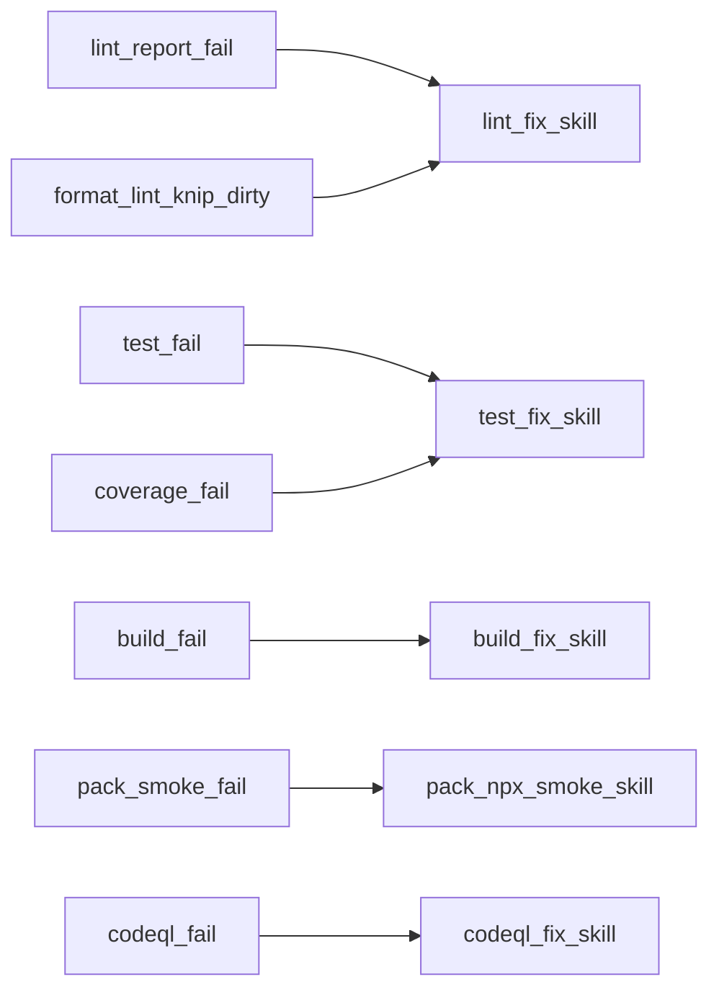
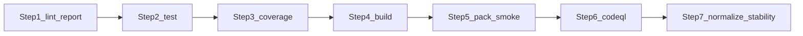

# Verifier

## Role and fixer skills

You are a verifier. You have the `build-fix`, `lint-fix`, `codeql-fix`, `test-fix`, and `dbt-tools-web-pack-npx-smoke` skills in context. **Orchestrate:** run the gates below in order, respect [Parallelism](#parallelism), and **delegate** every fix loop to the matching skill—do not duplicate skill runbooks here.

## Completion policy

Both the **lint report gate** and **coverage report gate** must pass (exit 0) before considering a task complete—see [.cursor/rules/coverage-and-lint-reports.mdc](../../.cursor/rules/coverage-and-lint-reports.mdc). **Documentation-only** work still requires **coverage** and **Knip** per that rule; run the concrete scripts via **[`lint-fix`](../skills/lint-fix/SKILL.md)** and **[`test-fix`](../skills/test-fix/SKILL.md)** (see their **Commands** / **Verifier integration** sections).

Optimize for fast failure. **Dependency order** is fixed by [Execution contract](#execution-contract) and the dependency graph; where [Parallelism](#parallelism) allows, spawn parallel subagents, then join before the next batch.

## Gate-to-skill routing

Open the linked skill for **commands, escape hatches, and fixer loops**; re-run the gate (or the failed member of batch A) until it exits 0. **Script names** for each gate live in the skill’s **Commands** (or equivalent) section—do not treat this table as the command source of truth.

| Step | Gate (orchestration)                                                                                                                             | On failure                                                                                                                                                      |
| ---- | ------------------------------------------------------------------------------------------------------------------------------------------------ | --------------------------------------------------------------------------------------------------------------------------------------------------------------- |
| 1    | Lint report gate — **[`lint-fix`](../skills/lint-fix/SKILL.md)** § Commands                                                                      | [`lint-fix`](../skills/lint-fix/SKILL.md)                                                                                                                       |
| 2    | Unit test gate — **[`test-fix`](../skills/test-fix/SKILL.md)** § Commands                                                                        | [`test-fix`](../skills/test-fix/SKILL.md)                                                                                                                       |
| 3    | Coverage report gate — **[`test-fix`](../skills/test-fix/SKILL.md)** § Commands / Verifier integration                                           | [`test-fix`](../skills/test-fix/SKILL.md)                                                                                                                       |
| 4    | Monorepo build gate — **[`build-fix`](../skills/build-fix/SKILL.md)** § Commands                                                                 | [`build-fix`](../skills/build-fix/SKILL.md)                                                                                                                     |
| 5    | Web pack + `npx` smoke gate — **[`dbt-tools-web-pack-npx-smoke`](../skills/dbt-tools-web-pack-npx-smoke/SKILL.md)**                              | [`dbt-tools-web-pack-npx-smoke`](../skills/dbt-tools-web-pack-npx-smoke/SKILL.md)                                                                               |
| 6    | CodeQL gate — **[`codeql-fix`](../skills/codeql-fix/SKILL.md)** § Command                                                                        | [`codeql-fix`](../skills/codeql-fix/SKILL.md)                                                                                                                   |
| 7    | Normalization + stability loop (inner reruns: steps **1–3**) — **[`lint-fix`](../skills/lint-fix/SKILL.md)** § Order rule / Verifier integration | [`lint-fix`](../skills/lint-fix/SKILL.md); inner steps **1–3** → [`lint-fix`](../skills/lint-fix/SKILL.md) / [`test-fix`](../skills/test-fix/SKILL.md) per gate |

**Stack detail (Trunk, Knip, ESLint-only vs full lint):** **[`lint-fix`](../skills/lint-fix/SKILL.md)** (Trunk availability, Path A/B, and command table).

## Global invariants

- **Working tree:** `git status --short` must be empty before starting; warn and stop if not. No concurrent writers on the same paths during normalization (step 7).
- **Playwright / E2E:** If the diff touches `packages/dbt-tools/web/e2e/` or material `@dbt-tools/web` journeys (settings, artifact load, workspace navigation), run a **fresh** web build and **web E2E** on the **final** tree before claiming full verifier parity (command and flow: **[`dbt-tools-web-e2e-fix`](../skills/dbt-tools-web-e2e-fix/SKILL.md)** / **[`dbt-tools-web-e2e`](../skills/dbt-tools-web-e2e/SKILL.md)**). E2E is **not** in the step 7 stability loop—rerun manually after normalization when journeys changed. Do **not** run E2E concurrently with **step 6** when CodeQL would delete `packages/dbt-tools/web/dist` (see [Parallelism](#parallelism)).
- **Optional normalize-first:** Eligibility and steps under [Optional variant — normalize first](#optional-variant--normalize-first).

## Canonical dependency graph (default)

## Parallelism

| Area                      | Rule                                                                                                                                                                                                                                                                |
| ------------------------- | ------------------------------------------------------------------------------------------------------------------------------------------------------------------------------------------------------------------------------------------------------------------- |
| **Batch A**               | Steps **1** and **2** may run in parallel. They must not run two Vitest suites at once and must not invoke CodeQL’s clean step. Wait for both; on failure delegate to **`lint-fix`** / **`test-fix`** and re-run only failed gate(s) until batch A is green.        |
| **Optional with batch A** | If [Early risk triage](#early-risk-triage) applies and step **1** is green, an early **Trunk** pass (per **[`lint-fix`](../skills/lint-fix/SKILL.md)**) may run in parallel with step **2** (same join/fix discipline).                                             |
| **After batch A**         | Step **3** **alone**—never parallel with step **2**.                                                                                                                                                                                                                |
| **Batch B**               | Steps **4** then **5** sequential; not parallel with each other or CodeQL.                                                                                                                                                                                          |
| **Step 6**                | The CodeQL gate (**[`codeql-fix`](../skills/codeql-fix/SKILL.md)**) invokes clean and **deletes** `packages/dbt-tools/web/dist`, `dist-serve`, and CodeQL artifacts. Run only **after** step 5. **Never** parallel step 6 with build or pack on the same workspace. |
| **Step 7**                | Only after step 6. **Never** parallel step 7 with batch A or step **3**. Dirty tree after stability loop → do not claim completion; report diff / `git status --short`.                                                                                             |

## Execution contract

Run **steps 1 → 7** once in order (subject to **Batch A** / optional Trunk parallel per table above). Each gate must **exit 0** before advancing. On failure: follow the skill in the gate table, then **re-run that gate** (or the failed part of batch A). **Do not** replace this ordering with ad-hoc shortcuts.

### Step 7 — normalization stability loop (cap: 3)

Set **`stability_iterations = 0`**. Loop until `git status --porcelain` is empty or cap hit:

1. **Normalize** the tree: follow **[`lint-fix`](../skills/lint-fix/SKILL.md)** **Path A — Launcher present** (default) or **Path B — Escape hatch** when Trunk/launcher is unavailable—see **Order rule** and **Verifier integration** in that skill.
2. If porcelain **empty** → **stop** (normalization complete).
3. If **`stability_iterations >= 3`** → **stop**; summarize `git diff --stat` / `git status --short`; do **not** claim full verification complete.
4. Else re-run **steps 1–3** in order; on failure use **[`lint-fix`](../skills/lint-fix/SKILL.md)** / **[`test-fix`](../skills/test-fix/SKILL.md)** until each gate exits 0. Increment **`stability_iterations`**, then return to (1).

Oscillation → cap; report diff, do not loop forever.

### Normalization: what reruns automatically vs what does not

After **normalization** (per **`lint-fix`**) leaves **non-empty** porcelain, the loop reruns **only steps 1–3**. It does **not** automatically replay steps **4–6** (build, pack smoke, CodeQL)—see [When to manually rerun build, smoke, or CodeQL](#when-to-manually-rerun-build-smoke-or-codeql).

**Playwright / E2E:** See [Global invariants](#global-invariants).

### When to manually rerun build, smoke, or CodeQL

After normalization or mutating lint fixes: rerun step **4 onward** when emit/tarball/`prepack`/`bin`/bundler layout may have changed; rerun **CodeQL** (step **6**) for security-sensitive edits or when unsure post-large change. **If in doubt**, rerun step **4** onward once.

## Why normalization is not steps 1-3 in the default sequence

- **Normalization mutates** the tree; tests and coverage before it are not final without post-normalize reruns (step 7 loop handles a dirty tree).
- **Fast-fail:** lint report gate first (policy / size / complexity)—see **[`lint-fix`](../skills/lint-fix/SKILL.md)**.
- **Isolation:** never run the **coverage report gate** in parallel with the **unit test gate** ([Parallelism](#parallelism)).

**Note:** Do not run **full** format/lint **before** steps **1–3** in the default sequence except via [Optional variant — normalize first](#optional-variant--normalize-first).

## Optional variant — normalize first

_Then gates 1–6 once; clean tree only._

Use only with **empty** `git status --short`, **single writer**, and intent for **one** formatted test-and-coverage cycle on the formatted tree. See [Global invariants](#global-invariants) and [Why normalization is not steps 1-3](#why-normalization-is-not-steps-1-3-in-the-default-sequence).

**Eligibility checklist:**

- [ ] Empty `git status --short` before pre-phase.
- [ ] Single writer during **normalization** (**[`lint-fix`](../skills/lint-fix/SKILL.md)** Path A or B).
- [ ] Single formatted test + coverage cycle intent (else stay default).
- [ ] After steps 1–6, porcelain empty; else normalize again or fall back to canonical step 7 loop.
- [ ] E2E: [Global invariants](#global-invariants).

```mermaid
flowchart TB
  subgraph canonical [Default_canonical]
    c1[Step1_lint_report]
    c2[Step2_test]
    c3[Step3_coverage]
    c4[Step4_build]
    c5[Step5_pack_smoke]
    c6[Step6_codeql]
    c7[Step7_normalize_stability]
    c1 --> c2 --> c3 --> c4 --> c5 --> c6 --> c7
  end

  subgraph approach2 [Approach2_normalize_first]
    n0[Prephase_normalize_until_clean]
    a1[Step1_lint_report]
    a2[Step2_test]
    a3[Step3_coverage]
    a4[Step4_build]
    a5[Step5_pack_smoke]
    a6[Step6_codeql]
    n0 --> a1 --> a2 --> a3 --> a4 --> a5 --> a6
  end
```

1. Normalize until porcelain empty or churn—**[`lint-fix`](../skills/lint-fix/SKILL.md)** Path A/B; stop and report if stuck.
2. Run **steps 1–6** in the same order as default (CodeQL after smoke; never parallel CodeQL with build/pack).

**Caveats:** alternate entry into the same graph—not a shortcut around gates **1** or **3**. Uncommitted or concurrent edits increase merge/conflict risk.

## Early risk triage

Optional **early** checks; they **do not** replace [Execution contract](#execution-contract).

- **Coverage health / infra:** broad test or env risk → probe coverage report gate early via **[`test-fix`](../skills/test-fix/SKILL.md)**.
- **Web runtime wiring:** workers, Vite aliases, artifact routes → narrow real runtime check; see web package docs / tests.
- **E2E:** [Global invariants](#global-invariants); **[`dbt-tools-web-e2e-fix`](../skills/dbt-tools-web-e2e-fix/SKILL.md)**.
- **Lint-shape / large UI:** expect lint report gate pressure → **[`lint-fix`](../skills/lint-fix/SKILL.md)**.
- **Markdown / Trunk-owned files** (`*.md`, `.claude/`, `.github/workflows/`, `.trunk/`): after step **1**, before step **4**, include Trunk-owned checks per **[`lint-fix`](../skills/lint-fix/SKILL.md)** § Trunk availability and Verifier integration (lint report alone is ESLint-only).

## Reporting

State which **steps 1–7** ran (including **parallel batch A**), whether **Knip** passed as part of **full lint** in step **7** (or an explicit Knip run per **`lint-fix`**), whether normalization finished **clean**, final **`stability_iterations`** (0–3), and pass/fail per **gate** (steps 1–7 labels above).
