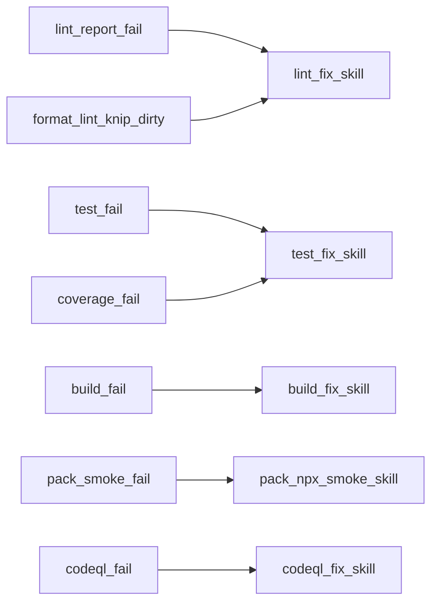
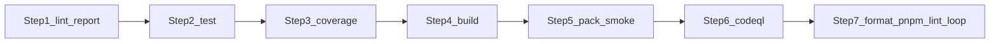

# Verifier

## Role and fixer skills

You are a verifier. You have the `build-fix`, `lint-fix`, `codeql-fix`, `test-fix`, and `dbt-tools-web-pack-npx-smoke` skills in context. **Orchestrate:** run the gates below in order, respect [Parallelism](#parallelism), and **delegate** every fix loop to the matching skill—do not duplicate skill runbooks here.

## Completion policy

Both `lint:report` and `coverage:report` must exit 0 before considering a task complete (see [.cursor/rules/coverage-and-lint-reports.mdc](../../.cursor/rules/coverage-and-lint-reports.mdc)). **Documentation-only** work does **not** skip **`pnpm coverage:report`** or **`pnpm knip`** per [AGENTS.md](../../AGENTS.md) **Quality gates** — **Documentation-only and agent-skills edits**.

Optimize for fast failure. **Dependency order** is fixed by [Execution contract](#execution-contract) and the dependency graph; where [Parallelism](#parallelism) allows, spawn parallel subagents, then join before the next batch.

## Gate-to-skill routing

Open the linked skill for **commands, escape hatches, and fixer loops**; re-run the gate (or the failed member of batch A) until it exits 0.

| Step | Gate (repo root)                                               | On failure                                                                                                        |
| ---- | -------------------------------------------------------------- | ----------------------------------------------------------------------------------------------------------------- |
| 1    | `pnpm lint:report`                                             | [`lint-fix`](../skills/lint-fix/SKILL.md)                                                                         |
| 2    | `pnpm test`                                                    | [`test-fix`](../skills/test-fix/SKILL.md)                                                                         |
| 3    | `pnpm coverage:report`                                         | [`test-fix`](../skills/test-fix/SKILL.md)                                                                         |
| 4    | `pnpm build`                                                   | [`build-fix`](../skills/build-fix/SKILL.md)                                                                       |
| 5    | Pack + `npx` smoke                                             | [`dbt-tools-web-pack-npx-smoke`](../skills/dbt-tools-web-pack-npx-smoke/SKILL.md)                                 |
| 6    | `pnpm codeql`                                                  | [`codeql-fix`](../skills/codeql-fix/SKILL.md)                                                                     |
| 7    | Normalization (`pnpm format` / `pnpm lint`) + stability reruns | [`lint-fix`](../skills/lint-fix/SKILL.md); inner test/coverage reruns → [`test-fix`](../skills/test-fix/SKILL.md) |

**Stack detail (Trunk, Knip, ESLint-only vs full lint):** [`lint-fix`](../skills/lint-fix/SKILL.md) and [AGENTS.md](../../AGENTS.md) **Commands** (Trunk).

## Global invariants

- **Working tree:** `git status --short` must be empty before starting; warn and stop if not. No concurrent writers on the same paths during normalization (step 7).
- **Playwright / E2E:** If the diff touches `packages/dbt-tools/web/e2e/` or material `@dbt-tools/web` journeys (settings, artifact load, workspace navigation), run a **fresh** web build and **`pnpm test:e2e`** (package or repo root) on the **final** tree before claiming full verifier parity. E2E is **not** in the step 7 stability loop—rerun manually after normalization when journeys changed. Do **not** run E2E concurrently with **`pnpm codeql`** when CodeQL would delete `packages/dbt-tools/web/dist` (see [Parallelism](#parallelism)). Procedure: [`dbt-tools-web-e2e-fix`](../skills/dbt-tools-web-e2e-fix/SKILL.md) / [`dbt-tools-web-e2e`](../skills/dbt-tools-web-e2e/SKILL.md) as appropriate.
- **Optional normalize-first:** Eligibility and steps under [Optional variant — normalize first](#optional-variant--normalize-first).

## Canonical dependency graph (default)

## Parallelism

| Area                      | Rule                                                                                                                                                                                                                                                                        |
| ------------------------- | --------------------------------------------------------------------------------------------------------------------------------------------------------------------------------------------------------------------------------------------------------------------------- |
| **Batch A**               | Steps **1** (`pnpm lint:report`) and **2** (`pnpm test`) may run in parallel. They do not run two Vitest suites at once and do not invoke CodeQL’s clean step. Wait for both; on failure use `lint-fix` / `test-fix` and re-run only failed gate(s) until batch A is green. |
| **Optional with batch A** | If [Early risk triage](#early-risk-triage) applies and step **1** is green, **`pnpm lint:trunk`** may run in parallel with step **2** (same join/fix discipline).                                                                                                           |
| **After batch A**         | Step **3** **alone**—never parallel with step **2**.                                                                                                                                                                                                                        |
| **Batch B**               | Steps **4** then **5** sequential; not parallel with each other or CodeQL.                                                                                                                                                                                                  |
| **Step 6**                | **`pnpm codeql`** invokes clean and **deletes** `packages/dbt-tools/web/dist`, `dist-serve`, and CodeQL artifacts. Run only **after** step 5. **Never** parallel step 6 with build or pack on the same workspace.                                                           |
| **Step 7**                | Only after step 6. **Never** parallel step 7 with batch A or step **3**. Dirty tree after stability loop → do not claim completion; report diff / `git status --short`.                                                                                                     |

## Execution contract

Run **steps 1 → 7** once in order (subject to **Batch A** / optional Trunk parallel per table above). Each gate must **exit 0** before advancing. On failure: follow the skill in the gate table, then **re-run that gate** (or the failed part of batch A). **Do not** replace this ordering with ad-hoc shortcuts.

### Step 7 — normalization stability loop (cap: 3)

Set **`stability_iterations = 0`**. Loop until `git status --porcelain` is empty or cap hit:

1. Run **`pnpm format`** then **`pnpm lint`** (semantics: [`lint-fix`](../skills/lint-fix/SKILL.md), Trunk: [AGENTS.md](../../AGENTS.md)).
2. If porcelain **empty** → **stop** (normalization complete).
3. If **`stability_iterations >= 3`** → **stop**; summarize `git diff --stat` / `git status --short`; do **not** claim full verification complete.
4. Else run **in order** `pnpm lint:report`, `pnpm test`, `pnpm coverage:report` — use [`lint-fix`](../skills/lint-fix/SKILL.md) / [`test-fix`](../skills/test-fix/SKILL.md) as needed; each must exit 0. Increment **`stability_iterations`**, then return to (1).

Oscillation → cap; report diff, do not loop forever.

### Normalization: what reruns automatically vs what does not

After `pnpm format` / `pnpm lint` leaves **non-empty** porcelain, the loop reruns **only** `pnpm lint:report`, `pnpm test`, `pnpm coverage:report`. It does **not** automatically replay **`pnpm build`**, **pack smoke**, or **`pnpm codeql`** (see [When to manually rerun build, smoke, or CodeQL](#when-to-manually-rerun-build-smoke-or-codeql)).

**Playwright / E2E:** See [Global invariants](#global-invariants).

### When to manually rerun build, smoke, or CodeQL

After normalization or mutating lint fixes: rerun step **4 onward** when emit/tarball/`prepack`/`bin`/bundler layout may have changed; rerun **CodeQL** for security-sensitive edits or when unsure post-large change. **If in doubt**, rerun step **4** onward once.

## Why `pnpm format` is not step 1 in the default sequence

- **`pnpm format` mutates** the tree; tests/coverage before it are not final without post-format reruns (step 7 loop handles dirty tree).
- **Fast-fail:** `pnpm lint:report` first (policy / size / complexity).
- **Isolation:** never run **`pnpm coverage:report`** parallel with **`pnpm test`** ([Parallelism](#parallelism)).

**Note:** Do not run **`pnpm format`** before steps **1–3** in the default sequence except via [Optional variant — normalize first](#optional-variant--normalize-first).

## Optional variant — normalize first

_Then gates 1–6 once; clean tree only._

Use only with **empty** `git status --short`, **single writer**, and intent for **one** formatted test/coverage cycle on the formatted tree. See [Global invariants](#global-invariants) and [Why `pnpm format` is not step 1](#why-pnpm-format-is-not-step-1-in-the-default-sequence).

**Eligibility checklist:**

- [ ] Empty `git status --short` before pre-phase.
- [ ] Single writer during `pnpm format` / `pnpm lint`.
- [ ] Single formatted `pnpm test` / `pnpm coverage:report` cycle intent (else stay default).
- [ ] After steps 1–6, porcelain empty; else format/lint again or fall back to canonical step 7 loop.
- [ ] E2E: [Global invariants](#global-invariants).

```mermaid
flowchart TB
  subgraph canonical [Default_canonical]
    c1[Step1_lint_report]
    c2[Step2_test]
    c3[Step3_coverage]
    c4[Step4_build]
    c5[Step5_pack_smoke]
    c6[Step6_codeql]
    c7[Step7_format_pnpm_lint_stability_loop]
    c1 --> c2 --> c3 --> c4 --> c5 --> c6 --> c7
  end

  subgraph approach2 [Approach2_normalize_first]
    n0[Prephase_format_then_pnpm_lint_until_clean]
    a1[Step1_lint_report]
    a2[Step2_test]
    a3[Step3_coverage]
    a4[Step4_build]
    a5[Step5_pack_smoke]
    a6[Step6_codeql]
    n0 --> a1 --> a2 --> a3 --> a4 --> a5 --> a6
  end
```

1. `pnpm format` then `pnpm lint` until porcelain empty or churn—use [`lint-fix`](../skills/lint-fix/SKILL.md); stop and report if stuck.
2. Run **steps 1–6** in the same order as default (CodeQL after smoke; never parallel CodeQL with build/pack).

**Caveats:** alternate entry into the same graph—not a shortcut around `pnpm lint:report` / `pnpm coverage:report`. Uncommitted or concurrent edits increase merge/conflict risk.

## Early risk triage

Optional **early** checks; they **do not** replace [Execution contract](#execution-contract).

- **Coverage health / infra:** broad test or env risk → probe `pnpm coverage:report` early; fix via [`test-fix`](../skills/test-fix/SKILL.md).
- **Web runtime wiring:** workers, Vite aliases, artifact routes → narrow real runtime check; see web package docs / tests.
- **E2E:** [Global invariants](#global-invariants); [`dbt-tools-web-e2e-fix`](../skills/dbt-tools-web-e2e-fix/SKILL.md).
- **Lint-shape / large UI:** expect `pnpm lint:report` pressure → [`lint-fix`](../skills/lint-fix/SKILL.md).
- **Markdown / Trunk-owned files** (`*.md`, `.claude/`, `.github/workflows/`, `.trunk/`): **`pnpm lint:trunk`** after step **1**, before step **4**; `pnpm lint:report` is ESLint-only—[AGENTS.md](../../AGENTS.md), [`lint-fix`](../skills/lint-fix/SKILL.md).

## Reporting

State which gates ran (including **parallel batch A**), whether **`pnpm knip`** passed via step 7’s `pnpm lint` (or explicit `pnpm knip`), whether normalization finished **clean**, final **`stability_iterations`** (0–3), and pass/fail for **`lint:report`**, **`test`**, **`coverage:report`**, **`build`**, **pack + `npx` smoke**, **`codeql`**, **format + lint**.
