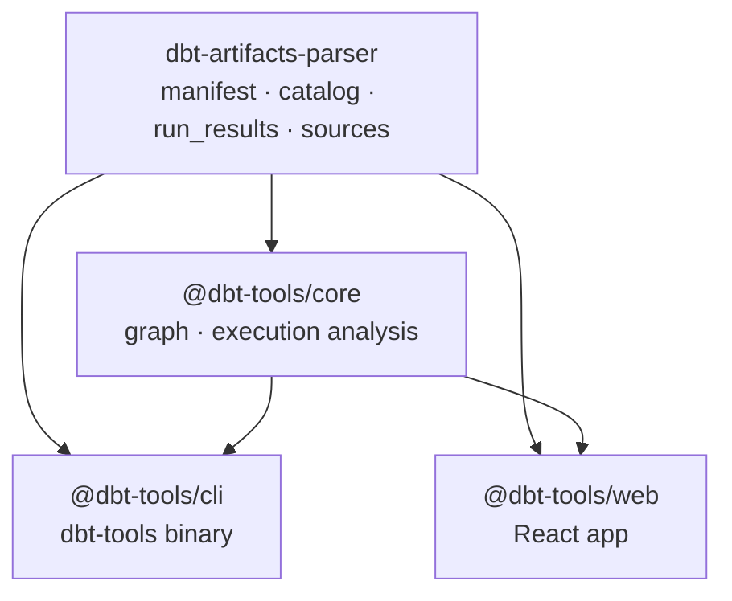

# dbt-artifacts-parser-ts

A TypeScript monorepo for parsing and analyzing [dbt](https://www.getdbt.com/) artifacts.

This repo contains two distinct but related ecosystems:

| Ecosystem                                                  | Description                                                                                     |
| ---------------------------------------------------------- | ----------------------------------------------------------------------------------------------- |
| [`dbt-artifacts-parser`](./packages/dbt-artifacts-parser/) | Standalone parsing library — type definitions and auto-version-detection for dbt JSON artifacts |
| [`@dbt-tools/*`](./packages/dbt-tools/)                    | Analysis tools suite (CLI, core library, web app) built on top of the parser                    |

---

## Architecture



---

## Packages

### dbt-artifacts-parser

> `packages/dbt-artifacts-parser/` · npm: `dbt-artifacts-parser`

A standalone TypeScript library for parsing dbt artifact files with full type safety and automatic version detection. Use this if you only need to read and type-check dbt JSON artifacts.

Supported artifacts:

| Artifact           | Versions |
| ------------------ | -------- |
| `manifest.json`    | v1–v12   |
| `catalog.json`     | v1       |
| `run_results.json` | v1–v6    |
| `sources.json`     | v1–v3    |

[Full documentation →](./packages/dbt-artifacts-parser/README.md)

---

### @dbt-tools

> `packages/dbt-tools/` · npm scope: `@dbt-tools`

A suite of analysis tools for dbt artifacts. Built on `dbt-artifacts-parser`.

| Package                                                  | Description                                                                        |
| -------------------------------------------------------- | ---------------------------------------------------------------------------------- |
| [`@dbt-tools/core`](./packages/dbt-tools/core/README.md) | Core library — dependency graphs, execution analysis, formatting                   |
| [`@dbt-tools/cli`](./packages/dbt-tools/cli/README.md)   | CLI tool (`dbt-tools`) for artifact analysis, AI-agent-friendly                    |
| [`@dbt-tools/web`](./packages/dbt-tools/web/README.md)   | React web app for visual artifact analysis (local target, upload, optional S3/GCS) |

[Suite overview →](./packages/dbt-tools/README.md)

---

## Quick Start

```bash
# Parse dbt artifacts in your own TypeScript project
npm install dbt-artifacts-parser

# Use the CLI to analyze artifacts
npm install -g @dbt-tools/cli
dbt-tools summary          # requires ./target/manifest.json
dbt-tools run-report       # requires ./target/run_results.json

# Visual analyzer in the browser (published server binary)
npm install -g @dbt-tools/web
dbt-tools-web --target ./target   # or: npx @dbt-tools/web --target ./target
```

See [`packages/dbt-tools/web/README.md`](./packages/dbt-tools/web/README.md) for configuration (`DBT_TOOLS_REMOTE_SOURCE`, debugging, Docker pointers).

---

## Development

See [CONTRIBUTING.md](./CONTRIBUTING.md) for how to build, test, and contribute to this monorepo.

---

## License

This monorepo uses **two different licenses** for different parts of the tree. The **authoritative path map** is **[`LICENSES/README.md`](./LICENSES/README.md)**. The file at the repository root named [`LICENSE`](./LICENSE) is a **short manifest** only (not the Apache legal text). GitHub and other tools may not show multiple licenses correctly; use the manifest and the links below.

| Area                                                                                                   | License                                              | Full text                                                                                                                                                                 |
| ------------------------------------------------------------------------------------------------------ | ---------------------------------------------------- | ------------------------------------------------------------------------------------------------------------------------------------------------------------------------- |
| [`packages/dbt-artifacts-parser/`](./packages/dbt-artifacts-parser/) (npm: `dbt-artifacts-parser`)     | **Apache-2.0**                                       | [`LICENSES/Apache-2.0.txt`](./LICENSES/Apache-2.0.txt) (canonical); also [`packages/dbt-artifacts-parser/LICENSE`](./packages/dbt-artifacts-parser/LICENSE) (npm tarball) |
| [`packages/dbt-tools/`](./packages/dbt-tools/) (`@dbt-tools/core`, `@dbt-tools/cli`, `@dbt-tools/web`) | **Source-available** (custom; not OSI “open source”) | [`packages/dbt-tools/LICENSE`](./packages/dbt-tools/LICENSE)                                                                                                              |

Published npm tarballs ship a `LICENSE` file and `package.json` metadata appropriate to each package. For permissions beyond what the dbt-tools license grants, contact the maintainer via the repository.

See [CONTRIBUTING.md](./CONTRIBUTING.md) for how contributions are licensed per package.
