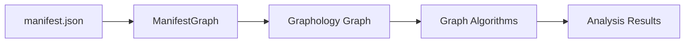

# 2. Use Graphology for Graph Management

Date: 2026-03-10

## Status

Accepted

Extended by [4. Use Topological Sort for Upstream Build Order](0004-use-topological-sort-for-upstream-build-order.md)

## Context

The `@dbt-tools/core` package needs to manage dependency graphs from dbt artifacts (manifest.json) that can contain hundreds of thousands of nodes and edges. We need a high-performance graph library that:

- Handles large-scale graphs efficiently (10^5+ nodes)
- Provides TypeScript support
- Offers NetworkX-like API for familiarity
- Supports directed graphs (DAGs)
- Enables efficient graph algorithms (cycles, paths, traversal)

Alternatives considered:

- **Custom implementation**: High performance but significant development overhead
- **Cytoscape.js**: More focused on visualization, heavier weight
- **ngraph**: Lower-level, less ergonomic API

## Decision

We will use [Graphology](https://graphology.github.io/) as the graph management library for `@dbt-tools/core`.

Graphology provides:

- Efficient in-memory graph representation optimized for large graphs
- Full TypeScript support with type definitions
- NetworkX-inspired API that is familiar to Python developers
- Extensive algorithm library (cycles, paths, centrality, etc.)
- Active maintenance and good performance characteristics
- Modular architecture allowing selective feature inclusion

## Consequences

**Positive:**

- Fast graph operations suitable for large dbt projects
- Type-safe API reduces runtime errors
- Rich algorithm ecosystem available out-of-the-box
- Familiar API reduces learning curve
- Well-documented and actively maintained

**Negative:**

- Additional dependency (~50KB minified)
- Requires understanding of Graphology's API patterns
- Some algorithms may need custom implementation for dbt-specific use cases

**Mitigation:**

- Benchmark graph loading with large manifests (10^5+ nodes) during implementation
- Create wrapper classes to abstract Graphology API for dbt-specific operations
- Document performance characteristics and optimization strategies
