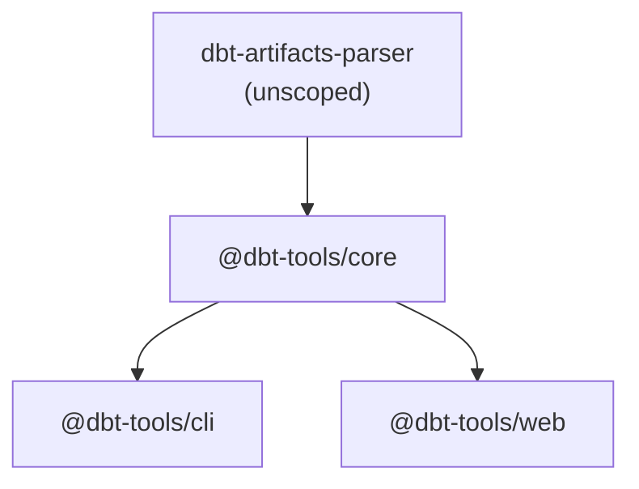

# 3. Use @dbt-tools scope for npm packages

Date: 2026-03-10

## Status

Accepted

## Context

We are building a suite of tools for analyzing dbt artifacts. The project structure includes:

- `dbt-artifacts-parser` - existing parser library
- `@dbt-tools/core` - core graph and analysis library (new)
- `@dbt-tools/cli` - command-line interface (new)
- `@dbt-tools/web` - web UI (not in MVP)

We need a consistent naming convention for npm packages that:

- Groups related packages together
- Avoids naming conflicts
- Follows npm scoping conventions
- Makes the relationship between packages clear

## Decision

We will use the `@dbt-tools` npm scope for all packages in the dbt-tools suite.

Package structure:

- `@dbt-tools/core` - Core library for graph management and execution analysis
- `@dbt-tools/cli` - Command-line interface
- `@dbt-tools/web` - Web UI

The existing `dbt-artifacts-parser` package will remain unscoped as it is a foundational library used by other projects.

## Consequences

**Positive:**

- Clear namespace organization
- Prevents naming conflicts with other dbt-related packages
- Makes package relationships explicit
- Follows npm best practices for monorepos
- Easy to discover related packages

**Negative:**

- Requires npm organization setup (or user configuration for scoped packages)
- Slightly longer import paths (`@dbt-tools/core` vs `dbt-tools-core`)

**Mitigation:**

- Document npm scope setup in README
- Use workspace protocol (`workspace:*`) in pnpm for local development
- Ensure proper `publishConfig` in package.json files
