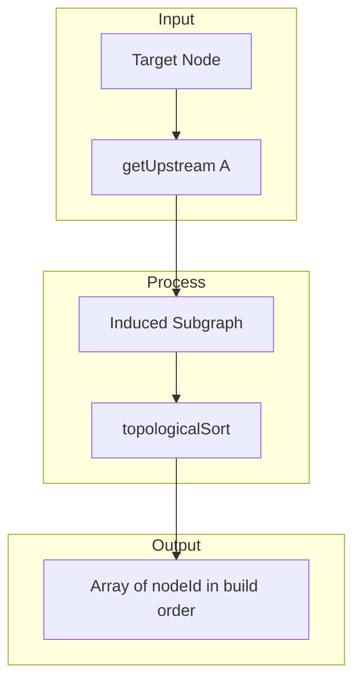

# 4. Use Topological Sort for Upstream Build Order

Date: 2026-03-12

## Status

Accepted

Depends-on [2. Use Graphology for Graph Management](0002-use-graphology-for-graph-management.md)

## Context

The `deps` command returns upstream or downstream dependencies. Users often need these in **build order**: for upstream dependencies, the order in which dbt would build models (sources first, then models that depend on them). Without ordering, results are effectively arbitrary.

Alternatives considered:

- **BFS/DFS traversal**: Simple to implement but does not guarantee topological order; visit order depends on graph structure and traversal direction.
- **Custom topological sort**: Would duplicate logic; graphology-dag already provides this for DAGs.
- **No ordering**: Simpler but poor UX for "what do I need to build first?"

Build order is meaningful only for **upstream** dependencies. Downstream dependencies (what depends on me) do not have a natural build sequence in the same sense.

## Decision

We use [graphology-dag](https://github.com/graphology/graphology-dag)'s `topologicalSort` for upstream build-order analysis. The approach:

1. Use `getUpstream()` to collect upstream nodes (and optionally limit depth).
2. Build an **induced subgraph** containing only those nodes and the edges between them.
3. Run `topologicalSort` on the subgraph to obtain canonical build order.

Build order is exposed via `ManifestGraph.getUpstreamBuildOrder()`, `DependencyService.getDependencies(…, buildOrder: true)`, and the CLI `--build-order` flag. Build order is only supported for `direction === "upstream"`.

## Consequences

**Positive:**

- Correct topological order: sources and roots first, consistent with dbt build semantics.
- Reuses graphology-dag (already a dependency per ADR 0002); no new libraries.
- Induced-subgraph pattern is reusable for other analyses (e.g., subgraph metrics).
- Clear separation: traversal (`getUpstream`) vs ordering (`topologicalSort`).

**Negative:**

- Build order only for upstream; downstream remains unordered (by design).
- Induced subgraph construction adds O(nodes + edges) work for the upstream set.
- Tree format (`--format tree`) with build order falls back to flat output.

**Mitigation:**

- Document in CLI help that `--build-order` requires `--direction upstream`.
- Benchmark with large manifests if performance becomes a concern.
