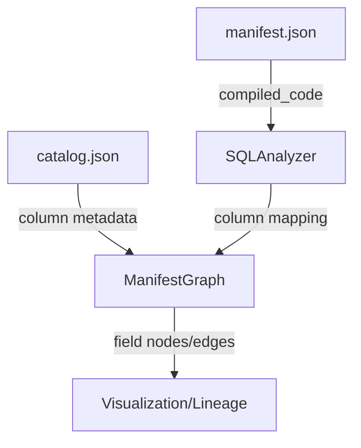

# 5. Field-level lineage inference via AST parsing

Date: 2026-03-13

## Status

Accepted

Builds on field-level lineage [6. Artifact-first and agent-compatible positioning of dbt-tools (superseded in part)](0006-artifact-first-agent-first-positioning-of-dbt-tools.md)

## Context

dbt Core's `manifest.json` artifact provides robust table-level lineage but lacks native column-level (field-level) lineage information. Users need to understand how specific data elements flow through their transformation pipelines for root cause analysis and impact assessment.

To implement this functionality in `dbt-tools`, we need a way to infer these dependencies from existing dbt artifacts (`manifest.json` and `catalog.json`).

## Decision

We will implement field-level lineage by performing Abstract Syntax Tree (AST) analysis on the `compiled_code` found in `manifest.json`.

1.  **Parsing**: Use `node-sql-parser` to transform the compiled SQL into an AST.
2.  **Mapping**: Traverse the AST to identify output columns (SELECT) and their source expressions.
3.  **Resolution**: Map these source expressions back to upstream models and their respective columns by resolving table aliases and JOIN conditions.
4.  **Metadata**: Utilize `catalog.json` to validate column names and types where necessary.
5.  **Graph Representation**: Represent fields as child nodes of models in a unified `ManifestGraph`, using a naming convention like `model_unique_id#column_name`.

### Architecture

## Consequences

- **Pros**:
  - Provides deep visibility into data provenance using standard dbt artifacts.
  - Decoupled from proprietary dbt Cloud features.
  - Enables precise impact analysis for schema changes.
- **Cons**:
  - **Complexity**: AST parsing for diverse SQL dialects (BigQuery, Snowflake, etc.) is non-trivial.
  - **Performance**: Parsing hundreds of SQL files adds overhead to graph initialization.
  - **Edge Cases**: Extremely complex SQL (e.g., recursive CTEs, highly dynamic Jinja) might fail to parse.
- **Mitigations**:
  - Implement a graceful fallback to model-level lineage when AST parsing fails.
  - Cache or selectively parse only the nodes required for the current dependency query.
  - Use a robust, dialect-aware parser like `node-sql-parser`.
