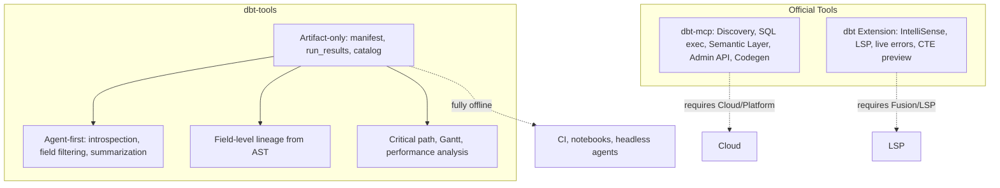

# 6. Artifact-first agent-first positioning of dbt-tools

Date: 2026-03-13

## Status

Accepted

Depends-on [5. Field-level lineage inference via AST parsing](0005-field-level-lineage-inference-via-ast-parsing.md)

Depends-on [5. Field-level lineage inference via AST parsing](0005-field-level-lineage-inference-via-ast-parsing.md)

## Context

Official dbt tools already exist and provide rich capabilities:

- **dbt-mcp** (Python): Discovery (lineage, model details, exposures), SQL execution, Semantic Layer, Admin API, Codegen, LSP-backed column lineage. Many tools require dbt Cloud/Platform or a live dbt project.
- **dbt VS Code extension**: Live error detection, IntelliSense, go-to-definition, instant refactoring, compiled view, CTE preview, rich lineage. Depends on Fusion engine and LSP.

dbt-tools aims to support rapid dbt development and AI-agent workflows. To avoid overlap and maximize unique value, we need clear strategic positioning.

## Decision

We adopt an **artifact-first, agent-first** positioning for the dbt-tools ecosystem.

### 1. Artifact-only operation

dbt-tools operates exclusively on dbt artifacts (`manifest.json`, `run_results.json`, `catalog.json`). No dbt CLI passthrough, Cloud APIs, or LSP dependencies. This enables fully offline workflows, CI, notebooks, and headless agents with no setup beyond artifact paths.

### 2. Agent-first design

Tools and outputs are optimized for AI agents: schema introspection, field filtering (`--fields`), canonical JSON structures, and summarization endpoints. Neither dbt-mcp nor the extension provide this kind of introspection and context control for AI consumers.

### 3. Unique feature roadmap (Tier 1)

- **Artifact-only MCP server**: Auto-load artifacts from configurable paths; expose `summary`, `graph`, `deps`, `run-report` as MCP tools.
- **Field-level lineage MCP tools**: `get_field_lineage`, `get_impacted_fields` backed by AST parsing (see ADR-0005). Distinct from dbt-mcp's Fusion/LSP-based column lineage.
- **Agent schema and context tools**: Command schema introspection, `--fields` on relevant commands, canonical artifact schemas.

### 4. Unique feature roadmap (Tier 2)

- **Performance and cost analysis**: Critical path, Gantt-style execution data, bottlenecks from `run_results.json`; cost proxies where artifact data permits; AI-friendly explanations.
- **Multi-run historical analysis**: Compare manifests and run_results across runs from archived artifacts (CI, S3/GCS) without Cloud APIs.

### 5. Explicit non-overlap

We do **not** implement: SQL execution, Semantic Layer, Admin API, Codegen, docs generation, or LSP-backed features (error detection, IntelliSense, go-to-definition, CTE preview). Those remain in dbt-mcp and the dbt extension.

### Positioning

### Alternatives considered

- **Full platform integration** (like dbt-mcp): Rejected — would duplicate and conflict with official tools.
- **Narrow parser-only scope**: Rejected — would underuse artifact potential for agents.
- **Hybrid (artifacts + optional Cloud)**: Rejected for MVP — keeps scope clean and fully offline.

## Consequences

**Positive:**

- Clear differentiation from dbt-mcp and dbt extension.
- Fully offline; no Cloud, LSP, or live project required.
- Strong fit for CI, notebooks, and headless AI agents.
- No setup beyond pointing at artifact paths.

**Negative:**

- Limited to artifact-derived data; no live project features.
- Cost data is sparse in standard artifacts.
- No SQL execution or Semantic Layer access.

**Mitigations:**

- Document what dbt-tools does not do; link to dbt-mcp and the dbt extension for complementary needs.
- Extend performance analysis where `run_results.json` permits; acknowledge gaps.

## References

- [dbt-mcp](https://github.com/dbt-labs/dbt-mcp) — tools and capabilities
- [ADR-0005](0005-field-level-lineage-inference-via-ast-parsing.md) — field-level lineage via AST parsing
