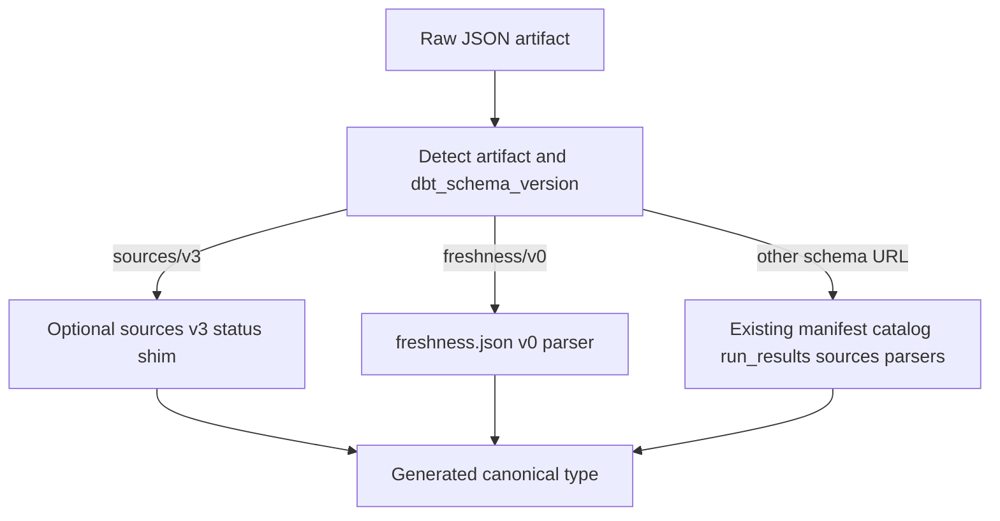

# 6. dbt v2 JSON compatibility uses schema versions, not engine versions

Date: 2026-09-18

## Status

Accepted

## Context

dbt v2 (Fusion) is a different producer than dbt Core, but the public JSON artifacts it
still writes are versioned by **artifact schema URL**, not by engine semver. Issue
[#187](https://github.com/yu-iskw/dbt-artifacts-parser-ts/issues/187) proposed a
producer-compatibility layer plus real Fusion fixtures and a live dbt-install canary.

An adversarial review of that RFC found three important corrections:

1. **The TypeScript parser is a schema-URL router plus a type cast**, not a strict
   validator. Extra Fusion fields do not fail parse the way Python Pydantic
   `extra="forbid"` does. A large compatibility transform layer is the wrong default.
2. **`Pass` / `Warn` / `Error` is the published `freshness.json` v0 contract**, not a
   sources v3 schema change. Fusion also emits those PascalCase values on legacy
   `sources.json` because it reuses one Rust enum, so a sources shim is secondary.
3. **A live canary that installs dbt and regenerates jaffle artifacts is the wrong
   operational model for this parser-only repository.** PR CI should stay
   fixture-driven. Drift detection should watch published schemas.

## Decision

Support dbt v2 JSON by keeping **artifact schema version as the public version
boundary**, adding **`freshness.json` as a first-class category**, and applying only
**narrow, proven producer shims**.

### Durable invariants

1. **Dispatch on `metadata.dbt_schema_version`.** `metadata.dbt_version` is diagnostic
   only. Do not introduce `ManifestV12Dbt2` (or similar) public type forks.
2. **Generated `vN.ts` files stay canonical.** Producer workarounds never land in
   schema-derived sources.
3. **`freshness.json` v0 is a distinct artifact.** Keep published statuses
   (`Pass` / `Warn` / `Error`) and `resource_type`. Do not parse it as `sources.json`.
4. **Sources v3 stays lowercase.** Fusion PascalCase `sources.json` statuses may be
   mapped onto the published enum. That mapping must not recurse, and must not run on
   freshness artifacts.
5. **Compatibility rules stay small and evidenced.** If shims start describing an
   alternate schema, stop and wait for an upstream schema bump.
6. **Parquet and other private Fusion outputs are out of scope** for this JSON
   compatibility decision.
7. **Schema support and producer-tested support are different claims.** Types come from
   published schemas; producer-compat fixtures prove known wire differences. A live dbt
   install is not required to accept JSON compatibility work.

## Consequences

**Positive:**

- Consumers can parse dbt v2 `freshness.json` without pretending it is sources v3.
- Fusion `sources.json` statuses become comparable to Core lowercase enums.
- Public types remain aligned with schemas.getdbt.com.
- CI stays deterministic and does not need warehouse credentials or a dbt toolchain.

**Negative / risks:**

- Synthetic producer-compat fixtures are narrower than a full Fusion jaffle run.
- Unproven Fusion field-shape differences will still type-check because parse is a cast.
- A sources PascalCase shim can hide an upstream schema bug; it needs an explicit
  removal condition.

## Alternatives considered

- **Implement the RFC as written** (broad compatibility package, full dbt project,
  live 2.0.x generator, treat PascalCase as a sources v3 schema problem): Rejected
  because it misplaces the freshness contract and overfits Python validation failures
  onto a cast-based TypeScript parser.
- **Fork public types by `dbt_version`:** Rejected because Core 1.8–1.12 and Fusion 2.0
  already share schema majors such as manifest v12.
- **Hand-edit generated enums to accept both `Pass` and `pass` on sources v3:** Rejected
  because it contaminates canonical schema types with one producer’s wire bug.
- **Document the mismatch only:** Rejected because `status === "pass"` checks would fail
  on Fusion `sources.json`, and `freshness.json` would remain unparsed.

## Trade-offs

- Prefer a **first-class freshness parser** over normalizing freshness down to sources
  v3, even though the files look similar.
- Prefer **schema-index canaries** over regenerating artifacts in GitHub Actions.
- Accept **synthetic fixtures** for known Fusion wire differences until a later change
  commits real Fusion outputs.

## References

- RFC tracker: [https://github.com/yu-iskw/dbt-artifacts-parser-ts/issues/187](https://github.com/yu-iskw/dbt-artifacts-parser-ts/issues/187)
- Python sibling RFC: [https://github.com/yu-iskw/dbt-artifacts-parser/issues/270](https://github.com/yu-iskw/dbt-artifacts-parser/issues/270)
- Published freshness schema: [https://schemas.getdbt.com/dbt/freshness/v0.json](https://schemas.getdbt.com/dbt/freshness/v0.json)
