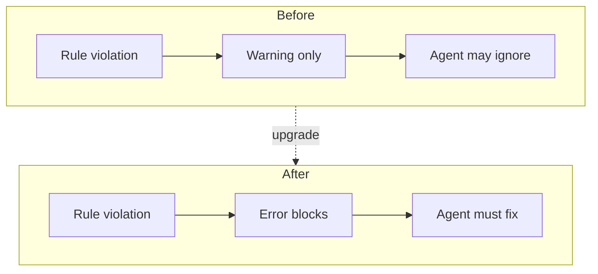

# 8. Stricter ESLint complexity rules for AI agent feedback

Date: 2026-03-13

## Status

Accepted

Replaces dependency approach [9. Replace eslint-for-ai with popular ESLint plugins](0009-replace-eslint-for-ai-with-popular-eslint-plugins.md)

Supports [10. Per-package coverage breakdown and fixture-based CLI tests for agent feedback](0010-per-package-coverage-breakdown-and-fixture-based-cli-tests-for-agent-feedback.md)

## Context

AI coding agents can implement complicated code; warnings are often ignored. We need deterministic, blocking feedback on complexity so agents refactor before proceeding. This aligns with our agent-first positioning (see [ADR-0006](0006-artifact-first-agent-first-positioning-of-dbt-tools.md)).

## Decision

We promote complexity and SonarJS rules from `warn` to `error` with tightened thresholds:

| Rule                              | Old  | New   | Threshold change |
| --------------------------------- | ---- | ----- | ---------------- |
| `complexity`                      | warn | error | 15 -> 12         |
| `max-lines-per-function`          | warn | error | 50 -> 40         |
| `sonarjs/cyclomatic-complexity`   | warn | error | 10 -> 8          |
| `sonarjs/cognitive-complexity`    | warn | error | 15 -> 12         |
| `sonarjs/no-duplicate-string`     | warn | error | —                |
| `sonarjs/prefer-immediate-return` | warn | error | —                |

### Rule severity flow

## Consequences

**Positive:**

- AI agents receive clearer, blocking signals and must refactor before proceeding.
- Codebase stays within maintainability thresholds.

**Negative:**

- Existing violations must be fixed before lint passes.
- Some functions may require non-trivial refactoring.

**Mitigations:**

- Fix violations incrementally per file.
- If thresholds prove too strict, relax to 15/50/10/15 as fallback.
