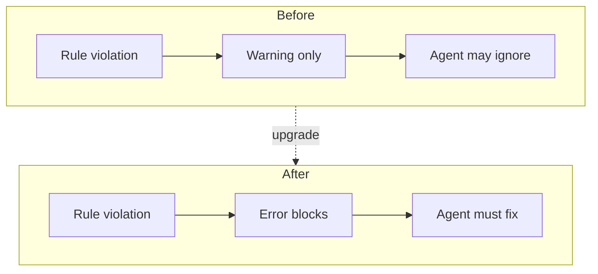

# 8. Stricter ESLint complexity rules for AI agent feedback

Date: 2026-03-13

## Status

Accepted

Replaces dependency approach [9. Replace eslint-for-ai with popular ESLint plugins](0009-replace-eslint-for-ai-with-popular-eslint-plugins.md)

Supports [10. Per-package coverage breakdown and fixture-based CLI tests for agent feedback](0010-per-package-coverage-breakdown-and-fixture-based-cli-tests-for-agent-feedback.md)

## Context

AI coding agents can implement complicated code; warnings are often ignored. We need deterministic, blocking feedback on complexity so agents refactor before proceeding. This aligns with our agent-first positioning (see [ADR-0006](0006-artifact-first-agent-first-positioning-of-dbt-tools.md)).

## Decision

We promote complexity and SonarJS rules from `warn` to `error` with tightened thresholds:

| Rule                              | Old  | New   | Threshold change |
| --------------------------------- | ---- | ----- | ---------------- |
| `complexity`                      | warn | error | 15 -> 12         |
| `max-lines-per-function`          | warn | error | 50 -> 40         |
| `sonarjs/cyclomatic-complexity`   | warn | error | 10 -> 8          |
| `sonarjs/cognitive-complexity`    | warn | error | 15 -> 12         |
| `sonarjs/no-duplicate-string`     | warn | error | —                |
| `sonarjs/prefer-immediate-return` | warn | error | —                |

### Rule severity flow

## Consequences

**Positive:**

- AI agents receive clearer, blocking signals and must refactor before proceeding.
- Codebase stays within maintainability thresholds.

**Negative:**

- Existing violations must be fixed before lint passes.
- Some functions may require non-trivial refactoring.

**Mitigations:**

- Fix violations incrementally per file.
- If thresholds prove too strict, relax to 15/50/10/15 as fallback.

## Amendment (2026-03-28)

The thresholds in the Decision table above were not achieved in practice. The "fallback"
values noted in Mitigations were applied instead, and additional structural rules were
added. The `complexity` (core ESLint) rule was removed entirely as it duplicates
`sonarjs/cyclomatic-complexity` (see comment in `eslint.config.mjs`).

**Actual thresholds in `eslint.config.mjs` (as of 2026-03-28):**

| Rule                            | Decision target | Actual (prod) | Actual (test) | Actual (E2E spec) |
| ------------------------------- | --------------- | ------------- | ------------- | ----------------- |
| `complexity` (core)             | error @ 12      | **Removed**   | Removed       | Removed           |
| `max-lines-per-function`        | error @ 40      | error @ 280   | error @ 700   | error @ 400       |
| `sonarjs/cyclomatic-complexity` | error @ 8       | error @ 20    | error @ 20    | error @ 30        |
| `sonarjs/cognitive-complexity`  | error @ 12      | error @ 20    | error @ 20    | error @ 35        |

**Additional rules added (not in original decision):**

- `max-depth`: error @ 6 (prod/test), error @ 10 (E2E spec)
- `max-params`: error @ 8
- `max-nested-callbacks`: error @ 4 (prod/test), error @ 8 (E2E spec)

The intent of blocking AI agents on complexity violations is preserved. The thresholds
were relaxed to accommodate larger generated parser files and complex Gantt rendering
components that could not be trivially decomposed below the originally targeted values.

## Amendment (2026-03-29)

Additional ESLint configuration was added after 2026-03-28 for **module size** and
**import boundaries** on `@dbt-tools/web`, plus targeted **Vitest test relaxations**.

### `max-lines` (non-test, web)

| File glob                                                                       | Max lines (skip blank + comments) |
| ------------------------------------------------------------------------------- | --------------------------------- |
| `packages/dbt-tools/web/**/*.tsx`                                               | 1200                              |
| `packages/dbt-tools/web/src/**/*.ts`                                            | 1200                              |
| `packages/dbt-tools/web/src/components/**/*.{ts,tsx}` and `hooks/**/*.{ts,tsx}` | 900                               |

### `no-restricted-imports` (layering)

- **Components/hooks** (`components`, `hooks`): forbid default import of `@dbt-tools/core`; forbid importing `ManifestGraph`, `ExecutionAnalyzer`, `detectBottlenecks`, `buildAnalysisSnapshotFromArtifacts`, `buildAnalysisSnapshotFromParsedArtifacts` from `@dbt-tools/core/browser` (worker-backed analysis path only).
- **`src/lib/**/_.ts`**: forbid `@web/components/_`and`@web/workers/\*` pattern imports.
- **`src/workers/**/\*.ts`**: forbid `react`, `react-dom`, `react/jsx-runtime`.

### Vitest test files

For `packages/**/*.test.ts` and `*.test.tsx`: `vitest/no-conditional-expect` is **off**;
`sonarjs/no-duplicate-string` is **off** (in addition to the shared complexity thresholds
in the 2026-03-28 table).
