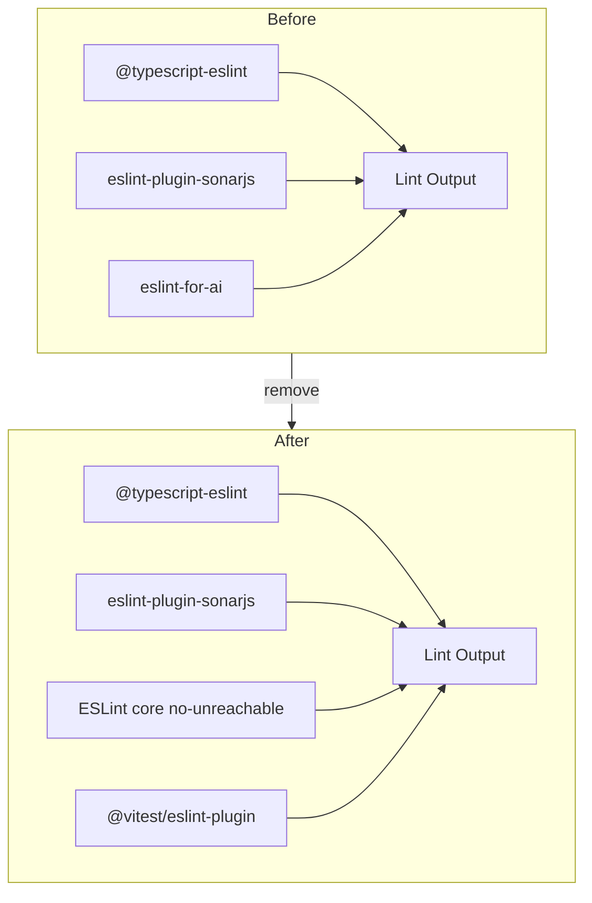

# 9. Replace eslint-for-ai with popular ESLint plugins

Date: 2026-03-13

## Status

Accepted

Amends [8. Stricter ESLint complexity rules for AI agent feedback](0008-stricter-eslint-complexity-rules-for-ai-agent-feedback.md)

## Context

We previously used `eslint-for-ai` for AI-agent-oriented lint rules. The package is niche (0 GitHub stars, low npm adoption) and does not meet our requirement to use only popular, well-maintained packages. Its four rules in use were:

| Rule                      | Scope  | Purpose                                    |
| ------------------------- | ------ | ------------------------------------------ |
| `no-bare-wrapper`         | source | Disallow pass-through wrapper functions    |
| `no-code-after-try-catch` | source | Disallow unreachable code after try/catch  |
| `no-constant-assertion`   | source | Disallow `expect(constant)` in tests       |
| `no-mock-only-test`       | tests  | Disallow tests that only assert mock calls |

## Decision

We remove `eslint-for-ai` and rely on popular plugins:

1. **Core ESLint `no-unreachable`** — partially replaces `no-code-after-try-catch` by flagging unreachable code.
2. **@vitest/eslint-plugin** — improves test quality (e.g. `vitest/expect-expect`); different semantics than `no-mock-only-test` but addresses test robustness.
3. **Accepted gaps** — no popular equivalent exists for `no-bare-wrapper` or `no-constant-assertion`; we accept these as dropped.

Our existing complexity and SonarJS rules (ADR-0008) plus TypeScript-ESLint continue to provide strong agent feedback for code quality.

### ESLint stack change

### Alternatives considered

- **Map to popular plugins only** — Partial coverage; no equivalent for bare-wrapper or constant-assertion.
- **Inline custom rules** — Higher maintenance; not worth the four rules.
- **Fork eslint-for-ai** — Rejected; would inherit an unpopular codebase.

## Consequences

**Positive:**

- Dependency hygiene: only popular, well-maintained packages.
- Reduced supply-chain and maintenance risk.
- Agent feedback remains strong via complexity/SonarJS rules (ADR-0008).

**Negative:**

- Four AI-specific rules dropped; two have no popular replacement.
- `no-mock-only-test` semantics not fully replicated by @vitest/eslint-plugin.

**Mitigations:**

- Enable `no-unreachable` and @vitest/eslint-plugin for partial coverage.
- Rely on code review and ADR-0008 rules for the remaining gaps.

## References

- [ADR-0006](0006-artifact-first-agent-first-positioning-of-dbt-tools.md) — agent-first positioning
- [ADR-0008](0008-stricter-eslint-complexity-rules-for-ai-agent-feedback.md) — stricter complexity rules

## Amendment (2026-03-29)

The Decision diagram lists TypeScript-ESLint, SonarJS, core `no-unreachable`, and
`@vitest/eslint-plugin`. The live stack also applies **React** linting to
`packages/dbt-tools/web/**/*.tsx` via **eslint-plugin-react** (recommended + JSX runtime,
`react/prop-types` off), **eslint-plugin-react-hooks** (`react-hooks/exhaustive-deps` as
error), and **eslint-plugin-jsx-a11y** (flat recommended). Complexity and SonarJS limits
for those files remain as documented in ADR-0008 (including amendments).

## Amendment (2026-03-30)

Effective complexity and SonarJS thresholds for all globs, including React files, are defined only in root `eslint.config.mjs` and [8. Stricter ESLint complexity rules for AI agent feedback](0008-stricter-eslint-complexity-rules-for-ai-agent-feedback.md)’s **2026-03-30** amendment, not by the original numeric table in ADR-0008’s Decision section.
