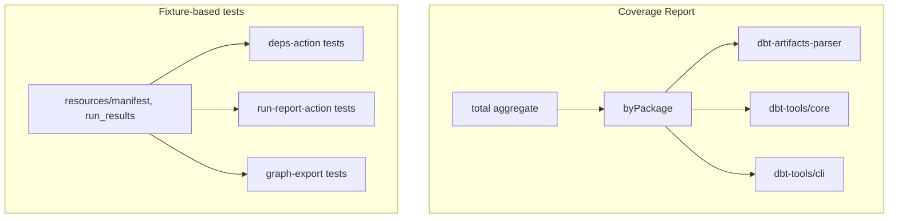

# 10. Per-package coverage breakdown and fixture-based CLI tests for agent feedback

Date: 2026-03-13

## Status

Accepted

Depends-on [6. Artifact-first agent-first positioning of dbt-tools](0006-artifact-first-agent-first-positioning-of-dbt-tools.md)

Depends-on [8. Stricter ESLint complexity rules for AI agent feedback](0008-stricter-eslint-complexity-rules-for-ai-agent-feedback.md)

## Context

Coverage and lint reports feed AI agents before task completion (see workspace rules). We had:

- **Single aggregate coverage** — when `belowThreshold` was true, agents could not see which package (parser, core, CLI) failed; all three packages were merged into one score.
- **CLI at 0% coverage** — `cli.ts`, `deps-action.ts`, and `run-report-action.ts` had no tests; `graph-export.ts` in core had none. Existing CLI tests only validated schema introspection.
- **Testing preference** — project guidelines favour fixture-based tests without mocks (decoupled, deterministic).

## Decision

We adopt two changes to improve agent feedback and coverage visibility:

### 1. Per-package coverage breakdown

`coverage-report.json` gains a `byPackage` field with aggregated metrics per package:

- `dbt-artifacts-parser`
- `dbt-tools/core`
- `dbt-tools/cli`

When `belowThreshold` is true, agents (and humans) can identify which package to improve. Aggregation uses weighted sums of covered/total across files in each package prefix.

### 2. Fixture-based tests for CLI actions and graph-export

- **deps-action** and **run-report-action**: Use `getTestResourcePath` from `dbt-artifacts-parser/test-utils` to resolve manifest and run_results fixtures. No mocks; `handleError` rethrows, `isTTY()` returns `false` for stable JSON output.
- **graph-export**: Use `loadTestManifest` + `ManifestGraph` + `exportGraphToFormat` to test JSON, DOT, GEXF formats, unsupported format error, and `fields` filtering.

## Consequences

**Positive:**

- Agents receive per-package visibility when coverage fails.
- CLI and graph-export gain meaningful coverage via deterministic fixtures.
- No mocks; tests align with project unit-test guidelines.

**Negative:**

- `byPackage` adds a small amount of logic to `coverage-score.mjs`.
- Fixture paths must stay in sync with resource layout.

**References:**

- [ADR-0006](0006-artifact-first-agent-first-positioning-of-dbt-tools.md) — agent-first positioning
- [ADR-0008](0008-stricter-eslint-complexity-rules-for-ai-agent-feedback.md) — AI agent feedback rules
