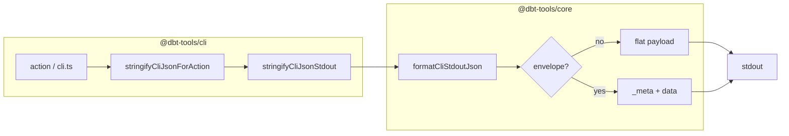

# 11. CLI stdout JSON envelope and introspection schemas for coding agents

Date: 2026-04-20

## Status

Accepted

## Context

Coding agents, CI, and wrappers consume **`@dbt-tools/cli`** primarily through **stdout**
and stderr. Several needs overlapped:

1. **Stable metadata alongside payloads** — CLI version, logical command name, resolved
   artifact paths (manifest / run_results / catalog / sources when applicable), and
   optional **`dbt_target`** context, without duplicating that logic in every consumer.
2. **Optional envelope vs flat JSON** — humans and simple pipes often want a **single
   JSON object** per line (legacy behavior). Agents benefit from a clear separation
   between **machine metadata** and the **domain payload** without breaking existing
   `--json` contracts.
3. **Describe outputs before running** — introspection **`dbt-tools schema`** already
   lists commands and flags; agents also need **JSON Schema (draft 2020-12)** for
   successful **JSON stdout** shapes so they can validate or generate clients.
4. **Consistency with existing intent envelopes** — [ADR 10](./0010-shared-discovery-ranker-intent-commands-and-cli-web-deep-links.md)
   documents structured envelopes for **intent** commands at the **domain** layer; this
   ADR covers the **CLI transport** layer for **all** JSON stdout paths that opt in.

Constraints: stay aligned with [ADR 8](./0008-dbt-tools-operational-intelligence-and-positioning-boundaries.md)
(one core substrate, thin CLI), and with [ADR 7](./0007-first-party-coding-agent-plugins-and-repository-verification.md)
(agent-verifiable behavior).

## Decision

### 1. Optional `{ _meta, data }` envelope on stdout

- **Opt-in** via **`--json-envelope`** or environment **`DBT_TOOLS_JSON_ENVELOPE`**
  (`1` / `true` / `yes`), resolved in **`@dbt-tools/cli`** (`resolveJsonEnvelopeRequested`).
- When enabled and the command is emitting **JSON** to stdout, **`@dbt-tools/core`**
  formats a single line/object using **`formatCliStdoutJson`**, wrapping the successful
  payload under **`data`** and attaching **`_meta`** built from CLI version, command
  name, **`dbt_target`** flag, and resolved artifact paths (**`buildStdoutEnvelopeMeta`**).
- **TTY / `--json` / `--no-json`** behavior continues to use **`shouldOutputJSON`** (re-exported
  in the CLI as **`shouldOutputJsonForCli`**); the envelope applies only when JSON stdout
  is actually selected and the command allows it.

### 2. `schema` introspection stays **flat** (no envelope)

- **`dbt-tools schema`** always prints a **plain** JSON object (full catalog or single
  **`CommandSchema`**). The envelope is **skipped** when **`command === "schema"`** so
  introspection remains a single top-level schema document without nested **`data`**.

### 3. `CommandSchema.stdout_json_schema`

- **`getCommandSchema` / schema generator** may embed **draft 2020-12** JSON Schema
  fragments under **`stdout_json_schema`** for commands where we publish a stable **MVP**
  contract (initially **summary**, **deps**, **status**; more may follow).
- Schemas are **deep-cloned** into the emitted command schema object (e.g. via
  **`structuredClone`**) to avoid shared mutable references.

### 4. CLI implementation patterns

- **`stringifyCliJsonForAction(command, paths, opts, payload)`** centralizes repeated
  wiring from actions into **`stringifyCliJsonStdout`**.
- **Graph** JSON export: parse exported string as JSON; on **`SyntaxError`** only, leave
  raw output; otherwise wrap through the same helper when parsing succeeds (non-syntax
  errors propagate).

## Consequences

**Positive:**

- Agents get **one** consistent way to attach **CLI version, artifacts, and command**
  to JSON results without ad hoc parsing.
- **`dbt-tools schema`** can expose **machine-readable contracts** for stdout (**`stdout_json_schema`**),
  improving validation and codegen.
- Raw **`schema`** output remains easy to ingest; optional envelope does not wrap
  introspection itself.

**Negative / risks:**

- Two stdout shapes (flat vs enveloped) increase documentation and test surface; consumers
  must check **`--json-envelope`** / env or read **`schema`** for expectations.
- **`stdout_json_schema`** coverage is **incremental**; commands without a fragment still
  rely on docs and examples until schemas are added.

**Follow-up (non-blocking):**

- Extend **`stdout_json_schema`** to more commands as payloads stabilize.
- Consider caching **`getCommandSchema`** if **`schema`** hot-reload paths become hot in CI.
