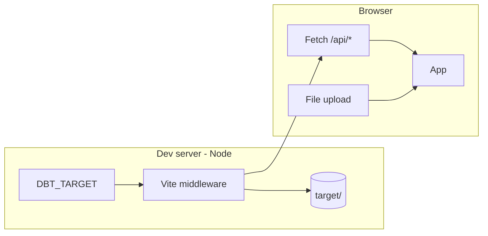

# 12. Optional default dbt target directory for web dev server

Date: 2026-03-13

## Status

Accepted

Depends-on [11. Web workspace MVP for visual dbt analysis](0011-web-workspace-mvp-for-visual-dbt-analysis.md)

Depends-on [11. Web workspace MVP for visual dbt analysis](0011-web-workspace-mvp-for-visual-dbt-analysis.md)

## Context

ADR-0011 established client-side artifact loading via file upload for the web app. For local development, users often run dbt in a project with `target/manifest.json` and `target/run_results.json` already present. Requiring manual upload every dev session adds friction. We want the option to preload from a configurable target directory at dev-server launch while retaining upload as the primary and only production flow.

Browsers cannot read local file paths. Preloading must happen on the dev server (Node), which has file system access, and the app must receive data via HTTP.

## Decision

1. **Env-driven dev API**: When `DBT_TARGET` is set, Vite dev middleware serves `manifest.json` and `run_results.json` from that path at `/api/manifest.json` and `/api/run_results.json`.

2. **App behavior**: On mount, the app tries to fetch from `/api/manifest.json` and `/api/run_results.json`. If both artifacts are available, it runs analysis automatically. If not, it shows the upload UI. Upload remains available at all times.

3. **Usage**: `DBT_TARGET=./target pnpm dev` or `DBT_TARGET=./path/to/target pnpm dev:target` from the web package; `DBT_TARGET=./target pnpm dev:web` from the repo root.

4. **Security**: Absolute paths (including `~`-expanded) are allowed; only relative paths are validated against cwd. Only the two specific filenames are served. Middleware is dev-only; production builds expose no `/api/` routes.

### Architecture

## Consequences

**Positive:**

- Faster dev feedback when iterating on a dbt project.
- Upload flow and production behavior unchanged.
- Small, localized change (middleware + conditional fetch).

**Negative:**

- Dev-only API surface; must be clearly documented.
- Different behavior in dev vs prod; tests should cover both paths.

**Mitigations:**

- Document `DBT_TARGET` in the web package README or dev scripts.
- E2E tests: one with default dir, one with upload-only.
- Absolute paths (including `~`-expanded) are allowed; only relative paths are validated against cwd.
- The dbt-target plugin uses `enforce: 'pre'` so its middleware serves `/api/*` before Vite's SPA fallback.
