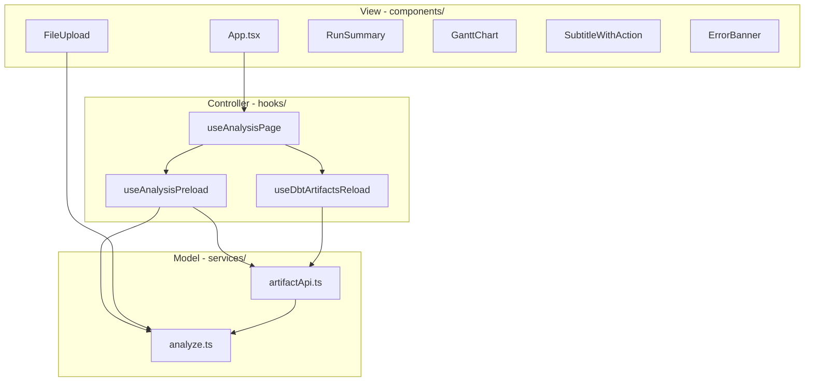
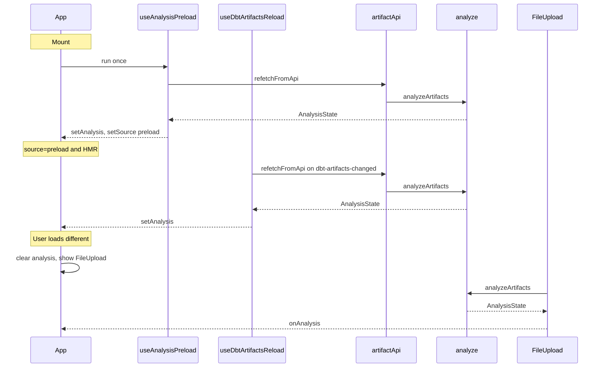

# 15. MVC-style layering for web app

Date: 2026-03-13

## Status

Accepted

Depends-on [11. Web workspace MVP for visual dbt analysis](0011-web-workspace-mvp-for-visual-dbt-analysis.md)

Depends-on [13. DBT_TARGET as primary dev source hide upload when preload succeeds](0013-dbt-target-as-primary-dev-source-hide-upload-when-preload-succeeds.md)

Depends-on [14. Auto-reload dbt artifacts when DBT_TARGET files change](0014-auto-reload-dbt-artifacts-when-dbt-target-files-change.md)

## Context

App.tsx combined preload, reload, upload handling, and UI in one file. ADR-0011 and ADR-0013/0014 added preload and auto-reload; logic grew without structure. We needed separation of concerns without introducing Redux/Zustand.

## Decision

1. **Model (services/)**: Pure data and analysis. `artifactApi.ts` provides `refetchFromApi()`. `analyze.ts` provides `analyzeArtifacts()` (moved from root).

2. **Controller (hooks/)**: State and side effects. `useAnalysisPreload` runs once on mount; `useDbtArtifactsReload` subscribes to HMR when source is preload; `useAnalysisPage` composes them and exposes `{ analysis, error, preloadLoading, ... }`.

3. **View (components/)**: Presentational only. Extract `SubtitleWithAction` and `ErrorBanner` from App; App becomes a thin shell that calls `useAnalysisPage` and renders components.

4. **Scope**: `dbt-target-plugin.ts` remains build-time tooling; it does not belong to MVC layers.

### Layer Structure

### Data Flow (Preload vs Upload vs Reload)

## Consequences

**Positive:**

- Clearer boundaries, easier testing, consistent place for new features.

**Negative:**

- More files and imports; some indirection for a small app.

**Mitigations:**

- Keep App thin; add new features in the appropriate layer.
