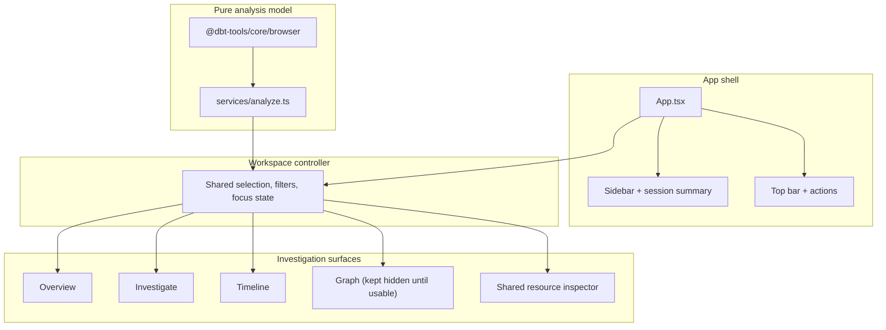

# 17. Workflow-first investigation workspace for dbt-tools web

Date: 2026-03-15

## Status

Accepted

Depends-on [11. Web workspace MVP for visual dbt analysis](0011-web-workspace-mvp-for-visual-dbt-analysis.md)

Depends-on [15. MVC-style layering for web app](0015-mvc-style-layering-for-web-app.md)

Depends-on [16. Responsive design for multi-device support](0016-responsive-design-for-multi-device-support.md)

## Context

ADR-0011 established a browser-based MVP for local dbt artifact analysis. ADR-0015 separated model, controller, and view concerns. ADR-0016 improved responsive behavior. Those decisions gave the project a working shell, but the current UX still reads mostly as page-oriented screens with separate local controls.

That structure makes it harder to use the web app as a run triage and investigation workspace. The product intent is closer to a debugger for dbt runs than to a generic dashboard:

- users need to move quickly from run health to the next useful inspection target
- selection in one surface should remain meaningful in other surfaces
- dense investigation tables and inspectors are more useful than large decorative cards
- timeline and lineage should explain why a node matters, not only display it

At the same time, the existing React/Vite frontend and shared analysis logic already work. A rewrite would slow delivery and duplicate logic that already belongs in `@dbt-tools/core/browser` and `services/analyze.ts`.

## Decision

Evolve the web app from a page-oriented artifact viewer into a workflow-first investigation workspace with:

1. A consistent app shell with sidebar, top bar, session summary, artifact provenance, and shared actions.
2. A shared controller-owned selection and filter model that coordinates Overview, Investigate, and Timeline.
3. Investigate as the primary dense workspace for assets, models, tests, sources, metrics, and semantic models.
4. Insight-first Overview content that prioritizes bottlenecks, failures, critical-path nodes, and downstream impact over dashboard clutter.
5. Timeline behavior that keeps selection synchronized and explains runtime blocking in an inspector-led flow.

### Non-decisions

- Do not rewrite the frontend stack.
- Do not replace stable parsing or analysis logic.
- Do not introduce Redux or Zustand for this iteration.
- Do not implement artifact comparison, compare routing, or compare-specific UI/state in this iteration.
- Do not expose Graph in navigation until focused graph behavior is genuinely usable.

### Architecture

The new structure keeps `services/analyze.ts` as the pure derivation layer and lifts cross-view UI behavior into controller state:

### Alternatives considered

1. Keep the current page model and mainly restyle components.
   This would improve appearance but keep the fragmented investigation flow and duplicated local state.

2. Rewrite the frontend around a new routing and state architecture.
   This would create unnecessary churn while the current React/Vite stack and analysis model are already serviceable.

3. Introduce a global store library for cross-view coordination.
   This would add dependency and conceptual overhead before the current controller layer is exhausted.

## Consequences

### Positive

- The product reads as one coherent investigation workspace.
- Overview can route users directly toward the next most useful action.
- Shared selection makes inspector, investigation tables, and timeline feel connected.
- The app remains local-first and continues reusing shared analysis logic.

### Negative

- The UI layer gains more primitives and controller state to coordinate.
- Migration temporarily increases complexity as older page concepts are folded into Investigate.
- Graph remains intentionally incomplete in public navigation until focus modes and inspector behavior are ready.

### Mitigations

- Keep the analysis layer pure and concentrated in `services/analyze.ts`.
- Prefer incremental refactors over route rewrites.
- Reuse the same inspector, table, and shell primitives across surfaces.

## References

- `packages/dbt-tools/web/src/App.tsx`
- `packages/dbt-tools/web/src/hooks/useWorkspaceController.ts`
- `packages/dbt-tools/web/src/services/analyze.ts`
