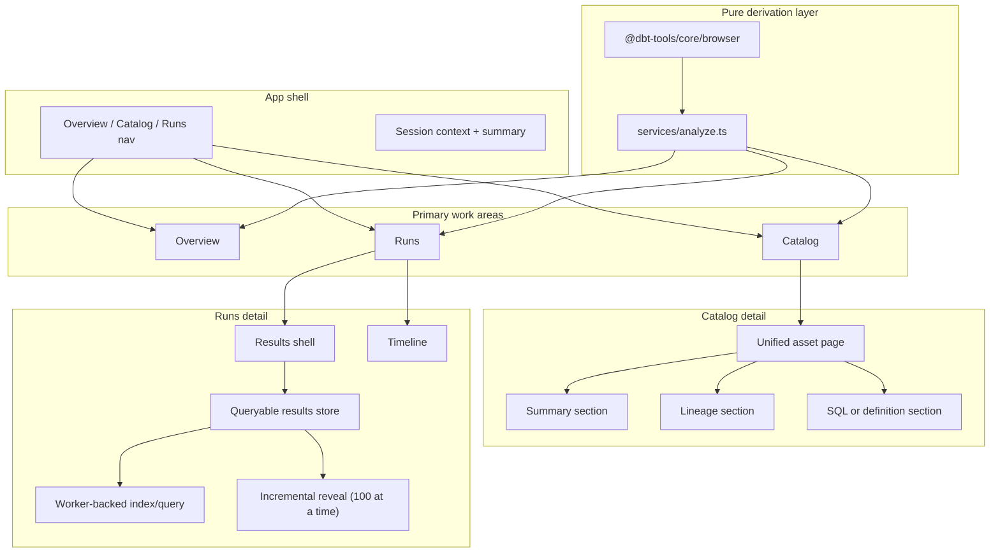

# 18. Hybrid dbt-first catalog and runs workspace for dbt-tools web

Date: 2026-03-24

## Status

Accepted

Depends-on [11. Web workspace MVP for visual dbt analysis](0011-web-workspace-mvp-for-visual-dbt-analysis.md)

Depends-on [16. Responsive design for multi-device support](0016-responsive-design-for-multi-device-support.md)

Depends-on [17. Workflow-first investigation workspace for dbt-tools web](0017-workflow-first-investigation-workspace-for-dbt-tools-web.md)

Supersedes parts of [17. Workflow-first investigation workspace for dbt-tools web](0017-workflow-first-investigation-workspace-for-dbt-tools-web.md)

## Context

ADR-0017 moved the web app toward a workflow-first investigation model. That was the right transition away from a page-by-page artifact viewer, but it still leaves the product framed primarily as an engineer-facing debugger with several peer views competing for attention.

The product direction is now broader:

- the app should remain artifact-first and dbt-native
- the primary audience is a mixed data team, not only data engineers
- users need fast answers to three recurring questions:
  - what is unhealthy in this run?
  - what is this asset and how is it connected?
  - where should I go next to investigate?

Research into benchmark products showed a useful split:

- dbt Docs is the better benchmark for catalog-style asset discovery, metadata comprehension, and lineage navigation
- Elementary is the better benchmark for trust cues, health framing, and triage-oriented workflows

The right direction is not a full observability control plane and not a cosmetic restyle. It is a hybrid workspace that keeps dbt artifacts as the source of truth while presenting them through a clearer catalog-and-runs information architecture.

## Decision

Evolve `@dbt-tools/web` into a **hybrid dbt-first catalog and runs workspace**.

### Product model

1. Keep the product **artifact-first**. The app continues to derive its state from dbt artifacts and local analysis logic rather than live platform APIs.
2. Keep the product **dbt-native**. Terminology, hierarchy, and data model should remain legible to dbt practitioners.
3. Design the UI to be **extensible toward governance and trust metadata** such as owner, tags, criticality, and health, without requiring those fields to exist today.

### Top-level information architecture

Replace the previous multi-view structure with three primary destinations:

1. **Overview** for run posture, bottlenecks, and next actions
2. **Catalog** for asset discovery, metadata inspection, lineage, and SQL
3. **Runs** for execution results and timeline analysis

`Models`, `Tests`, and `Timeline` stop being separate first-class navigation destinations and become sub-surfaces within `Runs`.

The sidebar may still expose familiar workflow labels such as `Assets`, `Lineage`, `Models`, `Tests`, and `Timeline` as grouped child links, provided they map into the `Catalog` and `Runs` architecture rather than reintroducing them as top-level view types.

### Runs detail structure

Runs is the execution-analysis center, but `Models` and `Tests` should not depend on eager visible rendering or eager main-thread filtering of the full result corpus.

For large projects, these result surfaces should use a **queryable results store with incremental revelation**:

- full-corpus counts remain available immediately
- matching rows are revealed in batches as users scroll
- heavy indexing and query work may run off the main thread while preserving the artifact-first model

This keeps the product dbt-native and local-first without tying visible UI cost to total result volume.

Timeline remains part of Runs, but it may expose secondary operational cues beyond raw execution status:

- attached test health may appear alongside execution status to surface “run succeeded but tests failed” cases
- timestamp mode may expose a viewer-controlled timezone selector because timeline inspection is an analysis workflow, not a raw artifact dump

### Catalog detail structure

Catalog is the primary asset-inspection workspace. Selected assets should expose:

- summary metadata
- lineage
- a type-appropriate detail surface

These should be presented as a **unified inspection page with stacked sections**, not as tabbed sub-surfaces.

This keeps discovery and deep inspection in one place instead of forcing users to jump between unrelated top-level pages or mode-switch inside a single asset.

Non-SQL dbt resource types should not be forced through a SQL-shaped detail panel. Metrics and semantic models should render structured definition surfaces using manifest-backed metadata, while models, snapshots, and other SQL-backed resources continue to expose SQL where available.

Lineage should remain useful even for isolated resources. When a selected asset has no related edges, the graph should still render the selected node rather than collapsing into an edge-only empty state.

### Visual direction

The design system should favor **analytical clarity over decorative glassmorphism**:

- stronger hierarchy
- clearer table and panel boundaries
- status color reserved for meaning
- calmer backgrounds and more explicit selected states

### Architecture

The implementation keeps the existing React/Vite stack and analysis model, but reorganizes the shell and view hierarchy:

## Alternatives considered

1. **Visual refresh only**
   Rejected because it would improve appearance without fixing fragmented navigation and weak product framing.

2. **dbt Docs-style catalog-first clone**
   Rejected because it would improve discovery but under-serve run triage and operational investigation.

3. **Elementary-style observability-first workspace**
   Rejected because it over-rotates toward incidents, health scoring, and governance features that do not yet exist in the artifact model.

4. **Full governance/control-plane repositioning**
   Rejected because it would imply backend capabilities and product scope beyond the current project.

## Consequences

### Positive

- The app has a clearer product story for mixed data teams.
- Catalog becomes a durable home for metadata, lineage, and future trust fields.
- Asset inspection becomes a continuous workflow instead of a tabbed mini-app.
- Catalog can represent metrics and semantic models with definition-first detail surfaces instead of SQL placeholders.
- Isolated resources still participate in lineage review through single-node rendering.
- Runs becomes a single execution-analysis center instead of several disconnected destinations.
- Runs results can scale without eager visible rendering of the full corpus.
- Timeline can surface attached test health and viewer-selected timestamp context without abandoning execution-first semantics.
- The redesign stays compatible with the existing artifact-first architecture.

### Negative

- Navigation, routing, and E2E tests must be updated together.
- Some wording and structure from ADR-0017 no longer matches the preferred public product framing.
- The UI now exposes future metadata placeholders that may be empty until richer artifact support is added.

### Mitigations

- Keep the derivation layer in `services/analyze.ts` and shared browser-safe core logic unchanged.
- Implement the IA shift incrementally on top of existing views.
- Render missing governance-oriented fields as neutral placeholders rather than fabricated values.

## References

- `packages/dbt-tools/web/src/App.tsx`
- `packages/dbt-tools/web/src/components/AnalysisWorkspace/AnalysisWorkspace.tsx`
- `packages/dbt-tools/web/src/services/analyze.ts`
- [About dbt docs commands](https://docs.getdbt.com/reference/commands/cmd-docs)
- [Elementary home page](https://www.elementary-data.com/)
- [Elementary data catalog docs](https://docs.elementary-data.com/cloud/features/collaboration-and-communication/catalog)
