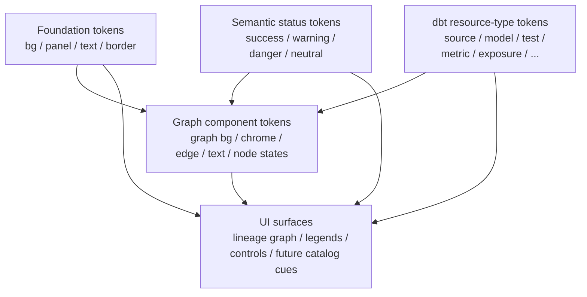

# 19. Standardize color schema for dbt-tools web and adopt dbt resource-type tokens

Date: 2026-03-24

## Status

Accepted

Depends-on [18. Hybrid dbt-first catalog and runs workspace for dbt-tools web](0018-hybrid-dbt-first-catalog-and-runs-workspace-for-dbt-tools-web.md)

## Context

The web app has grown from a basic artifact viewer into a multi-surface workspace with catalog, lineage, run analysis, and overview flows. Its color usage has also grown incrementally:

- shared app surfaces already use global background, panel, text, accent, and status tokens
- lineage graphs introduced their own hardcoded graph surface colors
- lineage type coloring exists, but only as an internal palette in graph code rather than as part of the app design system

This creates two problems:

1. the lineage graph does not consistently communicate dbt resource types in a dbt-native way by default
2. graph colors risk becoming a one-off visual fork from the rest of the app if they are tuned independently

The design goal is not to clone dbt Docs exactly. dbt Docs is the benchmark for resource-type distinction and lineage legibility, but the web app needs its own consistent surface/background system across the broader product.

## Decision

Standardize a shared color schema for `@dbt-tools/web` and promote dbt resource-type colors to first-class design tokens.

### Color architecture

The web app color system will be organized into four layers:

1. foundation surface tokens for backgrounds, panels, borders, and text
2. semantic status tokens for success, warning, failure, and neutral states
3. dbt resource-type tokens for source, seed, snapshot, model, semantic model, metric, exposure, test, macro, operation, and generic nodes
4. graph component tokens for lineage-specific surfaces, edges, text, and control chrome

Graph component tokens should consume the shared system rather than introducing separate ad hoc colors.

### Lineage default behavior

The lineage graph should default to **resource-type coloring** rather than status coloring.

This makes the graph immediately useful for catalog-style reasoning:

- users can scan structure and node classes at a glance
- the graph reads more like dbt Docs
- status and coverage remain available as alternate lenses without becoming the default visual language

### Background and surface direction

The graph background should remain **app-native**, not a copied dbt Docs background.

The graph may still use a darker canvas than the rest of the app when that improves lineage legibility, but those colors must be defined through the shared web token system.

### Architecture

The token flow should work as follows:

## Alternatives considered

1. **Graph-only palette tweak**
   Rejected because it would improve the lineage graph while leaving the app without a coherent color architecture.

2. **Exact dbt Docs visual clone**
   Rejected because dbt Docs is a benchmark for lineage semantics, not a requirement for exact visual parity across the app.

3. **Keep status as the default lineage lens**
   Rejected because status-first coloring is better for triage than for understanding the structure and classes of dbt assets.

4. **Broader full-app rebrand**
   Rejected because the immediate need is color standardization and lineage legibility, not a complete redesign of every surface.

## Consequences

### Positive

- The lineage graph becomes more dbt-native and easier to scan.
- dbt resource-type colors become reusable design primitives instead of graph-only implementation details.
- Graph surfaces can evolve without diverging from the app’s overall visual system.
- Future catalog and governance surfaces have a clearer token foundation.

### Negative

- Existing hardcoded graph colors must be refactored into tokenized values.
- Changing the default lineage lens may alter expectations for users familiar with the previous status-first default.
- Color choices now carry broader architectural weight and should be updated deliberately.

### Mitigations

- Keep status and coverage lenses available as alternate modes.
- Scope the first implementation to lineage and shared tokens before expanding color changes to other surfaces.
- Document the decision here so future visual changes reuse the same rationale.

## References

- `packages/dbt-tools/web/src/index.css`
- `packages/dbt-tools/web/src/lib/analysis-workspace/lineageModel.ts`
- `packages/dbt-tools/web/src/components/AnalysisWorkspace/LineageGraphSurface.tsx`
- [About dbt docs commands](https://docs.getdbt.com/reference/commands/cmd-docs)
