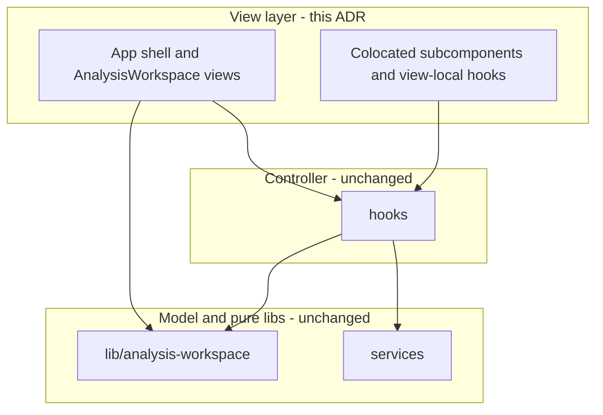
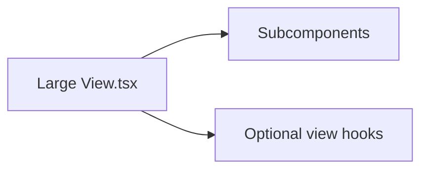

# 21. Strangler-style decomposition for oversized AnalysisWorkspace views

Date: 2026-03-24

## Status

Accepted

Depends-on [15. MVC-style layering for web app](0015-mvc-style-layering-for-web-app.md)

## Context

Several view modules under `packages/dbt-tools/web` grew past a comfortable review size (hundreds to over a thousand lines). Large single files increase merge conflict risk, obscure boundaries between presentation concerns, and make targeted testing harder. ADR-0015 already separates Model (`services/`, `lib/analysis-workspace/`), Controller (`hooks/`), and View (`components/`); the View layer itself had no standard pattern for splitting without reintroducing mixed responsibilities.

We need a repeatable way to break oversized AnalysisWorkspace views into smaller units while preserving behavior and staying aligned with MVC layering.

## Decision

1. **Strangler pattern inside the View layer** — Introduce new colocated files (subcomponents, small UI-only hooks, layout helpers) next to existing views. The original file may temporarily re-export or compose them; imports across the app migrate incrementally until the old monolith is thin or removed.

2. **Colocation rules** — Prefer subfolders when a feature area accumulates multiple files (e.g. `views/overview/`, `lineage/`, `timeline/`). Keep names feature-oriented (`OverviewStatusSection`, `LineageTooltipOverlay`) rather than generic (`Part1`, `Utils2`).

3. **No behavior change in the first pass** — Refactors are mechanical moves (extract component, pass same props). Avoid drive-by logic changes in the same change set as file splits.

4. **Boundary with Model and Controller** — Do not move domain logic out of `lib/analysis-workspace/` or `services/` into view files as part of this pattern. Do not duplicate `hooks/` composition unless extracting clearly view-local UI state (e.g. panel open/closed) into a colocated `useXxxUi` hook.

5. **Optional diagrams** — ADRs may include Mermaid diagrams to illustrate structure; see `.claude/skills/manage-adr/references/mermaid-diagrams.md`.

### Placement within ADR-0015 layers

### Strangler flow for a single view file

## Consequences

### Positive

- Smaller PRs and easier code review for UI changes.
- Clearer ownership of UI sections; fewer accidental edits to unrelated blocks in the same file.
- Aligns with existing tests: pure logic remains in `lib/analysis-workspace` unit tests; E2E covers user-visible flows.

### Negative / mitigations

- More files to navigate; mitigate with consistent folder naming and re-exports during transition.
- Risk of circular imports if subcomponents reach too deep; mitigate by keeping data flow downward from the parent view or shared `shared.tsx` primitives.
