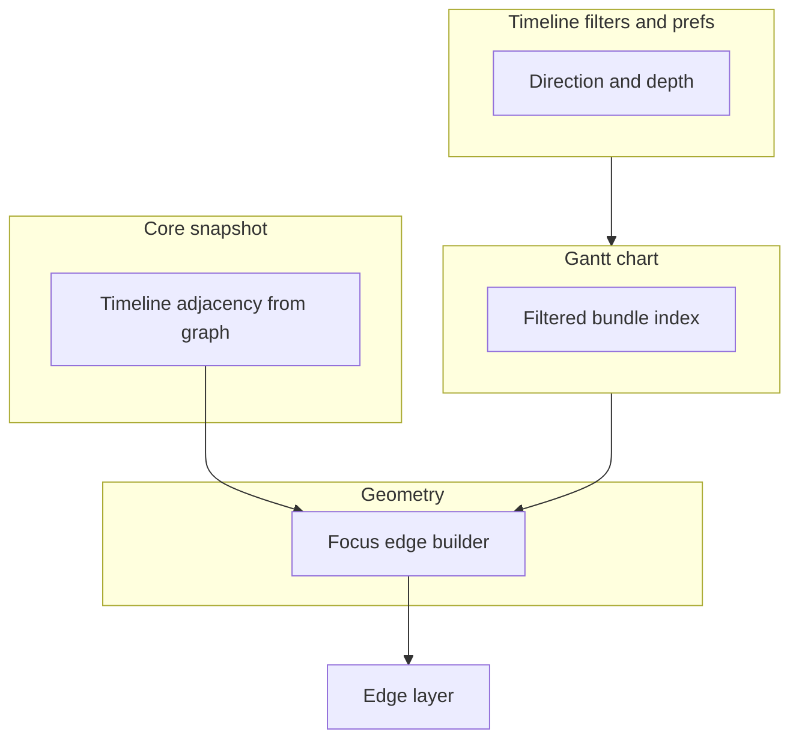

# 23. Symmetric capped focus dependency edges on the execution timeline

Date: 2026-03-25

## Status

Accepted

Depends on [17. Workflow-first investigation workspace for dbt-tools web](0017-workflow-first-investigation-workspace-for-dbt-tools-web.md)

Depends on [18. Hybrid dbt-first catalog and runs workspace for dbt-tools web](0018-hybrid-dbt-first-catalog-and-runs-workspace-for-dbt-tools-web.md)

Related to [15. MVC-style layering for web app](0015-mvc-style-layering-for-web-app.md) (timeline UI and pure geometry helpers live in the web view layer)

Extended by [25. Optional multi-hop capped focus edges on the execution timeline](0025-optional-multi-hop-capped-focus-edges-on-the-execution-timeline.md)

## Context

ADR-0017 positions the timeline as part of an investigation workflow: focused nodes should help users understand **why** a resource matters in the run, not only when it executed. ADR-0018 keeps Runs (including the timeline) as an execution-analysis surface.

In the manifest, dependency direction follows **producer → consumer** (upstream inputs listed on the consumer). The execution timeline draws **one-hop** dependency edges for the **focused** row (selection or hover). Historically:

- **Inbound** edges (neighbors → focus) were shown by default using a **deterministic rank** and a **compact cap** so high-degree nodes stayed readable.
- **Outbound** edges (focus → dependents) were behind a **Dependents** toggle that defaulted **off**.

That asymmetry was easy to read as broken graph data: focusing a **producer** hid the link to a **consumer** that still appeared when focusing the consumer (inbound from the producer). At the same time, turning on all outbound edges for high **fan-out** models would clutter the canvas.

## Decision

1. **Default dependents on**
   New sessions and “clear timeline filters” restore defaults so **both** directions of
   direct dependency context are available without extra hunting (see workspace
   preferences / timeline filter reset behavior in `@dbt-tools/web`).

2. **Downstream parity with upstream**
   When dependents are included, outbound neighbors on the visible timeline are **ranked**
   and **capped** using the same structural idea as inbound edges (shared cap constants in
   the timeline Gantt stack). Optional “show all” behavior may exist at the **geometry**
   layer without forcing clutter in the default UI.

3. **Geometry**
   Focus-edge geometry produces ranked, capped edges with per-edge `hop` and `leg`
   metadata; it composes with **extended** (multi-hop) mode in
   [ADR 0025](0025-optional-multi-hop-capped-focus-edges-on-the-execution-timeline.md).
   Implementation: `@dbt-tools/web` timeline Gantt modules (geometry, constants, edge
   layer).

4. **Tooltip hints**
   Focus-hover **Dependency context** explains caps, neighbors missing from the visible
   bundle, extended-mode state, and truncation—implemented alongside the same Gantt stack.

5. **Data contract**
   Edges connect only resources present in the **current filtered** timeline bundle.
   **Adjacency** is derived from the manifest graph via the **core analysis snapshot**
   (not ad hoc in the web artifact loader).

### Non-decisions

- Ranking and caps are **display-only**; they do not change dbt build order or manifest semantics.
- This ADR is the contract for **one-hop** focus edges (defaults, ranking, caps). **Capped** multi-hop segments (`hop ≥ 2`) are documented in [ADR 0025](0025-optional-multi-hop-capped-focus-edges-on-the-execution-timeline.md) (default **on**; users may turn **Extended deps** off in the legend).

### Architecture

## Consequences

- **Easier mental model**: Focusing either end of a direct manifest edge tends to reveal that edge when both rows are visible, reducing false “missing edge” reports.
- **Bounded clutter**: High fan-out nodes stay usable in the default compact mode; power users can expand via **All upstream** / **All downstream**.
- **More legend surface**: Users who want a minimal canvas can still turn **Dependents** off.
- **Maintenance**: Keep caps, ranking keys, filter defaults, geometry, tooltips, and
  edge rendering in `@dbt-tools/web` aligned; colocated tests in the timeline Gantt stack.

## Amendment (2026-03-30)

**Editorial (decision-first):** Replaced path-heavy Decision text and the prior amendment
with the version above. Filter state is expressed as **direction** and **depth** (not the
older boolean flag names); defaults and reset behavior live in workspace preferences and
timeline controls. **Numeric caps** remain in the Gantt constants module. Geometry may
still support “show all neighbors” options that the default UI does not surface.
