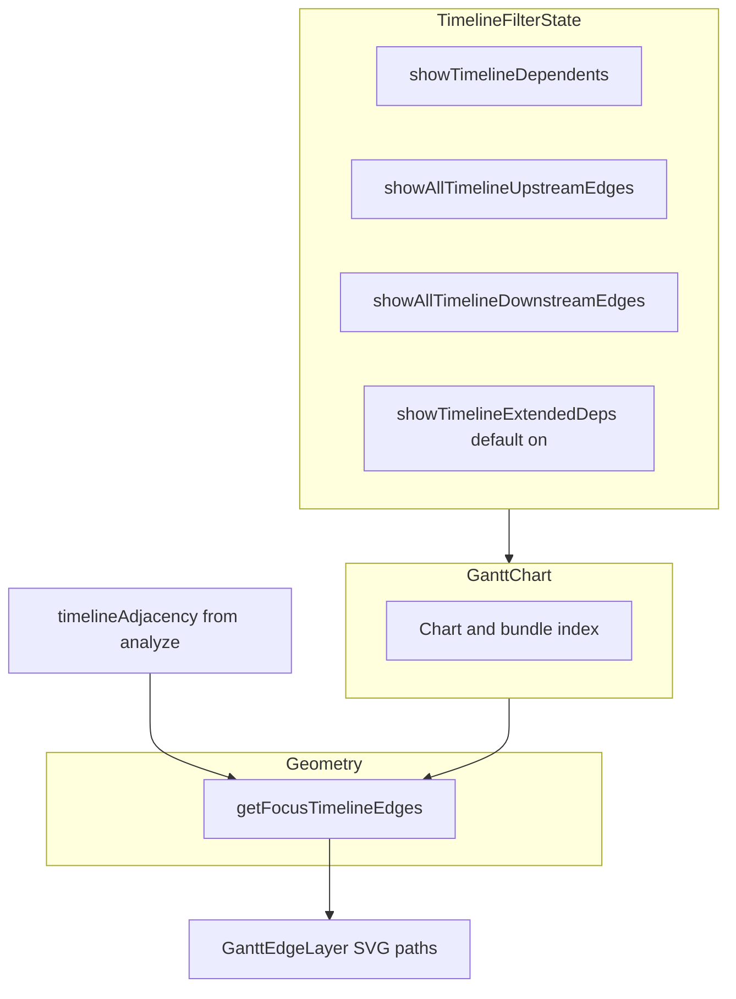

# 23. Symmetric capped focus dependency edges on the execution timeline

Date: 2026-03-25

## Status

Accepted

Depends on [17. Workflow-first investigation workspace for dbt-tools web](0017-workflow-first-investigation-workspace-for-dbt-tools-web.md)

Depends on [18. Hybrid dbt-first catalog and runs workspace for dbt-tools web](0018-hybrid-dbt-first-catalog-and-runs-workspace-for-dbt-tools-web.md)

Related to [15. MVC-style layering for web app](0015-mvc-style-layering-for-web-app.md) (timeline UI and pure geometry helpers live in the web view layer)

Extended by [25. Optional multi-hop capped focus edges on the execution timeline](0025-optional-multi-hop-capped-focus-edges-on-the-execution-timeline.md)

## Context

ADR-0017 positions the timeline as part of an investigation workflow: focused nodes should help users understand **why** a resource matters in the run, not only when it executed. ADR-0018 keeps Runs (including the timeline) as an execution-analysis surface.

In the manifest, dependency direction follows **producer → consumer** (upstream inputs listed on the consumer). The execution timeline draws **one-hop** dependency edges for the **focused** row (selection or hover). Historically:

- **Inbound** edges (neighbors → focus) were shown by default using a **deterministic rank** and a **compact cap** so high-degree nodes stayed readable.
- **Outbound** edges (focus → dependents) were behind a **Dependents** toggle that defaulted **off**.

That asymmetry was easy to read as broken graph data: focusing a **producer** hid the link to a **consumer** that still appeared when focusing the consumer (inbound from the producer). At the same time, turning on all outbound edges for high **fan-out** models would clutter the canvas.

## Decision

1. **Default dependents on**  
   New sessions and “clear timeline filters” reset `showTimelineDependents` to **true** so producer focus shows direct dependents without extra legend hunting (`App.tsx`, `ResultsView.tsx`).

2. **Downstream parity with upstream**  
   When dependents are enabled, outbound neighbors on the visible timeline are **ranked** and **capped** using the same structural idea as inbound edges (`TIMELINE_MAX_DOWNSTREAM_EDGES`, aligned with the upstream cap constant). A legend toggle **`showAllTimelineDownstreamEdges`** mirrors **All upstream** (`TimelineFilterState`, `GanttLegend.tsx`, `GanttChart.tsx`).

3. **Geometry and options**  
   `getFocusTimelineEdges` in `edgeGeometry.ts` returns `{ edges, extendedTruncated }` and takes options including `showAllDownstream`, `maxDownstreamEdges`, and `extendedDeps` (see [ADR 0025](0025-optional-multi-hop-capped-focus-edges-on-the-execution-timeline.md)). Each `FocusTimelineEdge` carries `hop` (1 for direct neighbors) and `leg` (`upstream` | `downstream`). Shared capping uses `applyNeighborCap`. Outbound order uses `rankOutboundNeighborIds` (sibling-test grouping where applicable, resource-type rank, temporal proximity to the focus end, then id). `countOutboundOnTimeline` supports hints and tests.

4. **Tooltip hints**  
   When the user hovers the focused row, **Dependency context** in the tooltip is built by [`buildDependencyContextHint`](../../packages/dbt-tools/web/src/components/AnalysisWorkspace/timeline/gantt/edgeGeometry.ts) (wired through [`useGanttFocusEdges.ts`](../../packages/dbt-tools/web/src/components/AnalysisWorkspace/timeline/gantt/useGanttFocusEdges.ts)): direct-neighbor caps, neighbors not on the timeline, extended-mode reminders, and extended truncation (see ADR 0025).

5. **Data contract unchanged**  
   Edges are only drawn between ids present in the **current filtered** timeline bundle index. Adjacency remains `timelineAdjacency` from `services/analyze.ts`.

### Non-decisions

- Ranking and caps are **display-only**; they do not change dbt build order or manifest semantics.
- This ADR is the contract for **one-hop** focus edges (defaults, ranking, caps). **Capped** multi-hop segments (`hop ≥ 2`) are documented in [ADR 0025](0025-optional-multi-hop-capped-focus-edges-on-the-execution-timeline.md) (default **on**; users may turn **Extended deps** off in the legend).

### Architecture

## Consequences

- **Easier mental model**: Focusing either end of a direct manifest edge tends to reveal that edge when both rows are visible, reducing false “missing edge” reports.
- **Bounded clutter**: High fan-out nodes stay usable in the default compact mode; power users can expand via **All upstream** / **All downstream**.
- **More legend surface**: Users who want a minimal canvas can still turn **Dependents** off.
- **Maintenance**: Changes to cap sizes, rank keys, or filter defaults should stay aligned with tests in `edgeGeometry.test.ts`, tooltip copy in `useGanttFocusEdges.ts`, and focus-edge rendering in `GanttEdgeLayer.tsx`.
