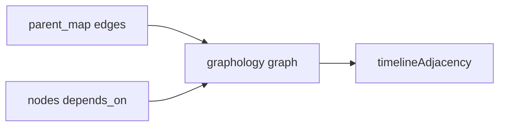

# 24. Union parent_map and depends_on for ManifestGraph edges

Date: 2026-03-26

## Status

Accepted

Related to [23. Symmetric capped focus dependency edges on the execution timeline](0023-symmetric-capped-focus-dependency-edges-on-the-execution-timeline.md) (timeline remains **one-hop** with caps; this ADR fixes **direct** edge completeness in the underlying graph)

Depends on [2. Use graphology for graph management](0002-use-graphology-for-graph-management.md)

## Context

The execution timeline builds `timelineAdjacency` from graphology **inbound/outbound** neighbors ([`analyze.ts`](../../packages/dbt-tools/web/src/services/analyze.ts)). Focused-row edges are **one-hop** only ([ADR 0023](0023-symmetric-capped-focus-dependency-edges-on-the-execution-timeline.md)).

[`ManifestGraph.addEdges`](../../packages/dbt-tools/core/src/analysis/manifest-graph.ts) historically did one of two things:

- If `manifest.parent_map` exists: add edges from `parent_map` only, then **return** (skip `depends_on` on nodes, exposures, and metrics).
- Otherwise: add edges from `depends_on` on nodes (and exposure/metric depends).

Many dbt manifests ship **both** `parent_map` and per-node `depends_on`. For **relationship tests** and similar nodes, `parent_map` can list a **subset** of refs while `depends_on.nodes` lists **all** direct node dependencies. Skipping `depends_on` produced **too few** inbound edges for those nodes, so the timeline showed **missing upstream** dependency lines even though the manifest declared the refs.

## Decision

1. When `parent_map` is present, still run **`addEdgesFromParentMap`** first.
2. **Always** run afterward: `addEdgesFromNodeDependsOn`, `addEdgesFromExposureDependsOn`, and `addEdgesFromMetricDependsOn`.
3. Rely on existing `!graph.hasEdge(depId, childId)` checks to avoid duplicate directed edges when the same dependency appears in both structures.

## Consequences

- **Positive:** Direct dependency lists match dbt’s declared `depends_on` refs; timeline and lineage see complete **one-hop** adjacency for focused nodes (subject to timeline caps and filters).
- **Positive:** Relationship tests and other multi-ref nodes can show all expected upstream edges when those refs exist as graph nodes.
- **Tradeoff:** Slightly more edges when both structures overlap; duplicates are suppressed by `hasEdge`.
- **Non-goals:** This does **not** add **multi-hop** dependency bands on the timeline; ADR 0023 still governs UI scope. Users needing transitive views should use **Lineage** or a future ADR.
- **Mitigation if needed:** If any edge from `depends_on` is ever deemed invalid for a non-test node, narrow the merge (e.g. tests only) and document here—in the common case, `depends_on` is the authoritative direct ref list.
