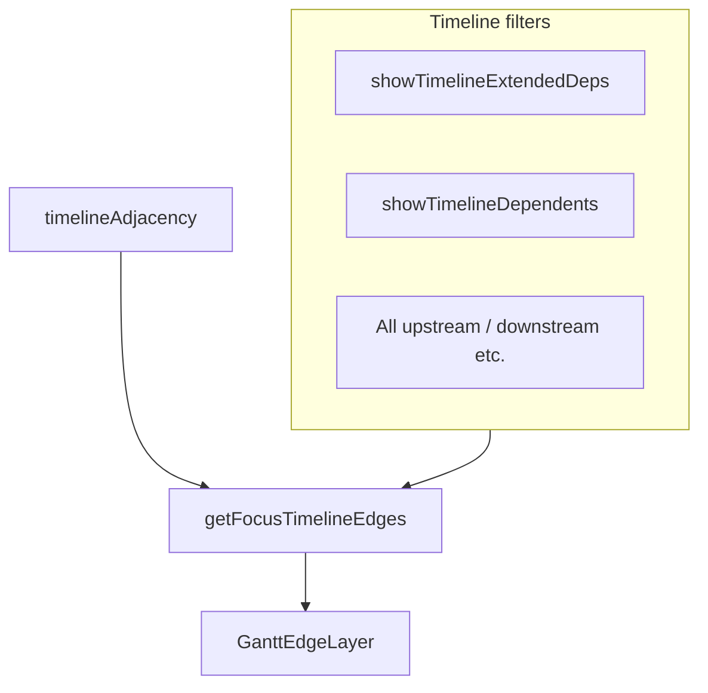

# 25. Optional multi-hop capped focus edges on the execution timeline

Date: 2026-03-26

## Status

Accepted

Amends [23. Symmetric capped focus dependency edges on the execution timeline](0023-symmetric-capped-focus-dependency-edges-on-the-execution-timeline.md)

Related to [15. MVC-style layering for web app](0015-mvc-style-layering-for-web-app.md)

Amends [23. Symmetric capped focus dependency edges on the execution timeline](0023-symmetric-capped-focus-dependency-edges-on-the-execution-timeline.md)

## Context

Users often need **transitive** context on the execution timeline (e.g. staging model → mart → test) without switching to Lineage. [ADR 0023](0023-symmetric-capped-focus-dependency-edges-on-the-execution-timeline.md) standardized **one-hop**, **capped** focus edges; multi-hop was intentionally excluded from that ADR’s default product surface until this decision added an **opt-in** mode.

Drawing unbounded transitive edges would clutter the canvas and risk performance on large runs.

## Decision

1. **Default unchanged**  
   With **Extended deps** off, behavior matches ADR 0023: one-hop upstream (ranked/capped) and optional one-hop downstream with the same caps and toggles.

2. **Optional extended mode**  
   New filter `showTimelineExtendedDeps` (default **false** in `App.tsx` and when clearing timeline filters in `ResultsView.tsx`). When **true**, `getFocusTimelineEdges` merges **extra** directed edges for **hop ≥ 2** only, discovered by BFS over [`timelineAdjacency`](../../packages/dbt-tools/web/src/services/analyze.ts) (inbound / outbound neighbor lists), restricted to ids present in the current filtered bundle index. Extended **downstream** segments are collected only when **Dependents** is on (`includeDownstream`), same as one-hop outbound. Duplicate `(fromId, toId)` keys dedupe with **one-hop winning**.

3. **Caps** (see [`constants.ts`](../../packages/dbt-tools/web/src/components/AnalysisWorkspace/timeline/gantt/constants.ts))
   - `TIMELINE_EXTENDED_MAX_HOPS` = **3** (maximum hop index for extended segments).
   - `TIMELINE_EXTENDED_MAX_EDGES_PER_DIRECTION` = **12** (separate budget for extended upstream vs extended downstream).

   One-hop edges continue to use `TIMELINE_MAX_UPSTREAM_EDGES` / `TIMELINE_MAX_DOWNSTREAM_EDGES` and **All upstream** / **All downstream** as today. Extended edges do **not** consume those caps.

4. **Styling**  
   In [`GanttEdgeLayer.tsx`](../../packages/dbt-tools/web/src/components/AnalysisWorkspace/timeline/gantt/GanttEdgeLayer.tsx), `focusEdgeVisualProps` keys off `hop` and `leg` on [`FocusTimelineEdge`](../../packages/dbt-tools/web/src/components/AnalysisWorkspace/timeline/gantt/edgeGeometry.ts): hop ≥ 2 uses thinner stroke, lower opacity, tighter dash patterns than one-hop, with upstream extended strokes using the slate marker and downstream extended using the accent marker (parallel to secondary vs downstream one-hop).

5. **Hints**  
   When `extendedTruncated` is true (per-direction extended cap hit), hover copy appends **“Extended dependency lines may be truncated by caps.”** ([`useGanttFocusEdges.ts`](../../packages/dbt-tools/web/src/components/AnalysisWorkspace/timeline/gantt/useGanttFocusEdges.ts)), in addition to any one-hop cap lines from ADR 0023.

6. **Relationship to ADR 0023**  
   Default timeline behavior remains one-hop unless the user enables **Extended deps**. ADR 0023’s non-decisions now state that multi-hop is covered here as an explicit opt-in.

## Consequences

- **Positive:** Focused investigation can see staging → mart chains when both appear on the filtered timeline.
- **Positive:** Defaults stay readable; power users opt in.
- **Tradeoff:** `FocusTimelineEdge` carries `hop` and `leg` on every edge; render and tests must stay aligned.
- **Non-goals:** Full project transitive closure, unbounded hops, or pixel-level E2E for edge appearance.
