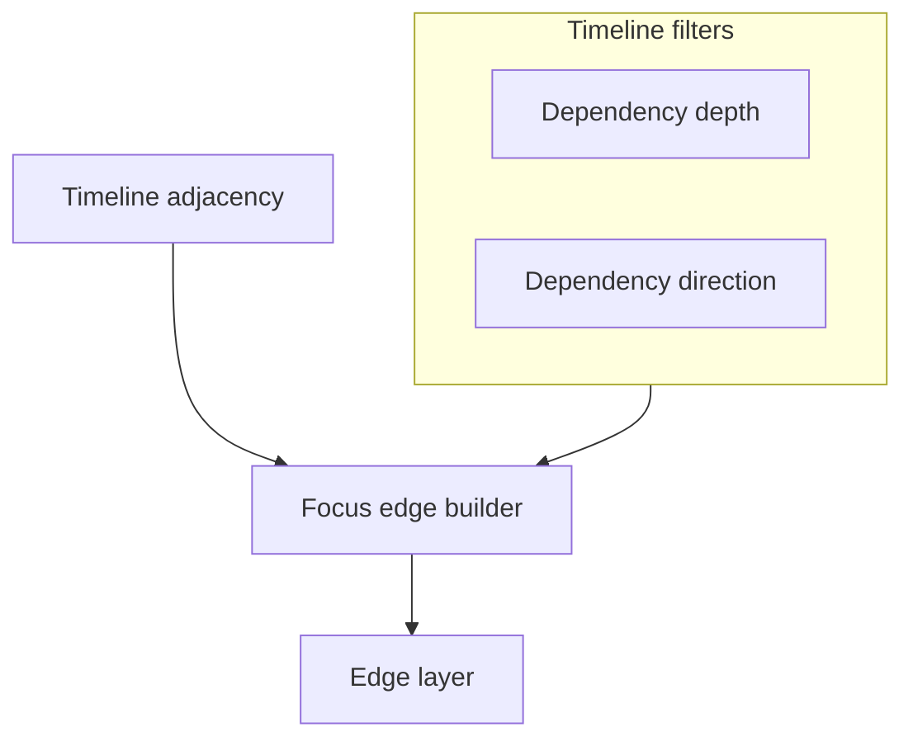

# 25. Optional multi-hop capped focus edges on the execution timeline

Date: 2026-03-26

## Status

Accepted

Amends [23. Symmetric capped focus dependency edges on the execution timeline](0023-symmetric-capped-focus-dependency-edges-on-the-execution-timeline.md)

Related to [15. MVC-style layering for web app](0015-mvc-style-layering-for-web-app.md)

## Context

Users often need **transitive** context on the execution timeline (e.g. staging model → mart → test) without switching to Lineage. [ADR 0023](0023-symmetric-capped-focus-dependency-edges-on-the-execution-timeline.md) standardized **one-hop**, **capped** focus edges; multi-hop was intentionally excluded from that ADR’s default product surface until this decision added a **capped** multi-hop mode. **Extended deps** now defaults **on** so transitive-on-timeline context is visible without hunting the legend, while caps and timeline scoping keep cost bounded.

Drawing unbounded transitive edges would clutter the canvas and risk performance on large runs.

## Decision

1. **With Extended deps off**  
   Behavior matches ADR 0023 for the drawn set: one-hop upstream (ranked/capped) and optional one-hop downstream with the same caps and toggles (no hop ≥ 2 segments).

2. **Extended mode (default on)**  
   **Multi-hop** segments are **on by default** via filter **depth** (not a separate
   boolean wired only from root app components): clearing timeline filters restores the
   same default. When extended mode is active, the focus-edge builder merges **extra**
   directed edges for **hop ≥ 2** via BFS over **timeline adjacency** from the core
   snapshot, restricted to ids in the current filtered bundle. Extended **downstream**
   segments follow the same **dependents** inclusion rules as one-hop outbound. Duplicate
   edge keys **dedupe with one-hop winning**.

3. **Caps** (normative numbers; implementation in `@dbt-tools/web` Gantt constants)
   - `TIMELINE_EXTENDED_MAX_HOPS` = **3** (maximum hop index for extended segments).
   - `TIMELINE_EXTENDED_MAX_EDGES_PER_DIRECTION` = **12** (separate budget for extended upstream vs extended downstream).

   One-hop edges keep their own caps and do not share the extended budgets.

4. **Styling**  
   Extended segments use distinct stroke weight, opacity, and dash patterns from
   one-hop; upstream vs downstream extended styling parallels the one-hop palette story.

5. **Hints**  
   Tooltip **Dependency context** covers one-hop caps, off-timeline neighbors, when
   extended mode is off, and extended truncation—implemented in the same Gantt stack as
   ADR 0023.

6. **Relationship to ADR 0023**  
   **Extended deps** defaults **on** for richer focus context; users who want one-hop-only on the chart disable it in the legend. ADR 0023 remains the contract for one-hop ranking and caps; multi-hop caps and semantics live here.

## Consequences

- **Positive:** Focused investigation can see staging → mart chains when both appear on the filtered timeline.
- **Tradeoff:** Default-on extended adds more SVG edges on large graphs; caps and opt-out mitigate clutter.
- **Tradeoff:** `FocusTimelineEdge` carries `hop` and `leg` on every edge; render and tests must stay aligned.
- **Non-goals:** Full project transitive closure, unbounded hops, or pixel-level E2E for edge appearance.

## Amendment (2026-03-30)

**Editorial (decision-first):** Trimmed path-heavy Decision bullets and the prior
amendment. Extended mode is driven by **depth** and **clamping** in the web Gantt control
mapping; adjacency is built in the **core analysis snapshot**. Caps **3** and **12** in
Decision §3 remain the documented limits.
