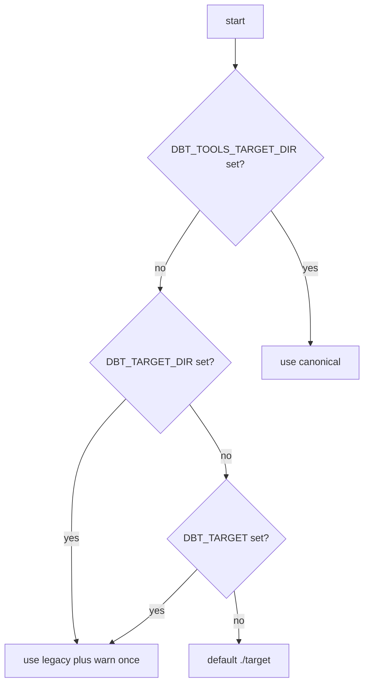

# 28. DBT*TOOLS* prefix for dbt-tools environment variables

Date: 2026-03-29

## Status

Accepted

Amends [12. Optional default dbt target directory for web dev server](0012-optional-default-dbt-target-directory-for-web-dev-server.md)

Amends [13. DBT_TARGET as primary dev source hide upload when preload succeeds](0013-dbt-target-as-primary-dev-source-hide-upload-when-preload-succeeds.md)

Amends [14. Auto-reload dbt artifacts when DBT_TARGET files change](0014-auto-reload-dbt-artifacts-when-dbt-target-files-change.md)

## Context

dbt-tools used unprefixed names such as `DBT_TARGET`, `DBT_DEBUG`, `DBT_WATCH`, and `DBT_TARGET_DIR` (CLI/core). Names starting with `DBT_` read like official dbt Core or Cloud configuration and collide conceptually with dbt’s own “target” language (profile target vs. `target/` directory). That creates avoidable confusion and support cost.

ADR-0012 through ADR-0014 documented **behavior** (dev middleware, preload UX, file watch). They referred to the historical variable names; this decision **does not change** those behaviors—only how configuration is named and discovered.

## Decision

1. **Canonical namespace**: All dbt-tools-owned process environment variables use the prefix `DBT_TOOLS_`.

2. **Unified artifacts directory**: One canonical variable, `DBT_TOOLS_TARGET_DIR`, replaces the split between web (`DBT_TARGET`) and core/CLI (`DBT_TARGET_DIR`) for “path to the dbt `target/` directory containing artifacts.”

3. **Other web dev toggles** (Vite middleware only):
   - `DBT_TOOLS_DEBUG` — set to `1` for server-side debug logging (replaces `DBT_DEBUG`).
   - `DBT_TOOLS_WATCH` — set to `0` to disable file watching (replaces `DBT_WATCH`; default remains on when unset).
   - `DBT_TOOLS_RELOAD_DEBOUNCE_MS` — debounce for reload notifications (replaces `DBT_RELOAD_DEBOUNCE_MS`).

4. **Backward compatibility**: Implementations read canonical variables first, then legacy `DBT_*` names. When only a legacy name is used, emit a **one-time** `console.warn` per legacy key naming the replacement.

5. **Single module**: Resolution and deprecation warnings live in `@dbt-tools/core` (`config/dbt-tools-env.ts`) so CLI and the Vite plugin share one precedence story. Do not re-export this module from `@dbt-tools/core/browser`.

### Resolution flow (artifacts directory)

## Consequences

- **Positive**: Users can distinguish dbt-tools configuration from dbt’s own environment variables; one directory variable works for web dev and CLI in the same shell.
- **Documentation**: READMEs, CONTRIBUTING, and in-app hints must show canonical names; legacy names remain documented as deprecated.
- **Removal**: Legacy reads may be removed in a future major or minor release after a deprecation window; track with a follow-up ADR or changelog if dropped.
- **Risk**: Existing scripts and muscle memory using `DBT_TARGET` keep working but see a warning until updated.
