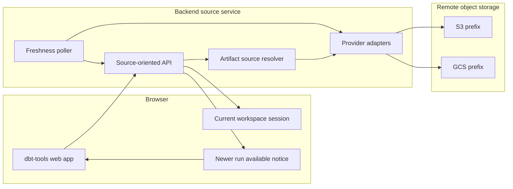

# 29. Remote object storage artifact sources and auto-reload

Date: 2026-03-29

## Status

Accepted

Depends-on [6. Artifact-first and agent-compatible positioning of dbt-tools](0006-artifact-first-agent-first-positioning-of-dbt-tools.md)

Depends-on [15. MVC-style layering for web app](0015-mvc-style-layering-for-web-app.md)

Related [14. Auto-reload dbt artifacts when DBT_TARGET files change](0014-auto-reload-dbt-artifacts-when-dbt-target-files-change.md)

## Context

**Terminology:** For **remote** managed sources, “freshness” and “reload” mean the backend **detects** newer complete artifact pairs (polling metadata) and the UI **notifies** the user; the open workspace **switches only after explicit confirmation**. That differs from **local preload**, where ADR-0014’s file-watch path can re-analyze immediately without a confirmation step.

ADR-0014 established a local-development reload loop for artifacts served from `DBT_TOOLS_TARGET_DIR` through the Vite dev server. That solves the laptop workflow, but a common dbt-tools use case is different: scheduled dbt jobs publish artifacts to remote object storage, and users want the web app to stay aligned with the latest successful run without manual file upload.

The strategic direction in ADR-0006 already points toward artifact-first, offline-friendly workflows that operate on archived artifacts, including runs stored in S3 or GCS. The current web architecture in ADR-0015 also gives us a clean separation between view, controller, and service concerns, which is the right baseline for adding non-local artifact sources.

We considered several ways to extend the web app:

| Approach                                                                        | Score | Notes                                                                                                                         |
| ------------------------------------------------------------------------------- | ----: | ----------------------------------------------------------------------------------------------------------------------------- |
| Browser-direct fixed URLs, manual refresh                                       |    48 | Simple, but weak UX and poor fit for private buckets.                                                                         |
| Browser-direct provider SDK auth                                                |    34 | Pushes cloud auth into the client and increases security/ops complexity.                                                      |
| Server-mediated fixed object keys with polling                                  |    71 | Viable, but assumes overwrites and does not fit append-only scheduled runs well.                                              |
| Server-mediated prefix discovery with metadata polling and notify-before-switch |    89 | Best fit for scheduled uploads, private buckets, and safe remote freshness (detect + notify; user confirms before switching). |
| Event/webhook-driven remote reload                                              |    62 | Strong eventual architecture, but too much infrastructure for the first decision.                                             |

The key forces are:

- Private buckets are common, so the browser should not need cloud credentials.
- Scheduled jobs often write new run-specific prefixes instead of overwriting one stable object key.
- `manifest.json` and `run_results.json` must be treated as one logical artifact pair.
- Local development and remote scheduled-run workflows need different reload behavior.

## Decision

We extend the web app with a production-capable remote artifact source architecture built around a backend-owned, provider-agnostic source adapter model.

### Source modes

The app recognizes three conceptual artifact source modes:

1. **Upload**: Browser-supplied artifacts for ad hoc local analysis.
2. **Local preload**: The existing dev-only source backed by `DBT_TOOLS_TARGET_DIR`.
3. **Remote managed source**: A backend-mediated source that resolves artifacts from remote object storage.

### Remote source contract

A configured remote source represents a storage location as **bucket/container + prefix**, not as fixed object URLs. The backend is responsible for discovering the latest complete `manifest.json` and `run_results.json` pair under that prefix and exposing that pair to the browser as one logical current run.

### Backend ownership and provider isolation

The backend owns all storage access for remote sources. In v1:

- The browser never receives S3 or GCS credentials.
- The browser never calls S3 or GCS APIs directly.
- Provider-specific concerns stay behind a server-side adapter boundary.

The server-side architecture includes one local adapter and remote adapters for S3 and GCS, all conforming to one shared artifact-source contract.

### Completeness and switching invariants

The system must preserve these invariants:

1. `manifest.json` and `run_results.json` are resolved as one run-scoped pair.
2. The app must never combine artifacts from different runs.
3. A newly discovered remote run is not eligible for use until the backend confirms a complete pair is available.
4. The browser sees a storage-agnostic source model; it does not reason about S3- vs GCS-specific metadata.

### Freshness and reload behavior

Remote freshness is detected by backend polling of provider metadata or version markers, such as ETag, generation, or last-modified timestamps. The decision is intentionally provider-agnostic: the invariant is periodic freshness checks against stable object version signals, not a provider-specific API shape.

Remote reload behavior differs from local development:

- **Local preload** keeps the existing immediate reload loop from ADR-0014.
- **Remote managed sources** detect when a newer complete run becomes available, notify the user, and switch only after user confirmation.

This keeps the remote workflow safe for active investigations while still surfacing fresh scheduled-run output.

### Browser-facing server capabilities

The backend exposes a source-oriented interface that lets the browser:

- fetch the currently resolved artifact pair,
- read source status and freshness information,
- learn that a newer run is available,
- request a switch to that newer run.

Exact endpoint paths, payload schemas, and wire formats are implementation details and stay out of this ADR.

### Architecture

This diagram shows the conceptual data flow for remote managed sources.

## Consequences

**Positive:**

- Extends the web app from local-dev convenience to scheduled-run monitoring on archived artifacts.
- Keeps cloud credentials and provider-specific logic out of the browser.
- Matches append-only run publication patterns better than fixed-object overwrites.
- Preserves investigation safety by avoiding automatic session replacement for remote updates.
- Creates one storage-agnostic source model that can support future providers and future history features.

**Negative / risks:**

- Requires a backend component beyond the current Vite dev middleware path.
- Polling adds control-plane cost and staleness windows compared with push-based notifications.
- Run discovery rules can become subtle when teams publish artifacts with inconsistent prefix layouts.
- Users now experience different reload semantics for local and remote sources.

**Mitigations:**

- Keep the source contract provider-agnostic and test it with local, S3, and GCS adapters.
- Treat pair completeness as a hard invariant so partial uploads do not surface in the app.
- Make remote-source status visible in the UI so users understand whether they are viewing the current run or a newer run is pending.

## Alternatives considered

- **Browser-direct fixed URLs with manual refresh**: Rejected because it handles private storage poorly and gives a weak scheduled-run experience.
- **Browser-direct provider SDK authentication**: Rejected because it moves secret and policy complexity into the client.
- **Server-mediated fixed object keys with polling**: Rejected as the default because many scheduled pipelines publish run-specific objects rather than overwriting stable keys.
- **Event/webhook-driven refresh**: Deferred because it requires more infrastructure coupling than the first remote-source architecture needs.

## References

- [ADR-0006](0006-artifact-first-agent-first-positioning-of-dbt-tools.md) — strategic artifact-first positioning, including archived artifacts in S3/GCS
- [ADR-0014](0014-auto-reload-dbt-artifacts-when-dbt-target-files-change.md) — local dev reload semantics that remain unchanged
- [ADR-0015](0015-mvc-style-layering-for-web-app.md) — web layering baseline for adding remote source services and controllers
