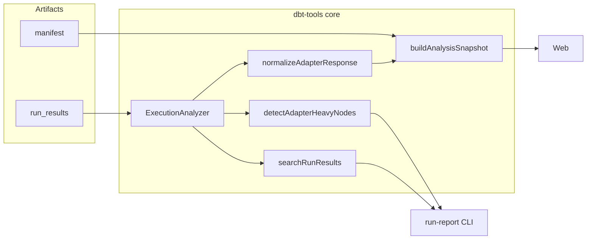

# 30. Adapter response metrics in analysis snapshot and run-report

Date: 2026-03-30

## Status

Accepted

Extends [7. Bottleneck detection via run results search](0007-bottleneck-detection-via-run-results-search.md)

## Context

dbt persists each node’s warehouse feedback under `run_results.results[].adapter_response` as an untyped object. Shapes differ by adapter (for example BigQuery may report `bytes_processed`, `slot_ms`, and `job_id`; others may report `query_id`, `rows_affected`, or an empty object). Many runs include `{}` for every row, so consumers must treat metrics as optional and best-effort.

The web analyzer and CLI already summarize wall-clock execution time and bottlenecks ([ADR 0007](0007-bottleneck-detection-via-run-results-search.md)). Teams also need **cost- and capacity-adjacent** signals from the same artifacts without re-querying the warehouse. The manifest already exposes `metadata.adapter_type` as `warehouseType` in the analysis snapshot, which helps labeling but must not be the only signal—keys present in `adapter_response` should drive UI and CLI behavior so mislabeled adapter types still work.

## Decision

1. **Normalization in `@dbt-tools/core`:** Add a small, pure module that narrows `unknown` / `adapter_response` into a typed **`AdapterResponseMetrics`** object with optional numeric and string fields (finite numbers and non-empty strings only) plus a **`rawKeys`** list for debugging. Do not tighten `dbt-artifacts-parser` schemas; keep adapter variance at the tools layer.

2. **Attach metrics on `NodeExecution`:** `ExecutionAnalyzer.getNodeExecutions()` enriches each row when the parsed result has a non-empty `adapter_response`. Empty objects omit `adapterMetrics` to limit snapshot size.

3. **Snapshot contract:** `ExecutionRow` carries the same optional `adapterMetrics`. **`adapterTotals`** on `AnalysisSnapshot` aggregates sums and `nodesWithAdapterData` in one pass for overview copy without rescanning rows in the browser.

4. **Search and ranking:** Extend `RunResultsSearchCriteria` with optional adapter thresholds and sorts. Add **`detectAdapterHeavyNodes`** (separate from ADR 0007’s time-based `detectBottlenecks`) to rank by `bytes_processed`, `slot_ms`, or `rows_affected` with percentage of total reported metric mass.

5. **CLI and web:** `run-report` gains optional flags for human and JSON adapter summaries and top-N by metric. The Runs view shows optional columns and sort modes when any execution has adapter metrics; search text includes query/job identifiers.

## Consequences

**Positive:** One normalization path feeds CLI, JSON export, and web; wall-clock bottlenecks remain unchanged; metrics are testable with real `run_results` fixtures. In the web Runs lens, adapter metric columns default on when any execution has normalized adapter data (`adapterMetricsHasData`); `adapter=0` in the URL opts out for quieter tables and shareable links.

**Negative / risks:** Metrics are not comparable across warehouses without human judgment; totals can double-count if semantics of `bytes_processed` differ by operation type; large `rawKeys` only—no full raw blob in rows by default.

## Alternatives considered

- **Strict per-adapter TypeScript unions:** Rejected—upstream dbt and adapters evolve; codegen would churn and still miss edge cases.
- **Fold adapter ranking into `detectBottlenecks`:** Rejected for the first iteration to keep ADR 0007 behavior and tests stable; a dedicated function keeps semantics clear.
- **Browser-only parsing:** Rejected—duplicates logic and drifts from CLI output.

## References

- dbt artifact typing: `dbt-artifacts-parser` run_results v6 `adapter_response` map type.
- Related: [ADR 0007](0007-bottleneck-detection-via-run-results-search.md) (wall-clock search and bottlenecks).

## Architecture

