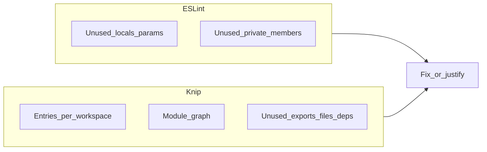

# 31. Knip and ESLint layers for monorepo dead-code detection

Date: 2026-03-30

## Status

Accepted

Complements [8. Stricter ESLint complexity rules for AI agent feedback](0008-stricter-eslint-complexity-rules-for-ai-agent-feedback.md) and [9. Replace eslint-for-ai with popular ESLint plugins](0009-replace-eslint-for-ai-with-popular-eslint-plugins.md)

Supports [10. Per-package coverage breakdown and fixture-based CLI tests for agent feedback](0010-per-package-coverage-breakdown-and-fixture-based-cli-tests-for-agent-feedback.md)

## Context

We need **repeatable** detection of unused symbols and dead modules across a **pnpm monorepo** (parser library, `@dbt-tools/*`, Vitest, Vite, Playwright). ESLint alone is strong for **intra-file** unused bindings but weak for **unused exports** and **orphan files** that nothing imports. A second tool that builds a **workspace-aware module graph** closes that gap without replacing ESLint.

Constraints:

- Published parser surface and codegen-adjacent paths produce **noisy “unused type”** reports if every exported schema type is treated as mandatory consumption in-repo.
- Some scripts are invoked from **shell** (not `import`), and some dependencies are loaded **dynamically**; static analysis needs explicit **ignore** or **entry** hints.
- Agent and human workflows already treat **lint and coverage reports** as gates; dead-code checks should be **similarly deterministic** (`exit 0` when clean).

## Decision

Adopt a **two-layer** model, both enforced from the repository root:

1. **ESLint (TypeScript):** Keep and extend type-aware rules for **unused locals/parameters** and, for production source only, **`no-unused-private-class-members`** so unused **private** methods/fields on classes are errors. Tests and Playwright specs keep relaxed structural limits as today.
2. **Knip:** Add **per-workspace** configuration so each package’s real **entry points** (published entry modules, CLI, Vite app, tests, e2e) seed the graph. Enable **`ignoreExportsUsedInFile`** so “exported for ergonomics but only used inside the module” does not drown signal. Narrow **`ignoreIssues`**, **`ignoreFiles`**, and **`ignoreDependencies`** only where static analysis cannot see shell or dynamic use. Ignore **CLI binaries** invoked from npm scripts but not declared as package deps (`codeql`, `trunk`, etc.).

**Quality gate:** `pnpm knip` must pass alongside existing lint and coverage report scripts.

**Invariants:**

- Do **not** treat Knip as an ESLint replacement; each layer answers a different question.
- Prefer **fixing or removing** dead code over growing ignore lists; ignores carry a **short rationale** in review or docs when non-obvious.

## Consequences

**Positive:**

- Unused **exports** and **files** surface before they rot across package boundaries.
- Private class cruft is caught early without waiting for cross-package imports to disappear.
- One command (`pnpm knip`) fits the same “agent gate” mental model as `pnpm lint:report`.

**Negative / risks:**

- **False positives** when entry points or dynamic imports are mis-modeled; mitigated by tightening `knip.json` and periodic review of ignores.
- **Configuration hints** from Knip may suggest redundant entries; hints are informational unless `treatConfigHintsAsErrors` is enabled.
- Removing unused UI or types may **shrink** the public re-export surface; consumers outside the repo should rely on **documented** package exports rather than deep imports.

## Alternatives considered

- **ESLint only** — insufficient for unused exports and orphan files at monorepo scale.
- **ts-prune (or export-only scanners)** — narrower than Knip (no unified unused-deps / workspace story); Knip is the active default in the TypeScript ecosystem for this combination.
- **Production bundle / tree-shaking reports** — validates shipped JS, not source-level intent; poor primary signal for “delete this class.”

## References

- Living config: root `knip.json`, `eslint.config.mjs`, `package.json` scripts (`knip`, `knip:fix`).
- Agent-facing gates: `AGENTS.md`, `.cursor/rules/coverage-and-lint-reports.mdc`, `CLAUDE.md` (quality gates section).
