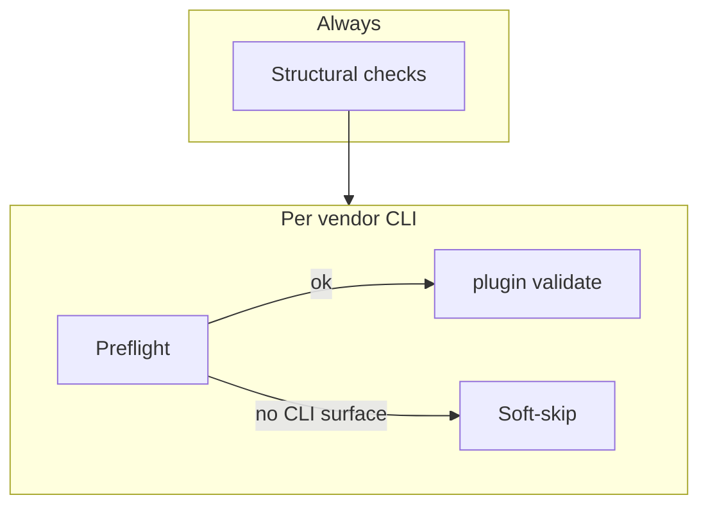

# 34. First-party coding agent plugins and repository verification

Date: 2026-04-10

## Status

Accepted

## Context

Multiple coding-agent products (Codex CLI, Claude Code, Cursor Agent CLI) each define plugin packaging and discovery differently. This repository ships **first-party** plugins for dbt-tools-related workflows and needs **one** plugin source tree for skills and manifests, without duplicating skill content per vendor or splitting plugins across repositories.

## Decision

1. **Plugin root:** First-party plugins live under `plugins/<plugin-id>/` with **parallel per-engine manifests** (`.claude-plugin`, `.codex-plugin`, `.cursor-plugin`) and **`skills/`** at the plugin root, following each vendor’s upstream layout expectations.

2. **Discovery split:** **Codex** uses a single repo marketplace at `.agents/plugins/marketplace.json`. **Cursor** uses `.cursor-plugin/marketplace.json`. **Claude Code** does **not** rely on a committed Claude-hosted root `marketplace.json` in this repo; the same on-disk plugin trees are consumed via project or user configuration (see `plugins/README.md` for contributor detail).

3. **Catalog alignment:** Cursor and Codex marketplace entries **stay aligned** (same plugin ids and local paths) when verification runs without a single-plugin filter; automated checks enforce that invariant.

4. **Verification strategy:** Structural checks (marketplaces, manifests, layout) run **offline** and **always**. Optional vendor CLI steps run **`plugin validate`** when **preflight** succeeds for that tool. If a vendor CLI does not expose a usable `plugin validate` surface, that vendor phase **soft-skips** (does not fail the run); hard failures apply when validation runs and fails. Pinned tool versions and operational commands live in `plugins/README.md` and the agent-plugins Docker image, not in this ADR.

## Consequences

**Positive:**

- One skill tree per plugin; a clear split between catalog JSON (Codex/Cursor) and Claude’s consumption path.
- CI and local checks can stay green when upstream CLIs lag on `plugin validate`, while structural guarantees remain mandatory.

**Negative / risks:**

- Contributors must maintain multiple manifest shapes when engines diverge.
- Marketplace edits for Codex and Cursor must stay paired to satisfy alignment checks.

## Alternatives considered

- **Separate repository per engine** — Rejected: duplicates skills and drifts from the monorepo source of truth.
- **Fail the run when any vendor lacks `plugin validate`** — Rejected: would block merges on vendor release cycles; soft-skip preserves structural guarantees first.

## References

- [ADR-0006](0006-artifact-first-agent-first-positioning-of-dbt-tools.md) — strategic artifact-first, agent-first positioning for dbt-tools (complementary; not a duplicate of this record).
- Coarse pointers: `plugins/README.md`; Docker-based verification under `plugins/tests/` (orchestrator `verify-agent-plugins.sh`).
