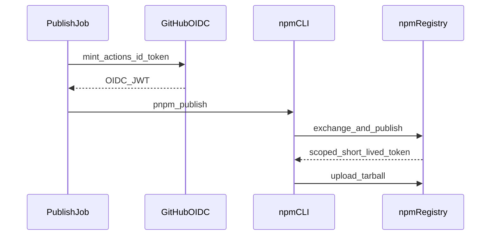

# 36. npm releases authenticate via GitHub Actions OIDC trusted publishing

Date: 2026-04-18

## Status

Accepted

## Context

Publishing to npm from CI has historically relied on **long-lived automation tokens** stored as GitHub secrets. Those tokens are attractive targets (logs, misconfiguration, fork PR workflows), require rotation discipline, and often grant **broader** registry access than a single release needs.

npm now supports **[trusted publishing](https://docs.npmjs.com/trusted-publishers)**: the npm CLI exchanges a **short-lived OIDC identity token** from supported CI (including **GitHub-hosted Actions**) for a **scoped, ephemeral** publish credential, bound to a **specific repository + workflow filename** configured on npmjs.

This monorepo ships `**dbt-artifacts-parser`** and scoped `**@dbt-tools/**\*`packages.`**@dbt-tools/**\*`releases still require the`**dbt-artifacts-parser**` version they depend on to **already exist on npm\*\* before publishing (workspace dependencies are rewritten at publish time)—that ordering constraint is independent of auth, but it shapes how we run workflows.

npm’s integration checks also expect published packages to declare a `**repository.url`\*\* consistent with the GitHub repo used for OIDC.

## Decision

1. **Primary CI auth for npm publish is OIDC trusted publishing**, not `NPM_TOKEN`:

- Workflows that publish retain `**permissions.id-token: write`\*\*.
- Publish steps **do not** set `NODE_AUTH_TOKEN` from classic write tokens; the npm CLI performs OIDC exchange when trusted publishers are configured on npmjs.
- Before publish, CI **asserts a minimum npm CLI** (trusted publishing requires **npm ≥ 11.5.1** and a supported Node line per npm docs) so failures are explicit rather than cryptic registry auth errors.

2. **Keep two dedicated publish workflows** rather than a single combined workflow by default:

- One workflow publishes `**dbt-artifacts-parser`\*\* only.
- Another publishes `**@dbt-tools/core**`, then `**@dbt-tools/cli**`, then `**@dbt-tools/web**`.
- Rationale: each npm package may only configure **one** trusted publisher at a time, and npm matches the **exact workflow filename**; splitting keeps each package’s trusted surface minimal and avoids forcing every package to trust a monolithic “publish everything” entrypoint unless we explicitly choose that later.

3. **Operational guidance** for maintainers (workflow filenames, publish order, token migration) is summarized in **[AGENTS.md](../../AGENTS.md)** under npm publish; **npm’s** **[trusted publishing](https://docs.npmjs.com/trusted-publishers)** documentation remains the source of truth for registry-side setup.
4. **Published `package.json` files** include `**repository`**, `**bugs**`, and `**homepage\*\*` pointing at this GitHub repository so npm’s GitHub publisher validation can succeed.

### Trust flow (high level)

## Consequences

**Positive:**

- **No long-lived write token** on the publish path when fully migrated; reduced secret handling and blast radius.
- **Per-package** trust binding to a **named workflow file**, aligned with least privilege.
- **Automatic provenance** attestation behavior for trusted publishes from GitHub Actions on public repos (per npm docs), improving downstream verifiability without bespoke signing steps.

**Negative / risks:**

- **Maintainer setup is off-repo**: each package on npmjs must be configured correctly (repo, **exact** workflow filename, optional environment). Misconfiguration surfaces only at publish time.
- **Self-hosted GitHub runners** are not supported for npm trusted publishing today; we assume **GitHub-hosted** `ubuntu-latest` for release jobs.
- If npm raises minimum versions again, CI may need to bump Node/npm assumptions (today aligned via `[.node-version](../../.node-version)` and the npm gate).
- **Classic tokens may still be needed** for unrelated automation (or **read-only** tokens for private dependency installs if introduced later); trusted publishing covers **publish**, not all npm operations.

## Alternatives considered

- **Keep classic `NPM_TOKEN` only** — Rejected as the long-term default: higher credential risk and weaker alignment with registry direction of travel; acceptable only as a temporary fallback during migration.
- **Single combined “publish all” workflow** — Deferred: would simplify to **one** trusted workflow filename per package, but couples unrelated release cadences and broadens the trusted workflow surface; we can revisit if operational pain outweighs the split.
- **Per-package granular write tokens instead of OIDC** — Rejected: still long-lived secrets, more items to rotate and audit.

## References

- Project notes: [AGENTS.md](../../AGENTS.md) (Commands — npm publish)
- CI entrypoints: [`.github/workflows/publish-dbt-artifacts-parser.yml`](../../.github/workflows/publish-dbt-artifacts-parser.yml), [`.github/workflows/publish-dbt-tools.yml`](../../.github/workflows/publish-dbt-tools.yml)
- npm: [Trusted publishing](https://docs.npmjs.com/trusted-publishers)
- Scoped package naming decision: [ADR-0003](0003-use-dbt-tools-scope-for-npm-packages.md)
