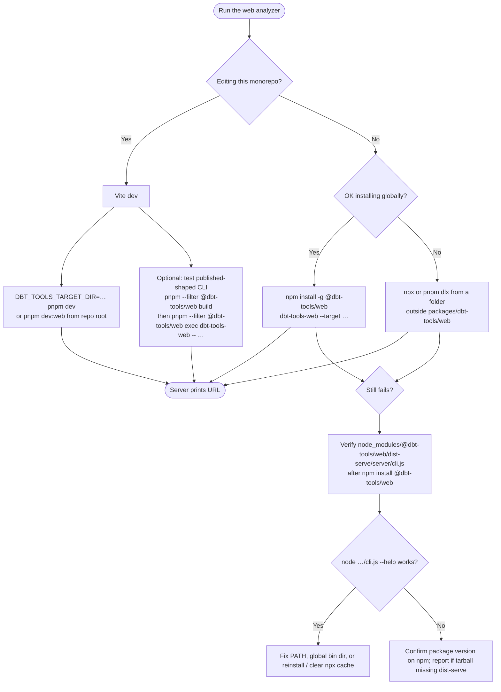
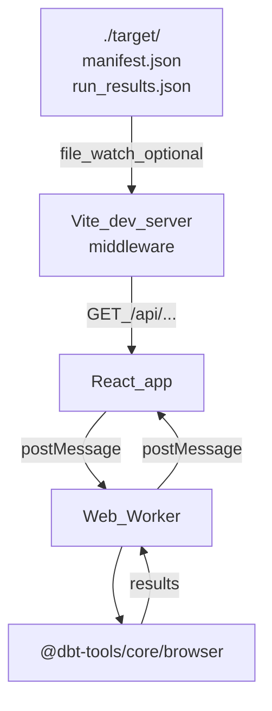

# User guide: @dbt-tools/web

Operator-focused documentation for the dbt-tools web analyzer. For a short npm-first overview, see the [package README](../packages/dbt-tools/web/README.md). For development setup, see [CONTRIBUTING.md](../CONTRIBUTING.md).

---

## npm install, `npx`, `dlx`, and global binary

The published package exposes the **`dbt-tools-web`** CLI ([`package.json` `bin`](../packages/dbt-tools/web/package.json)). Typical ways to run it:

| Method           | Example                                                                       |
| ---------------- | ----------------------------------------------------------------------------- |
| Global install   | `npm install -g @dbt-tools/web` then `dbt-tools-web --target /path/to/target` |
| One-off (`npm`)  | `npx @dbt-tools/web --target /path/to/target`                                 |
| One-off (`pnpm`) | `pnpm dlx @dbt-tools/web -- --target /path/to/target`                         |

**Prefer a neutral working directory** for `npx` / `pnpm dlx`: your home directory, `/tmp`, or any folder that is **not** `packages/dbt-tools/web` inside a clone of this repository. From inside that package directory without a prior **`pnpm --filter @dbt-tools/web build`**, the resolver may use the **workspace** tree, where **`dist-serve/server/cli.js`** (the binary target) does not exist until built—leading to **`sh: dbt-tools-web: command not found`** (exit **127**) or related install errors.

### Which path should I use?



### Contributors: exercise the same binary npm ships

From the **repository root**:

```bash
pnpm --filter @dbt-tools/web build
pnpm --filter @dbt-tools/web exec dbt-tools-web -- --target /path/to/dbt/target
```

For everyday UI work, use **Vite** with **`DBT_TOOLS_TARGET_DIR`** (previous section) instead of the published server.

---

## Vite dev server (monorepo)

When you run `pnpm dev` / `pnpm dev:web` from the repository, **Vite** serves the app with middleware that mirrors the same **`/api/...`** artifact routes as the published **`dbt-tools-web`** server. Additional **file watching** behavior applies only here.

### Preloading local artifacts

```bash
DBT_TOOLS_TARGET_DIR=./target pnpm dev
# from this package:
pnpm dev:target
```

Legacy env names (`DBT_TARGET`, `DBT_TARGET_DIR`) still work with a one-time deprecation warning; prefer **`DBT_TOOLS_TARGET_DIR`**.

Open the URL Vite prints (e.g. `http://localhost:5173/`).

### Debug logging

- **Server-side (Vite middleware):** `DBT_TOOLS_DEBUG=1` (legacy: `DBT_DEBUG`)
- **Client-side:** add **`?debug=1`** to the URL

```bash
DBT_TOOLS_DEBUG=1 DBT_TOOLS_TARGET_DIR=~/path/to/target pnpm dev
# then: http://localhost:5173/?debug=1
```

### Auto-reload when artifacts change

When `DBT_TOOLS_TARGET_DIR` is set under Vite, the app can **reload and re-analyze** after `manifest.json` or `run_results.json` change on disk (e.g. after `dbt run`):

| Variable                       | Default | Description                                    |
| ------------------------------ | ------- | ---------------------------------------------- |
| `DBT_TOOLS_WATCH`              | on      | Set to `0` to disable watching and auto-reload |
| `DBT_TOOLS_RELOAD_DEBOUNCE_MS` | `300`   | Debounce (ms) for rapid writes                 |

Legacy: `DBT_WATCH`, `DBT_RELOAD_DEBOUNCE_MS`.

```bash
DBT_TOOLS_WATCH=0 DBT_TOOLS_TARGET_DIR=./target pnpm dev
```

### Full Vite / build env reference

| Variable                       | Default | Description                                                                                                                              |
| ------------------------------ | ------- | ---------------------------------------------------------------------------------------------------------------------------------------- |
| `DBT_TOOLS_TARGET_DIR`         | —       | Enables serving artifacts via `/api/*` middleware                                                                                        |
| `DBT_TOOLS_REMOTE_SOURCE`      | —       | JSON for S3/GCS bucket + prefix (server-side only); see [ADR-0029](./adr/0029-remote-object-storage-artifact-sources-and-auto-reload.md) |
| `DBT_TOOLS_DEBUG`              | unset   | `1` enables server-side debug logging                                                                                                    |
| `DBT_TOOLS_WATCH`              | on      | `0` disables file watching (Vite dev)                                                                                                    |
| `DBT_TOOLS_RELOAD_DEBOUNCE_MS` | `300`   | Reload debounce (Vite dev)                                                                                                               |

**Deprecated (still read):** `DBT_TARGET`, `DBT_TARGET_DIR`, `DBT_DEBUG`, `DBT_WATCH`, `DBT_RELOAD_DEBOUNCE_MS`.

### Remote artifact sources (`DBT_TOOLS_REMOTE_SOURCE`)

The dev server (and **`dbt-tools-web`**) can resolve the latest complete **`manifest.json` + `run_results.json`** pair under an object-storage prefix, **poll** for newer runs, and the UI **prompts before switching** the workspace. Credentials stay in the **Node process** (AWS default chain, GCS ADC / `GOOGLE_APPLICATION_CREDENTIALS`), not in the browser.

Details and semantics: [ADR-0029](./adr/0029-remote-object-storage-artifact-sources-and-auto-reload.md).

Example (shape only — adjust bucket/prefix):

```bash
export DBT_TOOLS_REMOTE_SOURCE='{"provider":"s3","bucket":"my-bucket","prefix":"dbt/runs","pollIntervalMs":30000}'
pnpm dev
```

---

## Published server vs static Docker image

- **`dbt-tools-web`** (npm): Node HTTP server + static `dist/` + artifact middleware. Honors **`DBT_TOOLS_TARGET_DIR`**, **`DBT_TOOLS_REMOTE_SOURCE`**, **`DBT_TOOLS_DEBUG`**. Does **not** use Vite file-watch env vars.
- **Dockerfile (nginx):** builds static **`dist/`** and serves it with **nginx**. There is **no** Node artifact middleware in that image unless you change the deployment shape, so the same **`DBT_TOOLS_*`** server env vars **do not apply** to that container as shipped.

---

## Docker (monorepo build)

The image is a multi-stage build: Node installs workspace dependencies and runs `pnpm --filter @dbt-tools/web build`; the final stage serves **`dist/`** with [nginx unprivileged](https://hub.docker.com/r/nginxinc/nginx-unprivileged) (non-root, port **8080**, SPA fallback to `index.html`).

**Build context must be the monorepo root** (not `packages/dbt-tools/web` alone).

```bash
docker build -f packages/dbt-tools/web/Dockerfile -t dbt-tools-web:local .
docker run --rm -p 8080:8080 dbt-tools-web:local
```

Open `http://localhost:8080/`.

**Vite build-time** variables (`VITE_*`), if introduced, must be passed at **image build** time (e.g. `docker build --build-arg ...`) and wired in the Dockerfile.

### GitHub Container Registry (CI)

Workflow: [`.github/workflows/docker-dbt-tools-web.yml`](../.github/workflows/docker-dbt-tools-web.yml) — builds on `push` to `main`, `pull_request` (build only), and `workflow_dispatch`. Images are pushed to **GHCR**:

`ghcr.io/<github-owner-lowercase>/dbt-tools-web`

Tags include a **git SHA** on pushes to `main` (and manual runs), and **`latest`** for default-branch builds.

```bash
echo "$GITHUB_TOKEN" | docker login ghcr.io -u USERNAME --password-stdin
docker pull ghcr.io/<github-owner-lowercase>/dbt-tools-web:latest
```

Set package visibility under the repository **Packages** settings if needed.

---

## Architecture (Vite dev detail)



---

## Troubleshooting

| Symptom                                                   | Fix                                                                                                                                                                                                                                                                                                                                                                                                                                                                                                                                                                      |
| --------------------------------------------------------- | ------------------------------------------------------------------------------------------------------------------------------------------------------------------------------------------------------------------------------------------------------------------------------------------------------------------------------------------------------------------------------------------------------------------------------------------------------------------------------------------------------------------------------------------------------------------------ |
| **`sh: dbt-tools-web: command not found`** / **exit 127** | The shell did not find the **`dbt-tools-web`** executable. Install globally and put npm’s global **bin** on **`PATH`**, or use **`npx`** / **`pnpm dlx`** from a **neutral cwd** (see [npm install, `npx`, `dlx`, and global binary](#npm-install-npx-dlx-and-global-binary)). In a monorepo clone, do not rely on **`npx @dbt-tools/web`** from **`packages/dbt-tools/web`** without **`pnpm --filter @dbt-tools/web build`**. To isolate shim vs. app: after `npm install @dbt-tools/web`, run **`node node_modules/@dbt-tools/web/dist-serve/server/cli.js --help`**. |
| Blank page / "No artifacts found"                         | Ensure **`DBT_TOOLS_TARGET_DIR`** points at a directory containing **`manifest.json`**, or configure **`DBT_TOOLS_REMOTE_SOURCE`**.                                                                                                                                                                                                                                                                                                                                                                                                                                      |
| Auto-reload not triggering (Vite)                         | Ensure **`DBT_TOOLS_WATCH`** is not `0`; confirm read access to the target directory.                                                                                                                                                                                                                                                                                                                                                                                                                                                                                    |
| Slow UI with large manifests                              | Web worker + virtualization target large graphs; profile the main thread if still slow.                                                                                                                                                                                                                                                                                                                                                                                                                                                                                  |
| `GET /api/manifest.json` returns 404                      | **`DBT_TOOLS_TARGET_DIR`** unset, wrong path, or (remote) no complete pair discovered.                                                                                                                                                                                                                                                                                                                                                                                                                                                                                   |
| Debug logs missing                                        | Server: restart with **`DBT_TOOLS_DEBUG=1`**. Client: **`?debug=1`** on the URL.                                                                                                                                                                                                                                                                                                                                                                                                                                                                                         |
| Expected Vite HMR from npm install                        | Use **`pnpm dev`** from the monorepo or run **`dbt-tools-web`** and refresh after artifact changes.                                                                                                                                                                                                                                                                                                                                                                                                                                                                      |

---

## Related

- [Package README](../packages/dbt-tools/web/README.md)
- [CONTRIBUTING.md](../CONTRIBUTING.md)
- [ADR-0029](./adr/0029-remote-object-storage-artifact-sources-and-auto-reload.md)
