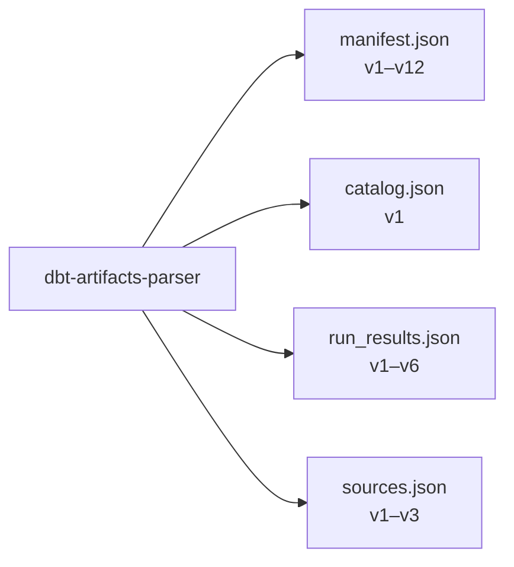

# dbt-artifacts-parser

TypeScript library for parsing dbt artifacts with full type safety and automatic version detection.

This is a **standalone library** with no dependency on `@dbt-tools/*`. Use it whenever you need to read, validate, or type-check dbt JSON artifacts in TypeScript.

## Supported Artifacts



---

## Installation

```bash
npm install dbt-artifacts-parser
# or
pnpm add dbt-artifacts-parser
```

---

## Usage

### Import Patterns

The library provides multiple import patterns to suit different use cases:

#### 1. Category Imports (Latest Version)

```typescript
import { WritableManifest } from "dbt-artifacts-parser/manifest";
import { CatalogArtifact } from "dbt-artifacts-parser/catalog";
import { RunResultsArtifact } from "dbt-artifacts-parser/run_results";
import { FreshnessExecutionResultArtifact } from "dbt-artifacts-parser/sources";
```

#### 2. Version-Specific Imports

Use the category import path and the versioned parser functions:

```typescript
import {
  parseManifestV1,
  parseManifestV12,
} from "dbt-artifacts-parser/manifest";
import {
  parseRunResultsV1,
  parseRunResultsV6,
} from "dbt-artifacts-parser/run_results";
import { parseCatalogV1 } from "dbt-artifacts-parser/catalog";
import { parseSourcesV3 } from "dbt-artifacts-parser/sources";
```

---

### Parsing Artifacts

#### Automatic Version Detection

The main parse functions automatically detect the artifact version and return the appropriately typed object:

```typescript
import { parseManifest } from "dbt-artifacts-parser/manifest";
import { parseCatalog } from "dbt-artifacts-parser/catalog";
import { parseRunResults } from "dbt-artifacts-parser/run_results";
import { parseSources } from "dbt-artifacts-parser/sources";
import fs from "fs";

const manifest = parseManifest(
  JSON.parse(fs.readFileSync("manifest.json", "utf-8")),
);
// Returns: ParsedManifest (union of all manifest versions)

const catalog = parseCatalog(
  JSON.parse(fs.readFileSync("catalog.json", "utf-8")),
);
// Returns: ParsedCatalog

const runResults = parseRunResults(
  JSON.parse(fs.readFileSync("run-results.json", "utf-8")),
);
// Returns: ParsedRunResults

const sources = parseSources(
  JSON.parse(fs.readFileSync("sources.json", "utf-8")),
);
// Returns: ParsedSources
```

#### Version-Specific Parsing

```typescript
import {
  parseManifestV1,
  parseManifestV12,
} from "dbt-artifacts-parser/manifest";
import { parseRunResultsV6 } from "dbt-artifacts-parser/run_results";
import { parseCatalogV1 } from "dbt-artifacts-parser/catalog";
import { parseSourcesV3 } from "dbt-artifacts-parser/sources";

const manifestV1 = parseManifestV1(manifestJson); // Returns: Manifest (v1)
const manifestV12 = parseManifestV12(manifestJson); // Returns: WritableManifest (v12)
const runResultsV6 = parseRunResultsV6(runResultsJson); // Returns: RunResultsArtifact (v6)
const catalogV1 = parseCatalogV1(catalogJson); // Returns: CatalogArtifact (v1)
const sourcesV3 = parseSourcesV3(sourcesJson); // Returns: FreshnessExecutionResultArtifact (v3)
```

---

### Type Usage

#### Union Types

```typescript
import type { ParsedManifest } from "dbt-artifacts-parser/manifest";
import type { ParsedCatalog } from "dbt-artifacts-parser/catalog";
import type { ParsedRunResults } from "dbt-artifacts-parser/run_results";
import type { ParsedSources } from "dbt-artifacts-parser/sources";

function processManifest(manifest: ParsedManifest) {
  console.log(manifest.metadata.dbt_schema_version);
  console.log(Object.keys(manifest.nodes));
}
```

#### Versioned Type Exports

Each category path re-exports the latest version's types by default:

```typescript
import type { WritableManifest } from "dbt-artifacts-parser/manifest";
import type { RunResultsArtifact } from "dbt-artifacts-parser/run_results";
import type { CatalogArtifact } from "dbt-artifacts-parser/catalog";
import type { FreshnessExecutionResultArtifact } from "dbt-artifacts-parser/sources";
```

---

## Supported Versions

### Manifest

- **v1–v2**: `Manifest` interface
- **v3–v10**: Generated schema interfaces (`HttpsSchemasGetdbtComDbtManifestV{N}Json`)
- **v11–v12**: `WritableManifest` interface
- **Latest**: v12 (`WritableManifest`)

### Catalog

- **v1**: `CatalogArtifact` interface
- **Latest**: v1

### RunResults

- **v1–v2**: `RunResults` interface
- **v3–v4**: Generated schema interfaces (`HttpsSchemasGetdbtComDbtRunResultsV{N}Json`)
- **v5–v6**: `RunResultsArtifact` interface
- **Latest**: v6 (`RunResultsArtifact`)

### Sources

- **v1**: `Sources` interface
- **v2**: Generated schema interface (`HttpsSchemasGetdbtComDbtSourcesV2Json`)
- **v3**: `FreshnessExecutionResultArtifact` interface
- **Latest**: v3 (`FreshnessExecutionResultArtifact`)

---

## API Reference

### Manifest Parsers

#### `parseManifest(manifest: Record<string, unknown>): ParsedManifest`

Automatically detects version and returns typed manifest.

**Throws**: `Error` if manifest is invalid or version is unsupported

#### `parseManifestV1` … `parseManifestV12`

Version-specific parsers that validate the version matches before returning.

**Throws**: `Error` with message `"Not a manifest.json v{N}"` if version doesn't match

### Catalog Parsers

#### `parseCatalog(catalog: Record<string, unknown>): ParsedCatalog`

#### `parseCatalogV1(catalog: Record<string, unknown>): CatalogArtifactV1`

### RunResults Parsers

#### `parseRunResults(runResults: Record<string, unknown>): ParsedRunResults`

#### `parseRunResultsV1` … `parseRunResultsV6`

### Sources Parsers

#### `parseSources(sources: Record<string, unknown>): ParsedSources`

#### `parseSourcesV1` / `parseSourcesV2` / `parseSourcesV3`

---

## Error Handling

All parser functions throw descriptive errors:

- **Invalid structure**: `"Not a {artifact}.json"` — input missing required metadata
- **Wrong version**: `"Not a {artifact}.json v{N}"` — version-specific parser called with wrong version
- **Unsupported version**: `"Unsupported {artifact} version: {version}"` — version not yet supported

```typescript
try {
  const manifest = parseManifest(invalidJson);
} catch (error) {
  if (error instanceof Error) {
    console.error(error.message); // "Not a manifest.json"
  }
}
```

---

## Project Structure

```text
packages/dbt-artifacts-parser/
├── src/
│   ├── catalog/          # Catalog artifact types and parsers
│   ├── manifest/         # Manifest artifact types and parsers
│   ├── run_results/      # RunResults artifact types and parsers
│   ├── sources/          # Sources artifact types and parsers
│   └── index.ts          # Main entry point
├── resources/            # JSON Schema source files (from schemas.getdbt.com)
└── scripts/              # Type generation scripts
```

---

## Development

```bash
# Build
pnpm build

# Run tests
pnpm test

# Regenerate TypeScript types from JSON schemas
pnpm gen:types
```

See [CONTRIBUTING.md](../../CONTRIBUTING.md) for the full developer guide.

---

## License

Apache License 2.0.

## Related Projects

Inspired by the Python [dbt-artifacts-parser](https://github.com/yu-iskw/dbt-artifacts-parser) library.
