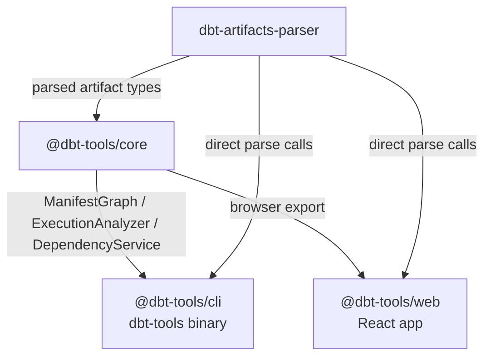
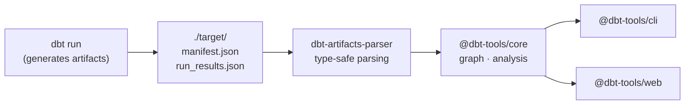

# @dbt-tools

A suite of TypeScript tools for analyzing dbt artifacts, built on [`dbt-artifacts-parser`](../dbt-artifacts-parser/README.md).

---

## Packages

| Package                               | Description                                                     |
| ------------------------------------- | --------------------------------------------------------------- |
| [`@dbt-tools/core`](./core/README.md) | Core library — dependency graphs, execution analysis, utilities |
| [`@dbt-tools/cli`](./cli/README.md)   | CLI tool (`dbt-tools`) for artifact analysis                    |
| [`@dbt-tools/web`](./web/README.md)   | React web app for visual artifact analysis                      |

---

## Architecture



---

## When to Use Which Package

| I want to…                                                                                                                                      | Use                                                                                                                             |
| ----------------------------------------------------------------------------------------------------------------------------------------------- | ------------------------------------------------------------------------------------------------------------------------------- |
| Parse dbt JSON artifacts in TypeScript with type safety                                                                                         | [`dbt-artifacts-parser`](../dbt-artifacts-parser/README.md)                                                                     |
| Build a dependency graph or run execution analysis programmatically                                                                             | [`@dbt-tools/core`](./core/README.md)                                                                                           |
| Analyze artifacts from the command line or feed results to an AI agent                                                                          | [`@dbt-tools/cli`](./cli/README.md)                                                                                             |
| Visually explore dependencies and execution timelines in a browser (local target, upload, or optional **S3/GCS** via `DBT_TOOLS_REMOTE_SOURCE`) | [`@dbt-tools/web`](./web/README.md) · [ADR-0029](../../docs/adr/0029-remote-object-storage-artifact-sources-and-auto-reload.md) |

---

## Installation

```bash
# Core library
pnpm add @dbt-tools/core

# CLI tool (global)
pnpm add -g @dbt-tools/cli

# Web package
pnpm add @dbt-tools/web
```

All `@dbt-tools/*` packages are published on npm:

- `@dbt-tools/cli`: [@dbt-tools/cli on npm](https://www.npmjs.com/package/@dbt-tools/cli) <!-- markdown-link-check-disable-line -->
- `@dbt-tools/web`: [@dbt-tools/web on npm](https://www.npmjs.com/package/@dbt-tools/web) <!-- markdown-link-check-disable-line -->
- `@dbt-tools/core`: [@dbt-tools/core on npm](https://www.npmjs.com/package/@dbt-tools/core) <!-- markdown-link-check-disable-line -->

### `npx` and binaries

```bash
# CLI — package exposes the "dbt-tools" binary
npx @dbt-tools/cli --help
dbt-tools summary

# Web — package exposes "dbt-tools-web" (static UI + artifact server)
npx @dbt-tools/web --help
npx @dbt-tools/web --target /path/to/dbt/target

# Core — library only; no CLI binary
# npx @dbt-tools/core is not meaningful for end users
```

Longer operator notes: [Web user guide](../../docs/user-guide-dbt-tools-web.md) · [CLI user guide](../../docs/user-guide-dbt-tools-cli.md).

To run the web app from **source** (Vite dev server, HMR):

```bash
# from repository root
pnpm dev:web
```

---

## Relationship to dbt-artifacts-parser

`@dbt-tools/*` packages depend on `dbt-artifacts-parser` for all artifact parsing and type definitions. They do **not** replace it — they add a layer of analysis on top.



---

## License

The `@dbt-tools/*` packages use a **custom source-available license**; they are **not** OSI “open source.” The following is a **short summary** — the binding terms are in the **`LICENSE`** file at the root of each published npm package (`package.json` uses `SEE LICENSE IN LICENSE`).

- **You may** use and modify the software for **personal use** and for **internal use** within your organization for your own business purposes, **provided** you do not offer a **commercial service** where the software (or a derivative intended to replace or substantially replicate the published `@dbt-tools/*` packages) is a material part of the value you sell or deliver to third parties (for example hosted access, resale, or client production work centered on operating the software — see `LICENSE` for definitions).
- **You may not**, without **prior written permission** from the copyright holder, offer such a **commercial service**, or **publish** the software or that kind of derivative to a **package registry** (npm, GitHub Packages, and similar) for third-party consumption.
- **Dependencies** such as **`dbt-artifacts-parser`** remain under **their own** licenses (**Apache-2.0** for that library). This license does not override them.

The **`dbt-artifacts-parser`** tree in this monorepo is **Apache-2.0** separately from `@dbt-tools/*`. If you are reading this in the upstream **Git repository**, `LICENSES/README.md` at the repository root maps licenses by path (that file is **not** shipped inside `@dbt-tools/*` npm tarballs).
