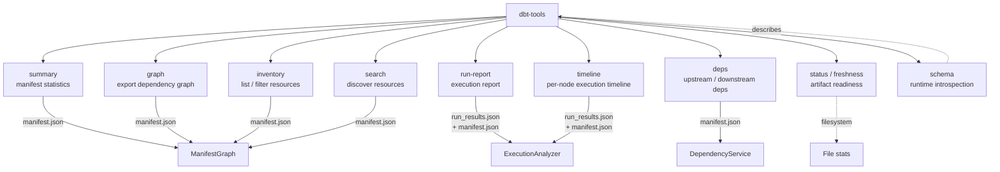

# @dbt-tools/cli

Command-line interface for dbt artifact analysis. Provides a structured, machine-readable contract for operators, automation, and coding agents.

**Quick start:** install Node.js **20+** (see the repo [`.node-version`](https://github.com/yu-iskw/dbt-artifacts-parser-ts/blob/main/.node-version) for the version used in development; Node 18 is EOL — [releases](https://nodejs.org/en/about/previous-releases)), then `npm install -g @dbt-tools/cli` and run `dbt-tools summary` from a directory that contains `./target/manifest.json`. Extended automation topics (errors, validation, `schema` introspection) are in the [user guide](../../../docs/user-guide-dbt-tools-cli.md).

## Commands



---

## Installation

```bash
pnpm add -g @dbt-tools/cli
```

---

## Features

- **Default `./target` directory**: Commands default to dbt's standard artifact location
- **JSON-by-default**: Machine-readable JSON output in non-interactive environments
- **Input validation**: Hardened against common automation mistakes (path traversals, control chars, etc.)
- **Field filtering**: Reduce payload/context size with `--fields` option
- **Schema introspection**: Runtime command discovery via `schema` command
- **Dependency analysis**: Find upstream/downstream dependencies with `deps` command
- **Inventory**: Browse and filter all dbt resources in one view
- **Timeline**: Inspect per-node execution timing (row-level, unlike `run-report`)
- **Search**: Discover resources by name, tag, type, or free-text query
- **Status / Freshness**: Check if artifacts are present and how recent they are
- **Subgraph focus**: Export a focused subgraph for any node via `graph --focus`

---

## Command Reference

### summary

Provide summary statistics for dbt manifest.

```bash
# Uses ./target/manifest.json by default
dbt-tools summary

# Custom target directory
dbt-tools summary --target-dir ./custom-target

# Explicit path
dbt-tools summary path/to/manifest.json

# Field filtering to reduce context window usage
dbt-tools summary --fields "total_nodes,total_edges"

# JSON output
dbt-tools summary --json
```

**Options:**

- `[manifest-path]` - Path to manifest.json (defaults to `./target/manifest.json`)
- `--target-dir <dir>` - Custom target directory
- `--fields <fields>` - Comma-separated list of fields to include
- `--json` - Force JSON output
- `--no-json` - Force human-readable output

---

### graph

Export dependency graph in various formats.

Supports optional subgraph focus via `--focus` to export a node-centred slice of the graph.

```bash
# Full graph (uses ./target/manifest.json by default)
dbt-tools graph

# Export as DOT format
dbt-tools graph --format dot --output graph.dot

# Export as GEXF format
dbt-tools graph --format gexf --output graph.gexf

# With field filtering (only affects JSON format)
dbt-tools graph --format json --fields "name,resource_type"

# Subgraph: focus on one node, 2 hops in both directions
dbt-tools graph --focus model.my_project.orders --focus-depth 2

# Upstream subgraph only
dbt-tools graph --focus model.my_project.orders --focus-direction upstream

# Downstream subgraph filtered to models and tests
dbt-tools graph --focus model.my_project.orders \
  --focus-direction downstream --resource-types model,test

# Custom target directory
dbt-tools graph --target-dir ./custom-target
```

**Options:**

- `[manifest-path]` - Path to manifest.json (defaults to `./target/manifest.json`)
- `--format <format>` - Export format: `json`, `dot`, or `gexf` (default: `json`)
- `--output <path>` - Output file path (default: stdout)
- `--target-dir <dir>` - Custom target directory
- `--fields <fields>` - Comma-separated list of fields to include (affects JSON nodes)
- `--focus <resource-id>` - Focus the export on a single node; produces a subgraph only
- `--focus-depth <n>` - Max traversal hops when `--focus` is set (default: unlimited)
- `--focus-direction <direction>` - Traversal direction: `upstream`, `downstream`, or `both` (default: `both`)
- `--resource-types <types>` - Comma-separated resource types to keep (e.g. `model,test`)
- `--field-level` - Include field-level (column-level) lineage
- `--catalog-path <path>` - Path to catalog.json (used with `--field-level`)

---

### run-report

Generate **aggregated** execution report from run_results.json (totals, critical path, bottlenecks).
For **row-level** per-node timings, use [`timeline`](#timeline) instead.

```bash
# Uses ./target/run_results.json and ./target/manifest.json by default
dbt-tools run-report

# Include bottleneck section (top 10 slowest nodes by default)
dbt-tools run-report --bottlenecks

# Top 5 slowest nodes
dbt-tools run-report --bottlenecks --bottlenecks-top 5

# Nodes exceeding 10 seconds
dbt-tools run-report --bottlenecks --bottlenecks-threshold 10

# Field filtering
dbt-tools run-report --fields "total_execution_time,critical_path"

# Custom paths
dbt-tools run-report ./custom/run_results.json ./custom/manifest.json

# JSON output
dbt-tools run-report --json
```

**Options:**

- `[run-results-path]` - Path to run_results.json (defaults to `./target/run_results.json`)
- `[manifest-path]` - Path to manifest.json (optional, for critical path analysis)
- `--target-dir <dir>` - Custom target directory
- `--fields <fields>` - Comma-separated list of fields to include
- `--bottlenecks` - Include bottleneck section in report
- `--bottlenecks-top <n>` - Top N slowest nodes (default: 10 when `--bottlenecks`)
- `--bottlenecks-threshold <s>` - Nodes exceeding s seconds (cannot combine with `--bottlenecks-top`)
- `--json` - Force JSON output
- `--no-json` - Force human-readable output

---

### deps

Get upstream or downstream dependencies for a dbt resource.

```bash
# Get downstream dependencies (default)
dbt-tools deps model.my_project.customers

# Get upstream dependencies
dbt-tools deps model.my_project.customers --direction upstream

# Get immediate neighbors only
dbt-tools deps model.my_project.customers --depth 1

# Output as a flat list
dbt-tools deps model.my_project.customers --format flat

# Get upstream dependencies in build order
dbt-tools deps model.my_project.customers --direction upstream --build-order

# With field filtering to reduce output size
dbt-tools deps model.my_project.customers --fields "unique_id,name"

# Custom manifest path
dbt-tools deps model.my_project.customers --manifest-path ./custom/manifest.json
```

**Options:**

- `<resource-id>` - Unique ID of the dbt resource (required)
- `--direction <direction>` - `upstream` or `downstream` (default: `downstream`)
- `--manifest-path <path>` - Path to manifest.json (defaults to `./target/manifest.json`)
- `--target-dir <dir>` - Custom target directory
- `--fields <fields>` - Comma-separated list of fields to include (e.g., `unique_id,name`)
- `--depth <number>` - Max traversal depth; 1 = immediate neighbors, omit for all levels
- `--format <format>` - Output structure: `flat` or `tree` (default: `tree`)
- `--build-order` - Output upstream dependencies in topological build order
- `--json` - Force JSON output
- `--no-json` - Force human-readable output

---

### inventory

List and filter all dbt resources from the manifest. Useful for browsing what's in the project, or feeding results into downstream commands.

Requires: `manifest.json`

```bash
# All resources
dbt-tools inventory

# Filter by type
dbt-tools inventory --type model

# Multiple types
dbt-tools inventory --type model,test

# Filter by package
dbt-tools inventory --package my_project

# Filter by tag
dbt-tools inventory --tag finance

# Filter by file path substring
dbt-tools inventory --path models/staging

# Combine filters
dbt-tools inventory --type model --tag finance --package my_project

# Only return specific fields
dbt-tools inventory --type model --fields "entries"

# Force JSON (default in non-TTY)
dbt-tools inventory --json
```

**Options:**

- `[manifest-path]` - Path to manifest.json (defaults to `./target/manifest.json`)
- `--type <type>` - Filter by resource type(s), comma-separated (e.g. `model`, `model,test`)
- `--package <package>` - Filter by exact package name
- `--tag <tag>` - Filter by tag(s), comma-separated (any match)
- `--path <path>` - Filter by file path substring
- `--fields <fields>` - Comma-separated fields to include
- `--target-dir <dir>` - Custom target directory
- `--json` - Force JSON output
- `--no-json` - Force human-readable output

**Example JSON output:**

```json
{
  "total": 42,
  "entries": [
    {
      "unique_id": "model.my_project.orders",
      "resource_type": "model",
      "name": "orders",
      "package_name": "my_project",
      "path": "models/marts/orders.sql",
      "tags": ["finance"],
      "description": "Core orders model"
    }
  ]
}
```

---

### timeline

Show **per-node execution entries** from run_results.json, sorted by duration. This is the row-level complement to `run-report`.

**How `timeline` differs from `run-report`:**

|                     | `run-report`                                          | `timeline`                           |
| ------------------- | ----------------------------------------------------- | ------------------------------------ |
| Output              | Aggregated stats (totals, critical path, bottlenecks) | One row per executed node            |
| Use case            | Overall health summary                                | Inspect individual execution timings |
| CSV output          | No                                                    | Yes                                  |
| Filtering by status | No                                                    | Yes (`--failed-only`, `--status`)    |

Requires: `run_results.json`. Optionally enriched by `manifest.json` (adds `name` and `resource_type`).

```bash
# All nodes sorted by duration (slowest first)
dbt-tools timeline

# With manifest enrichment (adds name and type to each row)
dbt-tools timeline /path/to/run_results.json /path/to/manifest.json

# Top 20 slowest
dbt-tools timeline --top 20

# Only failures
dbt-tools timeline --failed-only

# Filter by specific status
dbt-tools timeline --status error,warn

# Sort by start time
dbt-tools timeline --sort start

# CSV output
dbt-tools timeline --format csv > timeline.csv

# JSON output
dbt-tools timeline --json
```

**Options:**

- `[run-results-path]` - Path to run_results.json (defaults to `./target/run_results.json`)
- `[manifest-path]` - Path to manifest.json (optional, enriches rows with name and resource_type)
- `--sort <key>` - Sort order: `duration` (default, slowest first) or `start` (chronological)
- `--top <n>` - Show top N entries only
- `--failed-only` - Show only non-successful entries (excludes `success` and `pass`)
- `--status <status>` - Filter by status, comma-separated (e.g. `error,warn`)
- `--format <format>` - Output format: `json`, `table`, or `csv` (default: `json` non-TTY, `table` TTY)
- `--target-dir <dir>` - Custom target directory
- `--json` - Force JSON output
- `--no-json` - Force human-readable output

**Example JSON output:**

```json
{
  "total": 3,
  "entries": [
    {
      "unique_id": "model.my_project.orders",
      "name": "orders",
      "resource_type": "model",
      "status": "success",
      "execution_time": 12.45,
      "started_at": "2024-01-15T10:00:00Z",
      "completed_at": "2024-01-15T10:00:12Z"
    }
  ]
}
```

---

### search

Discover dbt resources by name, tag, type, or free-text query. Acts as a starting point before running `deps`, `inventory`, or other commands.

Requires: `manifest.json`

```bash
# Free-text search (substring matches on name, unique_id, tags, path)
dbt-tools search orders

# Inline key:value tokens in query
dbt-tools search "type:model orders"
dbt-tools search "tag:finance"
dbt-tools search "package:core source:stripe"

# Flag-based filters
dbt-tools search --type model
dbt-tools search --tag finance
dbt-tools search --package my_project

# Combine query with flags (flags take precedence over inline tokens)
dbt-tools search orders --type model

# Human-readable output (TTY default)
dbt-tools search orders --no-json

# Force JSON
dbt-tools search orders --json
```

**Supported inline tokens in query:**

- `type:<value>` — filter by resource type
- `package:<value>` — filter by package
- `tag:<value>` — filter by tag
- `owner:<value>` / `source:<value>` — matched as plain text terms

**Options:**

- `[query]` - Free-text search query with optional `key:value` tokens
- `[manifest-path]` - Path to manifest.json (defaults to `./target/manifest.json`)
- `--type <type>` - Filter by resource type(s), comma-separated
- `--package <package>` - Filter by package name
- `--tag <tag>` - Filter by tag(s), comma-separated
- `--path <path>` - Filter by file path substring
- `--fields <fields>` - Comma-separated fields to include
- `--target-dir <dir>` - Custom target directory
- `--json` - Force JSON output
- `--no-json` - Force human-readable output

**Example JSON output:**

```json
{
  "query": "orders",
  "total": 2,
  "results": [
    {
      "unique_id": "model.my_project.orders",
      "resource_type": "model",
      "name": "orders",
      "package_name": "my_project",
      "path": "models/marts/orders.sql"
    }
  ]
}
```

---

### status / freshness

Report dbt artifact presence, file modification times, and analysis readiness. `freshness` is an alias for `status`.

This command does **not** parse artifact content — it only checks the filesystem. It is safe to run even when artifacts are missing or invalid.

```bash
# Check default ./target directory
dbt-tools status

# Custom target directory
dbt-tools status --target-dir ./custom-target

# JSON output (machine-readable)
dbt-tools status --json

# Freshness alias
dbt-tools freshness
dbt-tools freshness --target-dir ./custom-target
```

**Readiness values:**

| Value           | Meaning                                                                                         |
| --------------- | ----------------------------------------------------------------------------------------------- |
| `full`          | Both `manifest.json` and `run_results.json` are present. All commands available.                |
| `manifest-only` | `manifest.json` found; `run_results.json` missing. `timeline` and `run-report` are unavailable. |
| `unavailable`   | `manifest.json` not found. Most commands will fail.                                             |

**Options:**

- `--target-dir <dir>` - Custom target directory (defaults to `./target`)
- `--json` - Force JSON output
- `--no-json` - Force human-readable output

**Example JSON output:**

```json
{
  "target_dir": "./target",
  "manifest": {
    "path": "/project/target/manifest.json",
    "exists": true,
    "modified_at": "2024-01-15T10:00:00Z",
    "age_seconds": 3600
  },
  "run_results": {
    "path": "/project/target/run_results.json",
    "exists": true,
    "modified_at": "2024-01-15T10:01:00Z",
    "age_seconds": 3540
  },
  "readiness": "full",
  "latest_modified_at": "2024-01-15T10:01:00Z",
  "age_seconds": 3540,
  "summary": "All artifacts present. Manifest and execution analysis available."
}
```

**Caveats:**

- Remote artifact sources (S3, GCS) are not checked; only local filesystem paths are inspected.
- Age values are computed at the time of the command, not relative to any dbt run.

---

### schema

Get machine-readable schema for commands (runtime introspection).

```bash
# Get schema for specific command
dbt-tools schema deps

# Get all command schemas
dbt-tools schema
```

**Options:**

- `[command]` - Command name (if omitted, returns all schemas)
- `--json` - Force JSON output (always JSON by default)

**Use Cases:**

- Discover available commands and options at runtime
- Understand argument requirements
- Get example usage for each command

---

## Default Directory Behavior

All commands default to the `./target` directory where dbt stores artifacts:

- `manifest.json` → `./target/manifest.json`
- `run_results.json` → `./target/run_results.json`

Override with:

- `--target-dir <directory>` flag
- `DBT_TOOLS_TARGET_DIR` environment variable (legacy: `DBT_TARGET_DIR`, `DBT_TARGET`)

---

## JSON Output

The CLI automatically outputs JSON when stdout is not a TTY (non-interactive environments):

- **Non-TTY (agents/pipes)**: JSON output by default
- **TTY (interactive)**: Human-readable output by default
- Use `--json` to force JSON
- Use `--no-json` to force human-readable

---

## Field Filtering

Use `--fields` to limit response size and reduce context window usage. Supported in `summary`, `deps`, `graph` (JSON), `run-report`, `inventory`, and `search`.

```bash
# Only return specific fields
dbt-tools deps model.my_project.customers --fields "unique_id,name"

# Supports nested fields
dbt-tools deps model.my_project.customers --fields "unique_id,name,attributes.resource_type"
```

---

## Input Validation

The CLI validates all inputs to prevent common mistakes:

- **Path traversals**: Rejects `../` and `..\` patterns
- **Control characters**: Rejects invisible characters (< 0x20 except `\n`, `\r`, `\t`)
- **Resource IDs**: Rejects embedded query params (`?`, `#`) and URL-encoded strings (`%`)
- **Pre-encoded URLs**: Rejects patterns like `%2e%2e` (encoded `..`)

**Common mistakes to avoid:**

- `model.x?fields=name` — embedded query param
- `model%2ex` — pre-encoded
- `../../.ssh` — path traversal
- `model.my_project.customers` — correct

---

## Error Handling

Errors are formatted as JSON in non-TTY environments:

```json
{
  "error": "ValidationError",
  "code": "VALIDATION_ERROR",
  "message": "Resource ID contains invalid characters",
  "details": {
    "field": "resource_id"
  }
}
```

**Common Error Codes:**

- `VALIDATION_ERROR`: Input validation failed
- `FILE_NOT_FOUND`: Artifact file not found
- `PARSE_ERROR`: Failed to parse JSON
- `UNSUPPORTED_VERSION`: Unsupported dbt version
- `UNKNOWN_ERROR`: Other errors

---

## Best Practices for Operators, Automation, and Agents

1. **Run `status` first** to check which artifacts are available before running analysis commands.
2. **Use `search` to discover resources** before running `deps` or `inventory`.
3. **Always use field filtering** for dependency queries and analysis to reduce context window usage.
4. **Use default `./target` directory** unless you have a specific reason not to.
5. **Validate resource IDs** before querying (use schema introspection if unsure).
6. **Handle errors programmatically** using error codes in non-interactive environments.
7. **Use schema introspection** to discover command capabilities at runtime.

---

## Examples

```bash
# Check artifact readiness before doing any analysis
dbt-tools status

# Find a resource before querying its deps
dbt-tools search orders --json | jq '.results[0].unique_id'

# List all models with the finance tag
dbt-tools inventory --type model --tag finance

# Find downstream dependencies
dbt-tools deps model.my_project.customers

# Find upstream dependencies with minimal output
dbt-tools deps model.my_project.customers --direction upstream --fields "unique_id"

# Execution timeline (slowest 10 nodes)
dbt-tools timeline --top 10

# Failed executions only
dbt-tools timeline --failed-only

# Export full graph for visualization
dbt-tools graph --format dot --output graph.dot

# Export focused subgraph around one node
dbt-tools graph --focus model.my_project.orders --focus-depth 2 --format dot --output orders_subgraph.dot

# Aggregated execution report with critical path
dbt-tools run-report

# Get command schema
dbt-tools schema deps | jq '.options[] | select(.name == "--direction")'
```

---

## Environment Variables

- `DBT_TOOLS_TARGET_DIR` - Override default target directory (defaults to `./target`; legacy: `DBT_TARGET_DIR`, `DBT_TARGET`)

---

## Development

```bash
pnpm build
pnpm test
```

See [CONTRIBUTING.md](../../../CONTRIBUTING.md) for the full developer guide.

---

## License

The `@dbt-tools/*` packages use a **custom source-available license**; they are **not** OSI "open source." The following is a **short summary** — the binding terms are in the **`LICENSE`** file at the root of each published npm package (`package.json` uses `SEE LICENSE IN LICENSE`).

- **You may** use and modify the software for **personal use** and for **internal use** within your organization for your own business purposes, **provided** you do not offer a **commercial service** where the software (or a derivative intended to replace or substantially replicate the published `@dbt-tools/*` packages) is a material part of the value you sell or deliver to third parties (for example hosted access, resale, or client production work centered on operating the software — see `LICENSE` for definitions).
- **You may not**, without **prior written permission** from the copyright holder, offer such a **commercial service**, or **publish** the software or that kind of derivative to a **package registry** (npm, GitHub Packages, and similar) for third-party consumption.
- **Dependencies** such as **`dbt-artifacts-parser`** remain under **their own** licenses (**Apache-2.0** for that library). This license does not override them.
