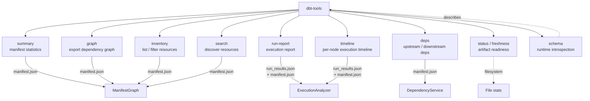

# @dbt-tools/cli

**Structured interface** for dbt artifact analysis: machine-readable JSON by default in non-interactive environments, runtime **`schema`** introspection, **`--fields`** to shrink payloads, and validated inputs with stable error codes—suited to **operators**, **CI**, **scripts**, and **coding agents** (skills, multi-step automation) without treating AI as the only consumer.

**Quick start:** install Node.js **20+** (see the repo [`.node-version`](https://github.com/yu-iskw/dbt-artifacts-parser-ts/blob/main/.node-version) for the version used in development; Node 18 is EOL — [releases](https://nodejs.org/en/about/previous-releases)), then `npm install -g @dbt-tools/cli` and run `dbt-tools summary --dbt-target ./target` (or set **`DBT_TOOLS_DBT_TARGET`** so you can omit the flag). Extended topics (errors, validation, `schema` introspection, agent-oriented patterns) are in this README: [Field Filtering](#field-filtering), [Input Validation](#input-validation), [Error handling](#error-handling), [Automation and agent workflows](#automation-and-agent-workflows), and [Environment variables](#environment-variables). Positioning: [ADR-0008](../../../docs/adr/0008-dbt-tools-operational-intelligence-and-positioning-boundaries.md).

## Commands



---

## Installation

```bash
pnpm add -g @dbt-tools/cli
```

---

## Features

- **Single artifact root (`--dbt-target`)**: Every artifact command reads **`manifest.json`** and **`run_results.json`** from one directory or object prefix; **`catalog.json`** and **`sources.json`** are optional enrichments when present
- **JSON stdout / structured errors**: With **`--json`**, stdout is JSON and stderr errors are structured JSON; without **`--json`**, errors are human-readable text
- **Input validation**: Hardened against common mistakes (path traversals, control chars, ambiguous resource IDs)
- **Field filtering**: Bound output size with `--fields` (also useful when piping into LLM context)
- **Schema introspection**: Runtime command and option discovery via `schema` command
- **Dependency analysis**: Find upstream/downstream dependencies with `deps` command
- **Inventory**: Browse and filter all dbt resources in one view
- **Timeline**: Inspect per-node execution timing (row-level, unlike `run-report`)
- **Search**: Discover resources by name, tag, type, or free-text query
- **Status / Freshness**: Check if artifacts are present and how recent they are
- **Subgraph focus**: Export a focused subgraph for any node via `graph --focus`
- **Remote prefixes**: Use **`s3://bucket/prefix`** or **`gs://bucket/prefix`** (scheme required). Objects are downloaded to a temp directory for the duration of the command. **Credentials** use the normal AWS / GCP client chains; optional JSON in **`DBT_TOOLS_REMOTE_SOURCE`** supplies region, endpoint, GCS project id, etc. (see [ADR-0004](../../../docs/adr/0004-remote-object-storage-artifact-sources-and-auto-reload.md)).

---

## Artifact root (`--dbt-target` / `DBT_TOOLS_DBT_TARGET`)

Pass **`--dbt-target`** on every artifact command, or set **`DBT_TOOLS_DBT_TARGET`** to the same value when you want to omit the flag (for example in CI).

- **Local**: absolute or cwd-relative directory containing **`manifest.json`** and **`run_results.json`** at the directory root. Optional **`catalog.json`** / **`sources.json`** are picked up when present.
- **S3 / GCS**: **`s3://bucket/prefix`** or **`gs://bucket/prefix`** only (unschemed `bucket/prefix` is treated as a **local** path). Required object keys are **`manifest.json`** and **`run_results.json`** under the normalized prefix.

```bash
export DBT_TOOLS_DBT_TARGET=./target

dbt-tools summary

# Equivalent explicit flag
dbt-tools summary --dbt-target ./target

dbt-tools status --dbt-target s3://my-bucket/dbt/artifacts/prod

dbt-tools run-report --dbt-target gs://my-bucket/runs/prod --json
```

---

## Command Reference

### summary

Provide summary statistics for dbt manifest.

```bash
dbt-tools summary --dbt-target ./target

# Field filtering to reduce context window usage
dbt-tools summary --dbt-target ./target --fields "total_nodes,total_edges"

# JSON output (structured errors on stderr when this flag is set)
dbt-tools summary --dbt-target ./target --json
```

**Options:**

- `--dbt-target <path|s3://…|gs://…>` - Artifact root (default: `DBT_TOOLS_DBT_TARGET` when set)
- `--fields <fields>` - Comma-separated list of fields to include
- `--json` - Force JSON stdout and structured JSON errors on stderr
- `--no-json` - Force human-readable output

---

### graph

Export dependency graph in various formats.

Supports optional subgraph focus via `--focus` to export a node-centred slice of the graph.

```bash
dbt-tools graph --dbt-target ./target

# Export as DOT format
dbt-tools graph --dbt-target ./target --format dot --output graph.dot

# Export as GEXF format
dbt-tools graph --dbt-target ./target --format gexf --output graph.gexf

# With field filtering (only affects JSON format)
dbt-tools graph --dbt-target ./target --format json --fields "name,resource_type"

# Subgraph: focus on one node, 2 hops in both directions
dbt-tools graph --dbt-target ./target --focus model.my_project.orders --focus-depth 2

# Upstream subgraph only
dbt-tools graph --dbt-target ./target --focus model.my_project.orders --focus-direction upstream

# Downstream subgraph filtered to models and tests
dbt-tools graph --dbt-target ./target --focus model.my_project.orders \
  --focus-direction downstream --resource-types model,test
```

**Options:**

- `--dbt-target <path|s3://…|gs://…>` - Artifact root (default: `DBT_TOOLS_DBT_TARGET` when set)
- `--format <format>` - Export format: `json`, `dot`, or `gexf` (default: `json`)
- `--output <path>` - Output file path (default: stdout)
- `--fields <fields>` - Comma-separated list of fields to include (affects JSON nodes)
- `--focus <resource-id>` - Focus the export on a single node; produces a subgraph only
- `--focus-depth <n>` - Max traversal hops when `--focus` is set (default: unlimited)
- `--focus-direction <direction>` - Traversal direction: `upstream`, `downstream`, or `both` (default: `both`)
- `--resource-types <types>` - Comma-separated resource types to keep (e.g. `model,test`)
- `--field-level` - Include field-level (column-level) lineage when `catalog.json` exists in the artifact root

---

### run-report

Generate **aggregated** execution report from run_results.json (totals, critical path, bottlenecks).
For **row-level** per-node timings, use [`timeline`](#timeline) instead.

```bash
dbt-tools run-report --dbt-target ./target

# Include bottleneck section (top 10 slowest nodes by default)
dbt-tools run-report --dbt-target ./target --bottlenecks

# Top 5 slowest nodes
dbt-tools run-report --dbt-target ./target --bottlenecks --bottlenecks-top 5

# Nodes exceeding 10 seconds
dbt-tools run-report --dbt-target ./target --bottlenecks --bottlenecks-threshold 10

# Field filtering
dbt-tools run-report --dbt-target ./target --fields "total_execution_time,critical_path"

# JSON output
dbt-tools run-report --dbt-target ./target --json
```

**Options:**

- `--dbt-target <path|s3://…|gs://…>` - Artifact root (default: `DBT_TOOLS_DBT_TARGET` when set)
- `--fields <fields>` - Comma-separated list of fields to include
- `--bottlenecks` - Include bottleneck section in report
- `--bottlenecks-top <n>` - Top N slowest nodes (default: 10 when `--bottlenecks`)
- `--bottlenecks-threshold <s>` - Nodes exceeding s seconds (cannot combine with `--bottlenecks-top`)
- `--json` - Force JSON stdout and structured JSON errors on stderr
- `--no-json` - Force human-readable output

---

### deps

Get upstream or downstream dependencies for a dbt resource.

```bash
# Get downstream dependencies (default)
dbt-tools deps model.my_project.customers --dbt-target ./target

# Get upstream dependencies
dbt-tools deps model.my_project.customers --dbt-target ./target --direction upstream

# Get immediate neighbors only
dbt-tools deps model.my_project.customers --dbt-target ./target --depth 1

# Output as a flat list
dbt-tools deps model.my_project.customers --dbt-target ./target --format flat

# Get upstream dependencies in build order
dbt-tools deps model.my_project.customers --dbt-target ./target --direction upstream --build-order

# With field filtering to reduce output size
dbt-tools deps model.my_project.customers --dbt-target ./target --fields "unique_id,name"
```

**Options:**

- `<resource-id>` - Unique ID of the dbt resource (required)
- `--dbt-target <path|s3://…|gs://…>` - Artifact root (default: `DBT_TOOLS_DBT_TARGET` when set)
- `--direction <direction>` - `upstream` or `downstream` (default: `downstream`)
- `--fields <fields>` - Comma-separated list of fields to include (e.g., `unique_id,name`)
- `--depth <number>` - Max traversal depth; 1 = immediate neighbors, omit for all levels
- `--format <format>` - Output structure: `flat` or `tree` (default: `tree`)
- `--build-order` - Output upstream dependencies in topological build order
- `--json` - Force JSON stdout and structured JSON errors on stderr
- `--no-json` - Force human-readable output

---

### inventory

List and filter all dbt resources from the manifest. Useful for browsing what's in the project, or feeding results into downstream commands.

Requires: `manifest.json` (and `run_results.json` in the same `--dbt-target` directory or prefix)

```bash
# All resources
dbt-tools inventory --dbt-target ./target

# Filter by type
dbt-tools inventory --dbt-target ./target --type model

# Multiple types
dbt-tools inventory --dbt-target ./target --type model,test

# Filter by package
dbt-tools inventory --dbt-target ./target --package my_project

# Filter by tag
dbt-tools inventory --dbt-target ./target --tag finance

# Filter by file path substring
dbt-tools inventory --dbt-target ./target --path models/staging

# Combine filters
dbt-tools inventory --dbt-target ./target --type model --tag finance --package my_project

# Only return specific fields
dbt-tools inventory --dbt-target ./target --type model --fields "entries"

# Force JSON (default in non-TTY)
dbt-tools inventory --dbt-target ./target --json
```

**Options:**

- `--dbt-target <path|s3://…|gs://…>` - Artifact root (default: `DBT_TOOLS_DBT_TARGET` when set)
- `--type <type>` - Filter by resource type(s), comma-separated (e.g. `model`, `model,test`)
- `--package <package>` - Filter by exact package name
- `--tag <tag>` - Filter by tag(s), comma-separated (any match)
- `--path <path>` - Filter by file path substring
- `--fields <fields>` - Comma-separated fields to include
- `--json` - Force JSON stdout and structured JSON errors on stderr
- `--no-json` - Force human-readable output

**Example JSON output:**

```json
{
  "total": 42,
  "entries": [
    {
      "unique_id": "model.my_project.orders",
      "resource_type": "model",
      "name": "orders",
      "package_name": "my_project",
      "path": "models/marts/orders.sql",
      "tags": ["finance"],
      "description": "Core orders model"
    }
  ]
}
```

---

### timeline

Show **per-node execution entries** from run_results.json, sorted by duration. This is the row-level complement to `run-report`.

**How `timeline` differs from `run-report`:**

|                     | `run-report`                                          | `timeline`                           |
| ------------------- | ----------------------------------------------------- | ------------------------------------ |
| Output              | Aggregated stats (totals, critical path, bottlenecks) | One row per executed node            |
| Use case            | Overall health summary                                | Inspect individual execution timings |
| CSV output          | No                                                    | Yes                                  |
| Filtering by status | No                                                    | Yes (`--failed-only`, `--status`)    |

Requires: `manifest.json` and `run_results.json` under **`--dbt-target`**. Rows are enriched with **`name`** and **`resource_type`** from the manifest when available.

```bash
# All nodes sorted by duration (slowest first)
dbt-tools timeline --dbt-target ./target

# Top 20 slowest
dbt-tools timeline --dbt-target ./target --top 20

# Only failures
dbt-tools timeline --dbt-target ./target --failed-only

# Filter by specific status
dbt-tools timeline --dbt-target ./target --status error,warn

# Sort by start time
dbt-tools timeline --dbt-target ./target --sort start

# CSV output
dbt-tools timeline --dbt-target ./target --format csv > timeline.csv

# JSON output
dbt-tools timeline --dbt-target ./target --json
```

**Options:**

- `--dbt-target <path|s3://…|gs://…>` - Artifact root (default: `DBT_TOOLS_DBT_TARGET` when set)
- `--sort <key>` - Sort order: `duration` (default, slowest first) or `start` (chronological)
- `--top <n>` - Show top N entries only
- `--failed-only` - Show only non-successful entries (excludes `success` and `pass`)
- `--status <status>` - Filter by status, comma-separated (e.g. `error,warn`)
- `--format <format>` - Output format: `json`, `table`, or `csv` (default: `json` non-TTY, `table` TTY)
- `--json` - Force JSON stdout and structured JSON errors on stderr
- `--no-json` - Force human-readable output

**Example JSON output:**

```json
{
  "total": 3,
  "entries": [
    {
      "unique_id": "model.my_project.orders",
      "name": "orders",
      "resource_type": "model",
      "status": "success",
      "execution_time": 12.45,
      "started_at": "2024-01-15T10:00:00Z",
      "completed_at": "2024-01-15T10:00:12Z"
    }
  ]
}
```

---

### search

Discover dbt resources by name, tag, type, or free-text query. Acts as a starting point before running `deps`, `inventory`, or other commands.

Requires: `manifest.json` and `run_results.json` under **`--dbt-target`** (same as other artifact commands).

```bash
# Free-text search (substring matches on name, unique_id, tags, path)
dbt-tools search --dbt-target ./target orders

# Inline key:value tokens in query
dbt-tools search --dbt-target ./target "type:model orders"
dbt-tools search --dbt-target ./target "tag:finance"
dbt-tools search --dbt-target ./target "package:core source:stripe"

# Flag-based filters
dbt-tools search --dbt-target ./target --type model
dbt-tools search --dbt-target ./target --tag finance
dbt-tools search --dbt-target ./target --package my_project

# Combine query with flags (flags take precedence over inline tokens)
dbt-tools search --dbt-target ./target orders --type model

# Human-readable output (TTY default)
dbt-tools search --dbt-target ./target orders --no-json

# Force JSON
dbt-tools search --dbt-target ./target orders --json
```

**Supported inline tokens in query:**

- `type:<value>` — filter by resource type
- `package:<value>` — filter by package
- `tag:<value>` — filter by tag
- `owner:<value>` / `source:<value>` — matched as plain text terms

**Options:**

- `[query]` - Free-text search query with optional `key:value` tokens
- `--dbt-target <path|s3://…|gs://…>` - Artifact root (default: `DBT_TOOLS_DBT_TARGET` when set)
- `--type <type>` - Filter by resource type(s), comma-separated
- `--package <package>` - Filter by package name
- `--tag <tag>` - Filter by tag(s), comma-separated
- `--path <path>` - Filter by file path substring
- `--fields <fields>` - Comma-separated fields to include
- `--json` - Force JSON stdout and structured JSON errors on stderr
- `--no-json` - Force human-readable output

**Example JSON output:**

```json
{
  "query": "orders",
  "total": 2,
  "results": [
    {
      "unique_id": "model.my_project.orders",
      "resource_type": "model",
      "name": "orders",
      "package_name": "my_project",
      "path": "models/marts/orders.sql"
    }
  ]
}
```

---

### status / freshness

Report dbt artifact presence, file modification times, and analysis readiness. `freshness` is an alias for `status`.

For **local** `--dbt-target`, this command does **not** download or parse artifact JSON — it only checks the filesystem. For **remote** targets, it resolves the same fixed filenames as other commands (downloading to a temp directory) and then reports file stats on the downloaded copies.

```bash
dbt-tools status --dbt-target ./target

# JSON output (machine-readable)
dbt-tools status --dbt-target ./target --json

# Freshness alias
dbt-tools freshness --dbt-target ./target
```

**Readiness values:**

| Value           | Meaning                                                                                         |
| --------------- | ----------------------------------------------------------------------------------------------- |
| `full`          | Both `manifest.json` and `run_results.json` are present. All commands available.                |
| `manifest-only` | `manifest.json` found; `run_results.json` missing. `timeline` and `run-report` are unavailable. |
| `unavailable`   | `manifest.json` not found. Most commands will fail.                                             |

**Options:**

- `--dbt-target <path|s3://…|gs://…>` - Artifact root (default: `DBT_TOOLS_DBT_TARGET` when set)
- `--json` - Force JSON stdout and structured JSON errors on stderr
- `--no-json` - Force human-readable output

**Example JSON output:**

```json
{
  "target_dir": "./target",
  "manifest": {
    "path": "/project/target/manifest.json",
    "exists": true,
    "modified_at": "2024-01-15T10:00:00Z",
    "age_seconds": 3600
  },
  "run_results": {
    "path": "/project/target/run_results.json",
    "exists": true,
    "modified_at": "2024-01-15T10:01:00Z",
    "age_seconds": 3540
  },
  "readiness": "full",
  "latest_modified_at": "2024-01-15T10:01:00Z",
  "age_seconds": 3540,
  "summary": "All artifacts present. Manifest and execution analysis available."
}
```

**Caveats:**

- **Local** targets are inspected in-place (no JSON parsing). **Remote** targets are fetched first, then stats reflect the temp download paths.
- Age values are computed at the time of the command, not relative to any dbt run.

---

### schema

Get machine-readable schema for commands (runtime introspection).

```bash
# Get schema for specific command
dbt-tools schema deps

# Get all command schemas
dbt-tools schema
```

**Options:**

- `[command]` - Command name (if omitted, returns all schemas)
- `--json` - Force JSON output (always JSON by default)

**Use Cases:**

- Discover available commands and options at runtime
- Understand argument requirements
- Get example usage for each command

---

## Artifact root (fixed filenames)

Every artifact command reads **`manifest.json`** and **`run_results.json`** from the same root (local directory or object-storage prefix). **`catalog.json`** and **`sources.json`** are optional when present.

Set the root with **`--dbt-target`**, or export **`DBT_TOOLS_DBT_TARGET`** so you can omit the flag. If neither is set, the CLI exits with an error that tells you to pass **`--dbt-target`**.

---

## JSON output

The CLI automatically outputs **JSON on stdout** when stdout is not a TTY (non-interactive environments):

- **Non-TTY (agents/pipes)**: JSON stdout by default
- **TTY (interactive)**: Human-readable stdout by default
- **`--json`**: force JSON stdout **and** structured JSON errors on stderr (when the failure is modeled with a stable `code`)
- **`--no-json`**: force human-readable stdout (stderr stays human-readable unless you use `--json`)

---

## Field Filtering

Use `--fields` to limit response size and reduce context window usage. Supported in `summary`, `deps`, `graph` (JSON), `run-report`, `inventory`, and `search`.

```bash
# Only return specific fields
dbt-tools deps --dbt-target ./target model.my_project.customers --fields "unique_id,name"

# Supports nested fields
dbt-tools deps --dbt-target ./target model.my_project.customers --fields "unique_id,name,attributes.resource_type"
```

---

## Input Validation

The CLI validates all inputs to prevent common mistakes:

- **Path traversals**: Rejects `../` and `..\` patterns
- **Control characters**: Rejects invisible characters (< 0x20 except `\n`, `\r`, `\t`)
- **Resource IDs**: Rejects embedded query params (`?`, `#`) and URL-encoded strings (`%`)
- **Pre-encoded URLs**: Rejects patterns like `%2e%2e` (encoded `..`)

**Common mistakes to avoid:**

- `model.x?fields=name` — embedded query param
- `model%2ex` — pre-encoded
- `../../.ssh` — path traversal
- `model.my_project.customers` — correct

---

## Error handling

- **Human stderr** is the default for failures (checklist-style hints for missing artifact files, validation messages, and similar).
- **Structured JSON on stderr** is emitted **only when you pass `--json`** on that command (independent of TTY). Scripts that parse errors should pass **`--json`**.

```json
{
  "error": "ArtifactBundleResolutionError",
  "code": "ARTIFACT_BUNDLE_INCOMPLETE",
  "message": "Required dbt artifacts are missing at the given target.",
  "details": {
    "target": "./target",
    "provider": "local",
    "missing": ["manifest.json"],
    "found": ["run_results.json"]
  }
}
```

**Common error codes** (non-exhaustive):

- `VALIDATION_ERROR`: input validation failed
- `ARTIFACT_BUNDLE_INCOMPLETE`: required fixed filenames missing at `--dbt-target`
- `FILE_NOT_FOUND`: artifact file not found (other paths)
- `PARSE_ERROR`: invalid JSON
- `UNSUPPORTED_VERSION`: unsupported dbt artifact version
- `UNKNOWN_ERROR`: other failures

---

## Automation and agent workflows

The same patterns help **scripts and CI** and **coding agents** (e.g. discover resources, then query deps with minimal fields).

1. **Run `status` first** (with the same **`--dbt-target`** you will use for analysis) to confirm required files exist.
2. **Use `search` to discover resources** before running `deps` or `inventory`.
3. **Use field filtering** on large outputs to keep JSON payloads small.
4. **Set `DBT_TOOLS_DBT_TARGET` in CI** so commands stay short and consistent.
5. **Validate resource IDs** before querying (use schema introspection if unsure).
6. **Pass `--json`** when scripts need **structured stderr** (do not rely on non-TTY heuristics for error JSON).
7. **Use schema introspection** to discover command capabilities at runtime.

Compose with other tooling as needed (e.g. warehouse job metadata, CI environment variables, or separate analysis of warehouse query logs)—`dbt-tools` stays artifact-grounded and does not execute warehouse queries.

---

## Examples

```bash
# Check artifact readiness before doing any analysis
dbt-tools status --dbt-target ./target

# Find a resource before querying its deps
dbt-tools search --dbt-target ./target orders --json | jq '.results[0].unique_id'

# List all models with the finance tag
dbt-tools inventory --dbt-target ./target --type model --tag finance

# Find downstream dependencies
dbt-tools deps --dbt-target ./target model.my_project.customers

# Find upstream dependencies with minimal output
dbt-tools deps --dbt-target ./target model.my_project.customers --direction upstream --fields "unique_id"

# Execution timeline (slowest 10 nodes)
dbt-tools timeline --dbt-target ./target --top 10

# Failed executions only
dbt-tools timeline --dbt-target ./target --failed-only

# Export full graph for visualization
dbt-tools graph --dbt-target ./target --format dot --output graph.dot

# Export focused subgraph around one node
dbt-tools graph --dbt-target ./target --focus model.my_project.orders --focus-depth 2 --format dot --output orders_subgraph.dot

# Aggregated execution report with critical path
dbt-tools run-report --dbt-target ./target

# Get command schema
dbt-tools schema deps | jq '.options[] | select(.name == "--direction")'
```

---

## Environment variables

- **`DBT_TOOLS_DBT_TARGET`**: default artifact root for the CLI when **`--dbt-target`** is omitted (local path, or `s3://…` / `gs://…` with a strict scheme).
- **Remote credentials / endpoint style** for `s3://` and `gs://` still follow **`DBT_TOOLS_REMOTE_SOURCE`** (see the artifact root section above).

---

## Development

```bash
pnpm build
pnpm test
```

See [CONTRIBUTING.md](../../../CONTRIBUTING.md) for the full developer guide.

---

## License

The `@dbt-tools/*` packages use a **custom source-available license**; they are **not** OSI "open source." The following is a **short summary** — the binding terms are in the **`LICENSE`** file at the root of each published npm package (`package.json` uses `SEE LICENSE IN LICENSE`).

- **You may** use and modify the software for **personal use** and for **internal use** within your organization for your own business purposes, **provided** you do not offer a **commercial service** where the software (or a derivative intended to replace or substantially replicate the published `@dbt-tools/*` packages) is a material part of the value you sell or deliver to third parties (for example hosted access, resale, or client production work centered on operating the software — see `LICENSE` for definitions).
- **You may not**, without **prior written permission** from the copyright holder, offer such a **commercial service**, or **publish** the software or that kind of derivative to a **package registry** (npm, GitHub Packages, and similar) for third-party consumption.
- **Dependencies** such as **`dbt-artifacts-parser`** remain under **their own** licenses (**Apache-2.0** for that library). This license does not override them.
