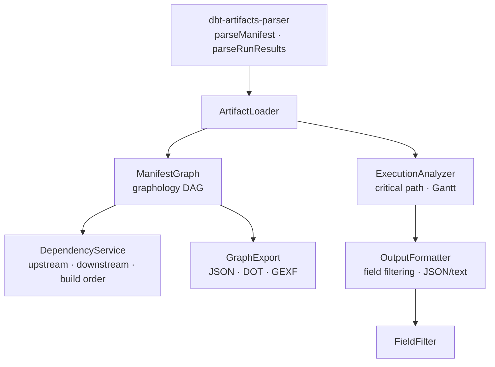

# @dbt-tools/core

Core library for dbt artifact graph management and analysis. Provides the analysis engine used by [`@dbt-tools/cli`](../cli/README.md) and [`@dbt-tools/web`](../web/README.md).

---

## Architecture



---

## Installation

```bash
pnpm add @dbt-tools/core
```

---

## Usage

```typescript
import { parseManifest } from "dbt-artifacts-parser/manifest";
import { ManifestGraph, ExecutionAnalyzer } from "@dbt-tools/core";

// Build dependency graph
const manifest = parseManifest(manifestJson);
const graph = new ManifestGraph(manifest);

// Summary statistics
const summary = graph.getSummary();
console.log(`Nodes: ${summary.total_nodes}, Cycles: ${summary.has_cycles}`);

// Dependency traversal
const upstream = graph.getUpstream("model.my_project.my_model");
const downstream = graph.getDownstream("model.my_project.my_model");

// Execution analysis
const analyzer = new ExecutionAnalyzer(runResults, manifest);
const report = analyzer.getSummary();
console.log(
  `Critical path: ${report.critical_path.map((n) => n.name).join(" → ")}`,
);
```

---

## Exports

### Node.js (default)

```typescript
import {
  // Analysis
  ManifestGraph,
  ExecutionAnalyzer,
  DependencyService,
  SqlAnalyzer,
  RunResultsSearch,
  AnalysisSnapshot,
  // I/O
  ArtifactLoader,
  // Validation
  InputValidator,
  // Formatting
  OutputFormatter,
  FieldFilter,
  GraphExport,
  // Errors
  ErrorHandler,
  // Introspection
  SchemaGenerator,
} from "@dbt-tools/core";
```

### Browser (no Node.js dependencies)

For use in browser environments (e.g. web workers in `@dbt-tools/web`):

```typescript
import {
  ManifestGraph,
  ExecutionAnalyzer,
  RunResultsSearch,
  AnalysisSnapshot,
} from "@dbt-tools/core/browser";
```

---

## Environment helpers (Node)

The Node entry re-exports configuration readers from [`src/config/dbt-tools-env.ts`](./src/config/dbt-tools-env.ts), including `getDbtToolsTargetDirFromEnv`, `getDbtToolsReloadDebounceMs`, `isDbtToolsWatchEnabled`, and **`getDbtToolsRemoteSourceConfigFromEnv`** with types **`DbtToolsRemoteSourceConfig`** / **`DbtToolsRemoteSourceProvider`**.

`DBT_TOOLS_REMOTE_SOURCE` is consumed by the **`@dbt-tools/web`** Vite middleware (not the browser). For operators, see [`packages/dbt-tools/web/README.md`](../web/README.md) and [ADR-0029](../../../docs/adr/0029-remote-object-storage-artifact-sources-and-auto-reload.md).

---

## API

### ManifestGraph

Builds a directed acyclic graph (DAG) from a parsed dbt manifest using [graphology](https://graphology.github.io/).

| Method                          | Description                                                             |
| ------------------------------- | ----------------------------------------------------------------------- |
| `getGraph()`                    | Returns the underlying `graphology` `DirectedGraph`                     |
| `getSummary()`                  | Returns `{ total_nodes, total_edges, has_cycles, node_counts_by_type }` |
| `getUpstream(nodeId, depth?)`   | All nodes that `nodeId` depends on (transitive, optional depth limit)   |
| `getDownstream(nodeId, depth?)` | All nodes that depend on `nodeId` (transitive, optional depth limit)    |

### ExecutionAnalyzer

Analyzes dbt execution results to compute critical paths and bottlenecks.

| Method                | Description                                                             |
| --------------------- | ----------------------------------------------------------------------- |
| `getSummary()`        | Returns execution summary with critical path, total time, slowest nodes |
| `getNodeExecutions()` | Per-node execution details (status, duration, thread)                   |
| `getGanttData()`      | Gantt chart data for timeline visualization                             |

### DependencyService

Higher-level dependency queries with build-order support.

| Method                                 | Description                                   |
| -------------------------------------- | --------------------------------------------- |
| `getUpstreamBuildOrder(nodeId)`        | Topological ordering of upstream dependencies |
| `getDependencyTree(nodeId, direction)` | Nested tree structure of dependencies         |

### ArtifactLoader

Loads dbt artifact files from disk.

```typescript
import { ArtifactLoader } from "@dbt-tools/core";

const loader = new ArtifactLoader({ targetDir: "./target" });
const manifest = await loader.loadManifest();
const runResults = await loader.loadRunResults();
```

### InputValidator

Validates user-supplied strings against common injection patterns (path traversal, control characters, URL encoding tricks).

### OutputFormatter / FieldFilter

Formats analysis output as JSON or human-readable text. `FieldFilter` limits output to a specified set of fields (useful for reducing context window usage in AI agents).

### GraphExport

Exports the dependency graph in multiple formats:

- `json` — nodes and edges as JSON
- `dot` — Graphviz DOT format
- `gexf` — GEXF format (for Gephi and other tools)

### ErrorHandler

Standardized error wrapping with typed error codes (`VALIDATION_ERROR`, `FILE_NOT_FOUND`, `PARSE_ERROR`, `UNSUPPORTED_VERSION`, `UNKNOWN_ERROR`).

### SchemaGenerator

Runtime introspection — generates machine-readable schemas for CLI commands. Used by `@dbt-tools/cli schema`.

---

## Performance

`ManifestGraph` uses graphology's adjacency-list representation and is optimized for large manifests with 100k+ nodes.

---

## Development

```bash
pnpm build
pnpm test
```

See [CONTRIBUTING.md](../../../CONTRIBUTING.md) for the full developer guide.

---

## License

Apache License 2.0.
