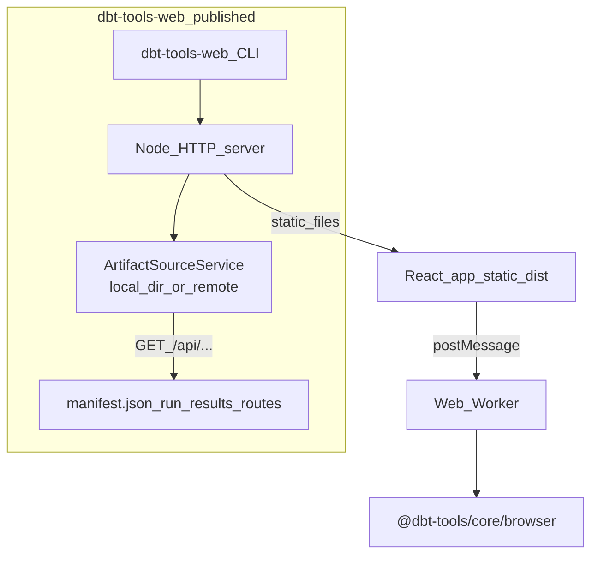

# @dbt-tools/web

**Artifact-driven investigation UI** for dbt: dependency and lineage graphs, execution timelines (critical path, bottlenecks), inventory and search, and health-oriented summaries—**deterministic views from `manifest.json` / `run_results.json` (and related artifacts). No LLM or chat surface is required**; the app is designed to answer operational questions (what failed, what was slow, what sits on the critical path, what depends on a node, what to inspect next) from structured analysis alone. Optional **S3/GCS** artifact sources are configured infrastructure, not a multi-tenant SaaS model—see [ADR-0029](../../../docs/adr/0029-remote-object-storage-artifact-sources-and-auto-reload.md) and [ADR-0035](../../../docs/adr/0035-dbt-tools-operational-intelligence-and-positioning-boundaries.md).

**End users:** install from npm and run **`dbt-tools-web`** (see below). **Contributors:** clone the monorepo and use Vite — see [Developing from source](#developing-from-source) and [CONTRIBUTING.md](https://github.com/yu-iskw/dbt-artifacts-parser-ts/blob/main/CONTRIBUTING.md).

Operator topics (**remote sources**, **Docker / GHCR**, **Vite-only env and file watch**) are covered in this README (the **Configuration** section below, [Docker and container images](#docker-and-container-images), and [Vite dev server (monorepo)](#vite-dev-server-monorepo)). Remote semantics: [ADR-0029](../../../docs/adr/0029-remote-object-storage-artifact-sources-and-auto-reload.md).

---

## Prerequisites

- **Node.js** — use the version in [`.node-version`](https://github.com/yu-iskw/dbt-artifacts-parser-ts/blob/main/.node-version) when developing; **Node.js 20+** is required to run the published app (Node 18 is EOL — see [Node.js releases](https://nodejs.org/en/about/previous-releases)).
- A dbt **`target/`** directory (or object storage) with **`manifest.json`** and **`run_results.json`** when you want preloaded artifacts.

---

## Install and run (npm)

The package publishes a small static server plus the **`dbt-tools-web`** binary ([source](https://github.com/yu-iskw/dbt-artifacts-parser-ts/blob/main/packages/dbt-tools/web/src/server/cli.ts)).

```bash
npm install -g @dbt-tools/web
dbt-tools-web --target /path/to/your/dbt/target
```

Or without a global install:

```bash
npx @dbt-tools/web --target /path/to/your/dbt/target
```

`npx` invokes the package’s binary (`dbt-tools-web`). Useful flags:

| Flag                    | Description                                          |
| ----------------------- | ---------------------------------------------------- |
| `--target <dir>` / `-t` | dbt `target` directory (sets `DBT_TOOLS_TARGET_DIR`) |
| `--port <n>` / `-p`     | Listen port (default **3000**)                       |
| `--help` / `-h`         | Usage                                                |

The server listens on **127.0.0.1** and prints the URL (e.g. `http://127.0.0.1:3000`). Open that URL in your browser manually (`open`, `xdg-open`, or your desktop environment).

### Security note (capabilities / Socket-style auditing)

For **supply-chain and capability** tooling (e.g. [Socket.dev alerts](https://socket.dev)):

- **`networkAccess` — expected.** The published app is a **local HTTP server** (`node:http` on loopback), the UI uses **`fetch`** to same-origin `/api/...` routes, and **optional** remote artifact mode uses **AWS S3** and **Google Cloud Storage** client libraries when you configure `DBT_TOOLS_REMOTE_SOURCE` (see [ADR-0029](https://github.com/yu-iskw/dbt-artifacts-parser-ts/blob/main/docs/adr/0029-remote-object-storage-artifact-sources-and-auto-reload.md)). There is no separate telemetry channel.
- **`shellAccess` (first-party) — none.** The CLI does **not** spawn a shell or external `open`/`xdg-open` helpers; it only starts the server and prints the URL.
- **`usesEval` — not in our shipped `dist` / `dist-serve` bundles** from this repository’s build. If a scanner still flags `usesEval`, it is usually from **transitive dependencies** in the full npm graph rather than first-party TypeScript.

You can also set **`DBT_TOOLS_TARGET_DIR`** in the environment instead of `--target`.

---

## Features

- **Dependency graph** — interactive lineage and blast-radius style exploration
- **Execution timeline** — Gantt-style `run_results` with critical path and bottleneck-oriented views
- **Local artifacts** — read `manifest.json` / `run_results.json` from a target directory via server-side routes (local-first default)
- **Remote sources (S3 / GCS)** — optional `DBT_TOOLS_REMOTE_SOURCE`; server-side credentials; UI prompts before switching runs ([ADR-0029](https://github.com/yu-iskw/dbt-artifacts-parser-ts/blob/main/docs/adr/0029-remote-object-storage-artifact-sources-and-auto-reload.md))
- **Large manifests** — web workers and virtualization for very large projects

---

## Architecture (runtime)



Heavy analysis runs in a **web worker** using `@dbt-tools/core/browser`. The same artifact HTTP surface is used in **Vite dev** (monorepo) with extra file-watching behavior — see [Vite dev server (monorepo)](#vite-dev-server-monorepo).

---

## Configuration (`dbt-tools-web` and production server)

Set these in the environment for the **Node process** that runs `dbt-tools-web` (not in the browser):

| Variable                  | Description                                                                                                                                                                                                                         |
| ------------------------- | ----------------------------------------------------------------------------------------------------------------------------------------------------------------------------------------------------------------------------------- |
| `DBT_TOOLS_TARGET_DIR`    | Directory containing `manifest.json` and `run_results.json` (unless using remote source)                                                                                                                                            |
| `DBT_TOOLS_REMOTE_SOURCE` | JSON config for S3/GCS discovery (server-side only); semantics in [ADR-0029](../../../docs/adr/0029-remote-object-storage-artifact-sources-and-auto-reload.md) (see also [Remote artifact sources](#remote-artifact-sources) below) |
| `DBT_TOOLS_DEBUG`         | Set to `1` for server-side debug logs                                                                                                                                                                                               |

**Client:** add **`?debug=1`** to the URL for browser console debug logging.

**Vite-only (monorepo dev):** `DBT_TOOLS_WATCH`, `DBT_TOOLS_RELOAD_DEBOUNCE_MS` — file watch and auto-reload; **not** used by the published `dbt-tools-web` binary. See [Vite dev server (monorepo)](#vite-dev-server-monorepo).

### Remote artifact sources

**Variable:** `DBT_TOOLS_REMOTE_SOURCE`. The dev server and **`dbt-tools-web`** can list keys under a bucket prefix, discover complete **`manifest.json` + `run_results.json`** pairs (non-recursive layout: root files or one subdirectory level per candidate), **poll** for changes, and surface newer runs in the UI **without switching your selected run automatically**. Credentials stay in the **Node process** (AWS default chain, GCS ADC / `GOOGLE_APPLICATION_CREDENTIALS`), not in the browser.

Example (shape only — adjust bucket/prefix):

```bash
export DBT_TOOLS_REMOTE_SOURCE='{"provider":"s3","bucket":"my-bucket","prefix":"dbt/runs","pollIntervalMs":30000}'
pnpm dev
```

### Vite dev environment reference (monorepo)

When **`DBT_TOOLS_TARGET_DIR`** is set, Vite serves `/api/...` like the published server. Extra variables:

| Variable                       | Default | Description                                                                                                                                      |
| ------------------------------ | ------- | ------------------------------------------------------------------------------------------------------------------------------------------------ |
| `DBT_TOOLS_TARGET_DIR`         | —       | Enables serving artifacts via `/api/*` middleware                                                                                                |
| `DBT_TOOLS_REMOTE_SOURCE`      | —       | JSON for S3/GCS bucket + prefix (server-side only); [ADR-0029](../../../docs/adr/0029-remote-object-storage-artifact-sources-and-auto-reload.md) |
| `DBT_TOOLS_DEBUG`              | unset   | `1` enables server-side debug logging                                                                                                            |
| `DBT_TOOLS_WATCH`              | on      | `0` disables file watching (Vite dev); see [Vite dev server](#vite-dev-server-monorepo)                                                          |
| `DBT_TOOLS_RELOAD_DEBOUNCE_MS` | `300`   | Reload debounce (Vite dev)                                                                                                                       |

---

## Docker and container images

### Published server vs static Docker image

- **`dbt-tools-web`** (npm): Node HTTP server + static `dist/` + artifact middleware. Honors **`DBT_TOOLS_TARGET_DIR`**, **`DBT_TOOLS_REMOTE_SOURCE`**, **`DBT_TOOLS_DEBUG`**. Does **not** use Vite file-watch env vars.
- **Dockerfile (nginx):** builds static **`dist/`** and serves it with **nginx**. There is **no** Node artifact middleware in that image unless you change the deployment shape, so the same **`DBT_TOOLS_*`** server env vars **do not apply** to that container as shipped.

### Build static image (monorepo)

The image is a multi-stage build: Node installs workspace dependencies and runs `pnpm --filter @dbt-tools/web build`; the final stage serves **`dist/`** with [nginx unprivileged](https://hub.docker.com/r/nginxinc/nginx-unprivileged) (non-root, port **8080**, SPA fallback to `index.html`).

**Build context must be the monorepo root** (not `packages/dbt-tools/web` alone).

```bash
docker build -f packages/dbt-tools/web/Dockerfile -t dbt-tools-web:local .
docker run --rm -p 8080:8080 dbt-tools-web:local
```

Open `http://localhost:8080/`.

**Vite build-time** variables (`VITE_*`), if introduced, must be passed at **image build** time (e.g. `docker build --build-arg ...`) and wired in the Dockerfile.

### GitHub Container Registry (CI)

Workflow: [`.github/workflows/docker-dbt-tools-web.yml`](../../../.github/workflows/docker-dbt-tools-web.yml) — builds on `push` to `main`, `pull_request` (build only), and `workflow_dispatch`. Images are pushed to **GHCR**:

`ghcr.io/<github-owner-lowercase>/dbt-tools-web`

Tags include a **git SHA** on pushes to `main` (and manual runs), and **`latest`** for default-branch builds.

```bash
echo "$GITHUB_TOKEN" | docker login ghcr.io -u USERNAME --password-stdin
docker pull ghcr.io/<github-owner-lowercase>/dbt-tools-web:latest
```

Set package visibility under the repository **Packages** settings if needed.

---

## Troubleshooting

| Symptom                                        | What to check                                                                                                                                                                                           |
| ---------------------------------------------- | ------------------------------------------------------------------------------------------------------------------------------------------------------------------------------------------------------- |
| Blank UI / no artifacts                        | Pass **`--target`** or set **`DBT_TOOLS_TARGET_DIR`** to a folder that contains **`manifest.json`** (and ideally `run_results.json`). For remote mode, set **`DBT_TOOLS_REMOTE_SOURCE`**.               |
| Blank page / “No artifacts found”              | Same as above: confirm **`DBT_TOOLS_TARGET_DIR`** or **`DBT_TOOLS_REMOTE_SOURCE`** resolves to a complete artifact pair.                                                                                |
| `GET /api/...` or `GET /api/manifest.json` 404 | **`DBT_TOOLS_TARGET_DIR`** unset, wrong path, or (remote) no complete pair discovered.                                                                                                                  |
| Auto-reload not triggering (Vite)              | Ensure **`DBT_TOOLS_WATCH`** is not `0`; confirm read access to the target directory. See [Vite dev server (monorepo)](#vite-dev-server-monorepo).                                                      |
| Expected “hot reload” after `dbt run`          | The **npm** server re-reads files when the app fetches them; refresh the browser. **File watch + auto-reload** is a **Vite dev** feature — see [Vite dev server (monorepo)](#vite-dev-server-monorepo). |
| Expected Vite HMR from npm install             | Use **`pnpm dev`** from the monorepo or run **`dbt-tools-web`** and refresh after artifact changes.                                                                                                     |
| Debug logs missing                             | Server: restart with **`DBT_TOOLS_DEBUG=1`**. Client: **`?debug=1`** on the URL.                                                                                                                        |
| Slow UI on huge projects                       | Prefer the latest version; very large graphs still benefit from narrowing scope in the UI. Web worker + virtualization target large graphs; profile the main thread if still slow.                      |

If **`npx`** against a local **`.tgz`** fails with **`Permission denied`**, use `npx -y ./name.tgz -- --help` from the directory that contains the file, or `npx -y --package=/abs/path/name.tgz -- dbt-tools-web …`. See **Verify publish locally** under [Developing from source](#developing-from-source).

---

## Developing from source

For **clone, pnpm install, build order, lint, and tests**, use [CONTRIBUTING.md](https://github.com/yu-iskw/dbt-artifacts-parser-ts/blob/main/CONTRIBUTING.md).

### Tech stack

| Layer          | Technology                                                    |
| -------------- | ------------------------------------------------------------- |
| UI             | [React](https://react.dev/)                                   |
| Build          | [Vite](https://vitejs.dev/)                                   |
| Charts         | [Recharts](https://recharts.org/)                             |
| Virtualization | [@tanstack/react-virtual](https://tanstack.com/virtual)       |
| Analysis       | `@dbt-tools/core` / `@dbt-tools/core/browser` in a web worker |
| E2E            | [Playwright](https://playwright.dev/)                         |
| Language       | TypeScript                                                    |

### Monorepo commands

```bash
# From repository root
pnpm dev:web

# Or from this package
cd packages/dbt-tools/web
pnpm dev
```

Preload local artifacts (Vite):

```bash
DBT_TOOLS_TARGET_DIR=./target pnpm dev
# or: pnpm dev:target
```

### Vite dev server (monorepo)

When you run `pnpm dev` / `pnpm dev:web` from the repository, **Vite** serves the app with middleware that mirrors the same **`/api/...`** artifact routes as the published **`dbt-tools-web`** server. Additional **file watching** and auto-reload apply only here.

Without env prefill, use the in-app **Load artifacts** panel: choose **local**, **S3**, or **GCS**, enter a **location** (directory path or `s3://` / `gs://` bucket prefix), run **Discover**, then **select a run** when more than one complete `manifest.json` + `run_results.json` pair exists. Cloud credentials never enter the browser—they stay in the Node server (same model as `DBT_TOOLS_REMOTE_SOURCE` in [ADR-0029](../../../docs/adr/0029-remote-object-storage-artifact-sources-and-auto-reload.md)).

#### Debug logging

- **Server-side (Vite middleware):** `DBT_TOOLS_DEBUG=1`
- **Client-side:** add **`?debug=1`** to the URL

```bash
DBT_TOOLS_DEBUG=1 DBT_TOOLS_TARGET_DIR=~/path/to/target pnpm dev
# then: http://localhost:5173/?debug=1
```

#### Auto-reload when artifacts change

When `DBT_TOOLS_TARGET_DIR` is set under Vite, the app can **reload and re-analyze** after `manifest.json` or `run_results.json` change on disk (for example after `dbt run`):

| Variable                       | Default | Description                                    |
| ------------------------------ | ------- | ---------------------------------------------- |
| `DBT_TOOLS_WATCH`              | on      | Set to `0` to disable watching and auto-reload |
| `DBT_TOOLS_RELOAD_DEBOUNCE_MS` | `300`   | Debounce (ms) for rapid writes                 |

```bash
DBT_TOOLS_WATCH=0 DBT_TOOLS_TARGET_DIR=./target pnpm dev
```

### Verify publish locally (tarball + `npx`)

To smoke-test the published **`dbt-tools-web`** entrypoint and tarball layout **without publishing to the public npm registry**:

- **Recommended (matches CI):** from the **monorepo root** after `pnpm install`, run Verdaccio, publish `dbt-artifacts-parser` → `@dbt-tools/core` → `@dbt-tools/web`, pack, then `npx` with `NPM_CONFIG_REGISTRY` pointing at that registry:

```bash
bash scripts/smoke-npx-with-verdaccio.sh
```

This avoids **`No matching version found for @dbt-tools/core@…`** when those versions are not yet on npm (packed tarballs list concrete semver peers).

- **Manual pack only** (only reliable if peer versions already exist on the registry `npx` uses, or you set `NPM_CONFIG_REGISTRY` accordingly):

```bash
pnpm --filter @dbt-tools/web pack
```

`prepack` runs the full web build and writes **`dbt-tools-web-<version>.tgz` at the repo root** (the file is gitignored).

- **Empty directory** so `npx` does not see the monorepo’s `node_modules`:

```bash
cd "$(mktemp -d)"
# After copying the .tgz into this directory (adjust version to match package.json):
npx -y ./dbt-tools-web-0.4.1.tgz -- --help
```

If you pass a **bare absolute path** to the tarball, some `npx` versions try to execute it as a shell script and fail (`Permission denied`). Prefer either a **relative** `./…tgz` path or an explicit package spec:

```bash
npx -y --package=/absolute/path/to/dbt-tools-web-0.4.1.tgz -- dbt-tools-web --help
```

### Project layout (abridged)

```text
packages/dbt-tools/web/
├── src/
│   ├── components/     # React UI (AnalysisWorkspace, AppShell, ui)
│   ├── artifact-source/ # Local + remote artifact HTTP surface
│   ├── server/         # dbt-tools-web CLI + static server
│   ├── workers/        # Analysis web worker
│   └── ...
├── e2e/                # Playwright specs
└── vite.config.ts
```

### E2E tests

```bash
pnpm test:e2e
```

(from repo root: `pnpm test:e2e` as documented in CONTRIBUTING)

---

## Related packages

| Package                                                                                                                        | Role              |
| ------------------------------------------------------------------------------------------------------------------------------ | ----------------- |
| [`@dbt-tools/core`](https://github.com/yu-iskw/dbt-artifacts-parser-ts/blob/main/packages/dbt-tools/core/README.md)            | Analysis engine   |
| [`@dbt-tools/cli`](https://github.com/yu-iskw/dbt-artifacts-parser-ts/blob/main/packages/dbt-tools/cli/README.md)              | CLI (`dbt-tools`) |
| [`dbt-artifacts-parser`](https://github.com/yu-iskw/dbt-artifacts-parser-ts/blob/main/packages/dbt-artifacts-parser/README.md) | Artifact parsing  |

---

## License

The `@dbt-tools/*` packages use a **custom source-available license**; they are **not** OSI “open source.” The following is a **short summary** — the binding terms are in the **`LICENSE`** file at the root of each published npm package (`package.json` uses `SEE LICENSE IN LICENSE`).

- **You may** use and modify the software for **personal use** and for **internal use** within your organization for your own business purposes, **provided** you do not offer a **commercial service** where the software (or a derivative intended to replace or substantially replicate the published `@dbt-tools/*` packages) is a material part of the value you sell or deliver to third parties (for example hosted access, resale, or client production work centered on operating the software — see `LICENSE` for definitions).
- **You may not**, without **prior written permission** from the copyright holder, offer such a **commercial service**, or **publish** the software or that kind of derivative to a **package registry** (npm, GitHub Packages, and similar) for third-party consumption.
- **Dependencies** such as **`dbt-artifacts-parser`** remain under **their own** licenses (**Apache-2.0** for that library). This license does not override them.
