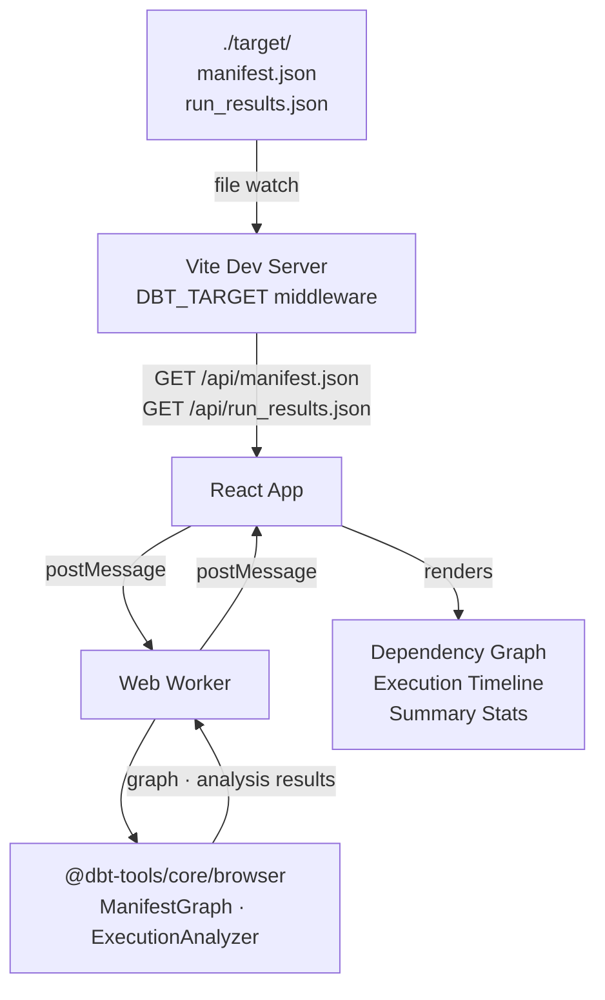

# @dbt-tools/web

React web application for visual dbt artifact analysis. Provides interactive dependency graph exploration and execution timeline visualization.

---

## Features

- **Dependency graph visualization** — explore model relationships as an interactive graph
- **Execution timeline** — Gantt-style view of `run_results.json` with critical path highlighting
- **Auto-reload** — automatically re-analyzes artifacts when `dbt run` completes
- **Large project support** — virtualized lists and web workers keep the UI responsive at 100k+ nodes

---

## Architecture



Heavy analysis runs in a web worker to keep the main thread free. The worker imports from `@dbt-tools/core/browser` (the Node.js-free export) so it works without any server-side code.

---

## Running Locally

The web app is not published to npm. Run it from the monorepo:

```bash
# From repo root
pnpm dev:web

# Or from the package directory
cd packages/dbt-tools/web
pnpm dev
```

### Preloading artifacts from a local dbt project

Set `DBT_TARGET` to serve `manifest.json` and `run_results.json` from that directory:

```bash
DBT_TARGET=./target pnpm dev
# or use the convenience script from repo root:
pnpm dev:web   # (configures DBT_TARGET=./target automatically)
```

Then open the URL Vite prints (e.g. `http://localhost:5173/`).

### Debug Logging

- **Server-side** (Vite middleware): set `DBT_DEBUG=1` when starting dev
- **Client-side** (browser console): add `?debug=1` to the URL

```bash
DBT_DEBUG=1 DBT_TARGET=~/path/to/target pnpm dev
# then open: http://localhost:5173/?debug=1
```

### Auto-reload When Artifacts Change

When `DBT_TARGET` is set, the app automatically reloads and re-analyzes when `manifest.json` or `run_results.json` change on disk (e.g. after `dbt run`):

| Variable | Default | Description |
|----------|---------|-------------|
| `DBT_WATCH` | `1` | Enable (`1`) or disable (`0`) file watching and auto-reload |
| `DBT_RELOAD_DEBOUNCE_MS` | `300` | Debounce in ms for rapid file writes |

```bash
# Disable auto-reload
DBT_WATCH=0 DBT_TARGET=./target pnpm dev
```

---

## Building for Production

```bash
pnpm build
# Output in dist/
pnpm preview   # serve the production build locally
```

---

## E2E Tests

The web app has Playwright end-to-end tests:

```bash
pnpm test:e2e
```

See `e2e/` for test specs.

---

## Development

```bash
pnpm build   # TypeScript + Vite build
pnpm dev     # Vite dev server with HMR
```

See [CONTRIBUTING.md](../../../CONTRIBUTING.md) for the full developer guide, including how to set up the monorepo and run all tests.

---

## License

Apache License 2.0.
