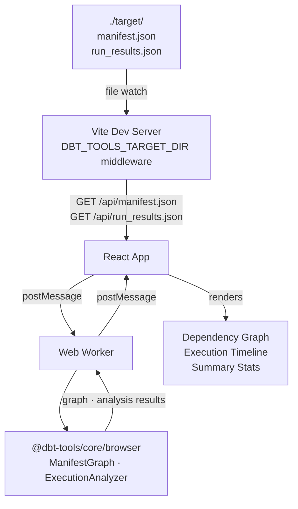

# @dbt-tools/web

React web application for visual dbt artifact analysis. Provides interactive dependency graph exploration and execution timeline visualization.

---

## Prerequisites

- **Node.js** ≥ 18
- **pnpm** ≥ 8 (the monorepo uses pnpm workspaces)
- A dbt project with a `./target/` directory containing `manifest.json` and/or `run_results.json`

---

## Tech Stack

| Layer           | Technology                                                       |
| --------------- | ---------------------------------------------------------------- |
| UI framework    | [React 18](https://react.dev/)                                   |
| Build tool      | [Vite 6](https://vitejs.dev/)                                    |
| Charts          | [Recharts](https://recharts.org/)                                |
| Virtualization  | [@tanstack/react-virtual](https://tanstack.com/virtual)          |
| Analysis engine | `@dbt-tools/core` (web worker, `@dbt-tools/core/browser` export) |
| E2E tests       | [Playwright](https://playwright.dev/)                            |
| Language        | TypeScript 5                                                     |

---

## Features

- **Dependency graph visualization** — explore model relationships as an interactive graph
- **Execution timeline** — Gantt-style view of `run_results.json` with critical path highlighting
- **Auto-reload (local target)** — with `DBT_TOOLS_TARGET_DIR`, re-analyzes when `manifest.json` / `run_results.json` change on disk (e.g. after `dbt run`)
- **Remote artifact sources (S3 / GCS)** — optional `DBT_TOOLS_REMOTE_SOURCE`; the dev server resolves the latest complete pair under a bucket prefix, polls for newer runs, and prompts before switching the workspace (see [ADR-0029](../../../docs/adr/0029-remote-object-storage-artifact-sources-and-auto-reload.md))
- **Large project support** — virtualized lists and web workers keep the UI responsive at 100k+ nodes

---

## Architecture



Heavy analysis runs in a web worker to keep the main thread free. The worker imports from `@dbt-tools/core/browser` (the Node.js-free export) so it works without any server-side code.

---

## Running Locally

The web app is not published to npm. Run it from the monorepo:

```bash
# From repo root
pnpm dev:web

# Or from the package directory
cd packages/dbt-tools/web
pnpm dev
```

### Preloading artifacts from a local dbt project

Set `DBT_TOOLS_TARGET_DIR` to serve `manifest.json` and `run_results.json` from that directory:

```bash
DBT_TOOLS_TARGET_DIR=./target pnpm dev
# or use the dev:target convenience script from the package directory:
pnpm dev:target   # shorthand for DBT_TOOLS_TARGET_DIR=./target vite
```

Legacy names (`DBT_TARGET`, `DBT_TARGET_DIR`) still work but log a one-time deprecation warning; prefer `DBT_TOOLS_TARGET_DIR`.

Then open the URL Vite prints (e.g. `http://localhost:5173/`).

### Debug Logging

- **Server-side** (Vite middleware): set `DBT_TOOLS_DEBUG=1` when starting dev (legacy: `DBT_DEBUG`)
- **Client-side** (browser console): add `?debug=1` to the URL

```bash
DBT_TOOLS_DEBUG=1 DBT_TOOLS_TARGET_DIR=~/path/to/target pnpm dev
# then open: http://localhost:5173/?debug=1
```

### Auto-reload When Artifacts Change

When `DBT_TOOLS_TARGET_DIR` is set, the app automatically reloads and re-analyzes when `manifest.json` or `run_results.json` change on disk (e.g. after `dbt run`):

| Variable                       | Default | Description                                         |
| ------------------------------ | ------- | --------------------------------------------------- |
| `DBT_TOOLS_WATCH`              | on      | Set to `0` to disable file watching and auto-reload |
| `DBT_TOOLS_RELOAD_DEBOUNCE_MS` | `300`   | Debounce in ms for rapid file writes                |

Legacy: `DBT_WATCH`, `DBT_RELOAD_DEBOUNCE_MS` (deprecated).

```bash
# Disable auto-reload
DBT_TOOLS_WATCH=0 DBT_TOOLS_TARGET_DIR=./target pnpm dev
```

---

## Configuration

All configuration is via environment variables passed to the Vite dev server or build:

| Variable                       | Default | Description                                                                                        |
| ------------------------------ | ------- | -------------------------------------------------------------------------------------------------- |
| `DBT_TOOLS_TARGET_DIR`         | —       | Directory containing `manifest.json` and `run_results.json`; enables the `/api/*` proxy middleware |
| `DBT_TOOLS_REMOTE_SOURCE`      | —       | JSON config for S3 or GCS bucket + prefix discovery (server-side access only); see ADR-0029        |
| `DBT_TOOLS_DEBUG`              | unset   | Set to `1` to enable server-side debug logging in the Vite middleware                              |
| `DBT_TOOLS_WATCH`              | on      | Set to `0` to disable file watching and auto-reload when artifacts change                          |
| `DBT_TOOLS_RELOAD_DEBOUNCE_MS` | `300`   | Debounce delay in ms before triggering a reload on rapid file writes                               |

**Deprecated (still read):** `DBT_TARGET`, `DBT_TARGET_DIR`, `DBT_DEBUG`, `DBT_WATCH`, `DBT_RELOAD_DEBOUNCE_MS`.

Add `?debug=1` to the browser URL to enable client-side debug logging.

---

## Building for Production

```bash
pnpm build
# Output in dist/
pnpm preview   # serve the production build locally
```

### Docker

The image is a multi-stage build: Node installs workspace dependencies and runs `pnpm --filter @dbt-tools/web build`; the final stage serves static `dist/` with [nginx unprivileged](https://hub.docker.com/r/nginxinc/nginx-unprivileged) (non-root, port **8080**, SPA fallback to `index.html`).

**Build context must be the monorepo root** (not this package directory), because the web app depends on workspace packages.

```bash
# From repository root
docker build -f packages/dbt-tools/web/Dockerfile -t dbt-tools-web:local .
docker run --rm -p 8080:8080 dbt-tools-web:local
```

Then open `http://localhost:8080/`.

The production image is static files only: there is no Vite dev middleware, so `DBT_TOOLS_TARGET_DIR` and related server-side env vars from local dev do not apply unless you add a different deployment shape. Any future **Vite build-time** variables (`VITE_*`) must be passed at image build time, for example `docker build --build-arg VITE_EXAMPLE=...` (and your Dockerfile would need to forward them into the build step).

#### GitHub Container Registry (CI)

The workflow [`.github/workflows/docker-dbt-tools-web.yml`](../../../.github/workflows/docker-dbt-tools-web.yml) builds this Dockerfile on `push` to `main`, on `pull_request` (build only, no push), and via `workflow_dispatch`. Images are pushed to **GHCR**:

`ghcr.io/<github-owner-lowercase>/dbt-tools-web`

Tags include a **git SHA** tag on every push to `main` (and manual runs), and **`latest`** when the default branch is built. Replace `<github-owner-lowercase>` with the repository owner in lowercase (for example your user or org name).

```bash
# Private package: create a PAT with read:packages (or use gh auth token)
echo "$GITHUB_TOKEN" | docker login ghcr.io -u USERNAME --password-stdin
docker pull ghcr.io/<github-owner-lowercase>/dbt-tools-web:latest
```

After the first successful push, set package visibility (public vs private) under the repository’s **Packages** settings if needed.

---

## Project Structure

```text
packages/dbt-tools/web/
├── src/
│   ├── components/          # React UI components
│   │   ├── AnalysisWorkspace/   # Analyzer workspace (import via ./AnalysisWorkspace → index.tsx)
│   │   │   └── views/           # Feature views: health/, inventory/, runs/; shared overview/ + assets
│   │   ├── AppShell/            # Top-level layout shell
│   │   └── ui/                  # Shared primitive components
│   ├── hooks/               # Custom React hooks
│   ├── services/            # Data-fetching and artifact API services
│   ├── workers/             # Web worker for off-thread analysis
│   ├── constants/           # Theme colors and shared constants
│   ├── lib/                 # Analysis workspace helpers
│   ├── styles/              # CSS tokens, base, and component styles
│   ├── App.tsx              # Root application component
│   └── main.tsx             # Entry point
├── e2e/                     # Playwright end-to-end test specs
├── vite.config.ts           # Vite + Vite middleware (DBT_TOOLS_TARGET_DIR proxy)
└── package.json
```

---

## E2E Tests

The web app has Playwright end-to-end tests:

```bash
pnpm test:e2e
```

See `e2e/` for test specs.

---

## Troubleshooting

| Symptom                              | Fix                                                                                                                                                                    |
| ------------------------------------ | ---------------------------------------------------------------------------------------------------------------------------------------------------------------------- |
| Blank page / "No artifacts found"    | Ensure `DBT_TOOLS_TARGET_DIR` points to a directory that contains `manifest.json`                                                                                      |
| Auto-reload not triggering           | Check `DBT_TOOLS_WATCH` is not set to `0`; verify the file watcher has read access to the target directory                                                             |
| Slow UI with large manifests         | The web worker and virtualized lists should handle 100k+ nodes; if performance still degrades, open the browser profiler and check for main-thread analysis code paths |
| `GET /api/manifest.json` returns 404 | `DBT_TOOLS_TARGET_DIR` is not set or the Vite dev server was started without it                                                                                        |
| Debug logs not appearing             | Server-side: restart dev with `DBT_TOOLS_DEBUG=1`; client-side: add `?debug=1` to the URL                                                                              |

---

## Development

```bash
pnpm build   # TypeScript + Vite build
pnpm dev     # Vite dev server with HMR
```

See [CONTRIBUTING.md](../../../CONTRIBUTING.md) for the full developer guide, including how to set up the monorepo and run all tests.

---

## Related Packages

| Package                                                        | Description                                                                  |
| -------------------------------------------------------------- | ---------------------------------------------------------------------------- |
| [`@dbt-tools/core`](../core/README.md)                         | Analysis engine used by this web app (dependency graphs, execution analysis) |
| [`@dbt-tools/cli`](../cli/README.md)                           | Command-line interface for the same analysis, optimized for AI agents        |
| [`dbt-artifacts-parser`](../../dbt-artifacts-parser/README.md) | Standalone library for parsing and typing dbt JSON artifacts                 |

---

## License

Apache License 2.0.
