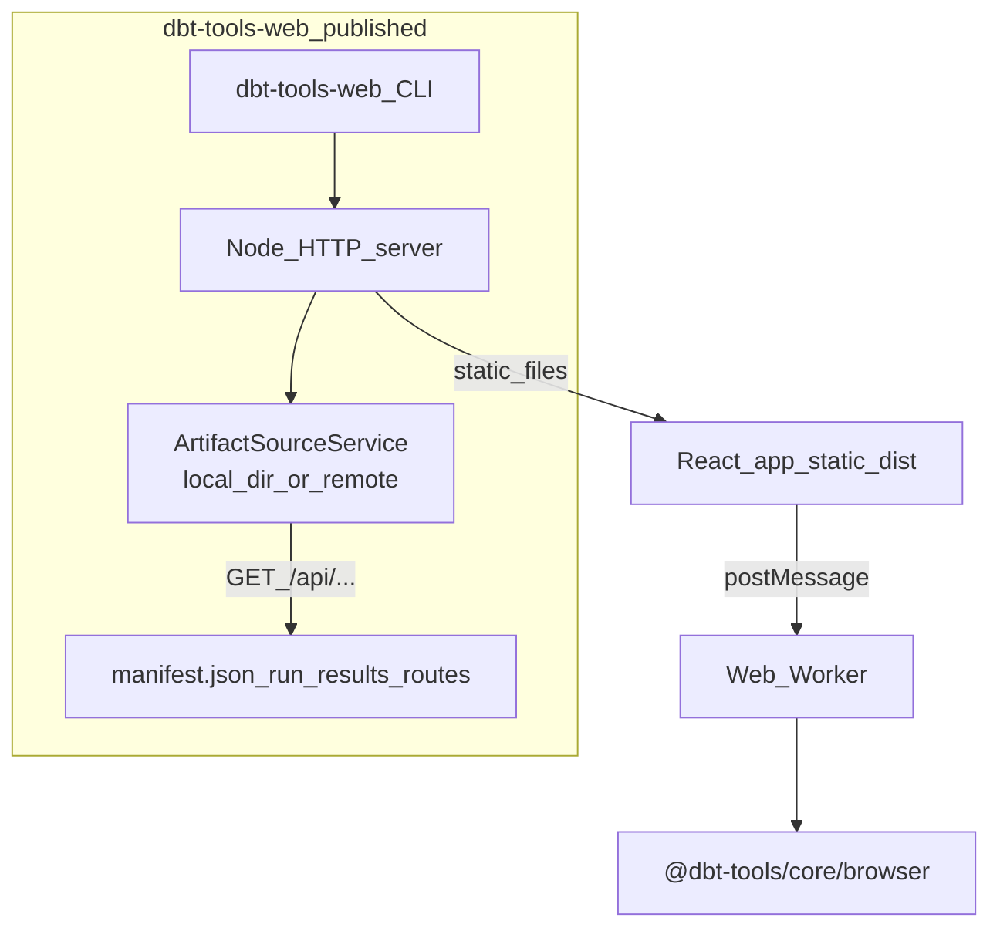

# @dbt-tools/web

React application for visual dbt artifact analysis: dependency graphs, execution timelines, inventory views, and optional remote runs from S3 or GCS.

**End users:** install from npm and run **`dbt-tools-web`** (see below). **Contributors:** clone the monorepo and use Vite — see [Developing from source](#developing-from-source) and [CONTRIBUTING.md](https://github.com/yu-iskw/dbt-artifacts-parser-ts/blob/main/CONTRIBUTING.md).

Full operator topics (Docker, GHCR, remote sources, Vite-only options) live in the [user guide](../../../docs/user-guide-dbt-tools-web.md).

---

## Prerequisites

- **Node.js** — use the version in [`.node-version`](https://github.com/yu-iskw/dbt-artifacts-parser-ts/blob/main/.node-version) when developing; **Node.js 20+** is required to run the published app (Node 18 is EOL — see [Node.js releases](https://nodejs.org/en/about/previous-releases)).
- A dbt **`target/`** directory (or object storage) with **`manifest.json`** and **`run_results.json`** when you want preloaded artifacts.

---

## Install and run (npm)

The package publishes a small static server plus the **`dbt-tools-web`** binary ([source](https://github.com/yu-iskw/dbt-artifacts-parser-ts/blob/main/packages/dbt-tools/web/src/server/cli.ts)).

```bash
npm install -g @dbt-tools/web
dbt-tools-web --target /path/to/your/dbt/target
```

Or without a global install (pick one):

```bash
npx @dbt-tools/web --target /path/to/your/dbt/target
pnpm dlx @dbt-tools/web -- --target /path/to/your/dbt/target
```

`npx` / `pnpm dlx` install the package temporarily and run the **`dbt-tools-web`** binary from npm.

**Working directory:** run these from a **normal project folder** (for example your home directory, `/tmp`, or a small throwaway directory)—**not** from `packages/dbt-tools/web` inside a clone of this repo **unless** you have already built that package (`pnpm --filter @dbt-tools/web build`). Otherwise the tool may resolve the **workspace copy**, which does not ship `dist-serve/` until built, and you can see errors such as **`sh: dbt-tools-web: command not found`** (exit 127) or a missing CLI file. **Contributors** doing day-to-day UI work should use **`pnpm dev`** / **`pnpm dev:web`** with **`DBT_TOOLS_TARGET_DIR`** instead; see [Developing from source](#developing-from-source).

Useful flags:

| Flag                    | Description                                          |
| ----------------------- | ---------------------------------------------------- |
| `--target <dir>` / `-t` | dbt `target` directory (sets `DBT_TOOLS_TARGET_DIR`) |
| `--port <n>` / `-p`     | Listen port (default **3000**)                       |
| `--no-open`             | Do not open a browser                                |
| `--help` / `-h`         | Usage                                                |

The server listens on **127.0.0.1** and prints the URL (e.g. `http://127.0.0.1:3000`).

You can also set **`DBT_TOOLS_TARGET_DIR`** (or legacy `DBT_TARGET_DIR` / `DBT_TARGET`) in the environment instead of `--target`.

---

## Features

- **Dependency graph** — interactive lineage
- **Execution timeline** — Gantt-style `run_results` with critical path
- **Local artifacts** — read `manifest.json` / `run_results.json` from a target directory via server-side routes
- **Remote sources (S3 / GCS)** — optional `DBT_TOOLS_REMOTE_SOURCE`; server-side credentials; UI prompts before switching runs ([ADR-0029](https://github.com/yu-iskw/dbt-artifacts-parser-ts/blob/main/docs/adr/0029-remote-object-storage-artifact-sources-and-auto-reload.md))
- **Large manifests** — web workers and virtualization for very large projects

---

## Architecture (runtime)



Heavy analysis runs in a **web worker** using `@dbt-tools/core/browser`. The same artifact HTTP surface is used in **Vite dev** (monorepo) with extra file-watching behavior — see the [user guide](../../../docs/user-guide-dbt-tools-web.md#vite-dev-server-monorepo).

---

## Configuration (`dbt-tools-web` and production server)

Set these in the environment for the **Node process** that runs `dbt-tools-web` (not in the browser):

| Variable                  | Description                                                                                                      |
| ------------------------- | ---------------------------------------------------------------------------------------------------------------- |
| `DBT_TOOLS_TARGET_DIR`    | Directory containing `manifest.json` and `run_results.json` (unless using remote source)                         |
| `DBT_TOOLS_REMOTE_SOURCE` | JSON config for S3/GCS discovery (server-side only); see [user guide](../../../docs/user-guide-dbt-tools-web.md) |
| `DBT_TOOLS_DEBUG`         | Set to `1` for server-side debug logs (legacy: `DBT_DEBUG`)                                                      |

**Deprecated (still read):** `DBT_TARGET`, `DBT_TARGET_DIR`, `DBT_DEBUG`.

**Client:** add **`?debug=1`** to the URL for browser console debug logging.

**Vite-only (monorepo dev):** `DBT_TOOLS_WATCH`, `DBT_TOOLS_RELOAD_DEBOUNCE_MS` — file watch and auto-reload; **not** used by the published `dbt-tools-web` binary. See the [user guide](../../../docs/user-guide-dbt-tools-web.md#vite-dev-server-monorepo).

---

## Docker and container images

For building the **nginx static image** from the monorepo, GHCR tags, and limitations (static `dist/` only), see [user guide — Docker & GHCR](../../../docs/user-guide-dbt-tools-web.md#docker).

---

## Troubleshooting

| Symptom                                               | What to check                                                                                                                                                                                                                                                                                                                                                                                                                                                                                                                                                                                                                                                                                                                                                                                                   |
| ----------------------------------------------------- | --------------------------------------------------------------------------------------------------------------------------------------------------------------------------------------------------------------------------------------------------------------------------------------------------------------------------------------------------------------------------------------------------------------------------------------------------------------------------------------------------------------------------------------------------------------------------------------------------------------------------------------------------------------------------------------------------------------------------------------------------------------------------------------------------------------- |
| `sh: dbt-tools-web: command not found` / **exit 127** | The shell could not run the **`dbt-tools-web`** binary. **Fix:** install globally (`npm install -g @dbt-tools/web`) and ensure your global npm **`bin`** directory is on **`PATH`**, **or** run **`npx`** / **`pnpm dlx`** from a directory **outside** this package’s source tree (see [Install and run](#install-and-run-npm)). **Monorepo:** after `pnpm --filter @dbt-tools/web build`, run `pnpm --filter @dbt-tools/web exec dbt-tools-web -- --target …` from the repo root. **Debug:** in a folder where you ran `npm install @dbt-tools/web`, check that `node_modules/@dbt-tools/web/dist-serve/server/cli.js` exists, then run `node node_modules/@dbt-tools/web/dist-serve/server/cli.js --help` — if that works but `dbt-tools-web` does not, the problem is PATH or the `.bin` shim, not the app. |
| Blank UI / no artifacts                               | Pass **`--target`** or set **`DBT_TOOLS_TARGET_DIR`** to a folder that contains **`manifest.json`** (and ideally `run_results.json`). For remote mode, set **`DBT_TOOLS_REMOTE_SOURCE`**.                                                                                                                                                                                                                                                                                                                                                                                                                                                                                                                                                                                                                       |
| `GET /api/...` 404                                    | Target dir missing files, wrong path, or remote config not returning a complete pair.                                                                                                                                                                                                                                                                                                                                                                                                                                                                                                                                                                                                                                                                                                                           |
| Expected “hot reload” after `dbt run`                 | The **npm** server re-reads files when the app fetches them; refresh the browser. **File watch + auto-reload** is a **Vite dev** feature — see the [user guide](../../../docs/user-guide-dbt-tools-web.md).                                                                                                                                                                                                                                                                                                                                                                                                                                                                                                                                                                                                     |
| Slow UI on huge projects                              | Prefer the latest version; very large graphs still benefit from narrowing scope in the UI.                                                                                                                                                                                                                                                                                                                                                                                                                                                                                                                                                                                                                                                                                                                      |

More rows, npm run paths, and diagrams: [user guide — npm install & troubleshooting](../../../docs/user-guide-dbt-tools-web.md#npm-install-npx-dlx-and-global-binary).

---

## Developing from source

For **clone, pnpm install, build order, lint, and tests**, use [CONTRIBUTING.md](https://github.com/yu-iskw/dbt-artifacts-parser-ts/blob/main/CONTRIBUTING.md).

### Tech stack

| Layer          | Technology                                                    |
| -------------- | ------------------------------------------------------------- |
| UI             | [React](https://react.dev/)                                   |
| Build          | [Vite](https://vitejs.dev/)                                   |
| Charts         | [Recharts](https://recharts.org/)                             |
| Virtualization | [@tanstack/react-virtual](https://tanstack.com/virtual)       |
| Analysis       | `@dbt-tools/core` / `@dbt-tools/core/browser` in a web worker |
| E2E            | [Playwright](https://playwright.dev/)                         |
| Language       | TypeScript                                                    |

### Monorepo commands

```bash
# From repository root
pnpm dev:web

# Or from this package
cd packages/dbt-tools/web
pnpm dev
```

Preload local artifacts (Vite):

```bash
DBT_TOOLS_TARGET_DIR=./target pnpm dev
# or: pnpm dev:target
```

### Project layout (abridged)

```text
packages/dbt-tools/web/
├── src/
│   ├── components/     # React UI (AnalysisWorkspace, AppShell, ui)
│   ├── artifact-source/ # Local + remote artifact HTTP surface
│   ├── server/         # dbt-tools-web CLI + static server
│   ├── workers/        # Analysis web worker
│   └── ...
├── e2e/                # Playwright specs
└── vite.config.ts
```

### E2E tests

```bash
pnpm test:e2e
```

(from repo root: `pnpm test:e2e` as documented in CONTRIBUTING)

---

## Related packages

| Package                                                                                                                        | Role              |
| ------------------------------------------------------------------------------------------------------------------------------ | ----------------- |
| [`@dbt-tools/core`](https://github.com/yu-iskw/dbt-artifacts-parser-ts/blob/main/packages/dbt-tools/core/README.md)            | Analysis engine   |
| [`@dbt-tools/cli`](https://github.com/yu-iskw/dbt-artifacts-parser-ts/blob/main/packages/dbt-tools/cli/README.md)              | CLI (`dbt-tools`) |
| [`dbt-artifacts-parser`](https://github.com/yu-iskw/dbt-artifacts-parser-ts/blob/main/packages/dbt-artifacts-parser/README.md) | Artifact parsing  |

---

## License

Apache License 2.0.
